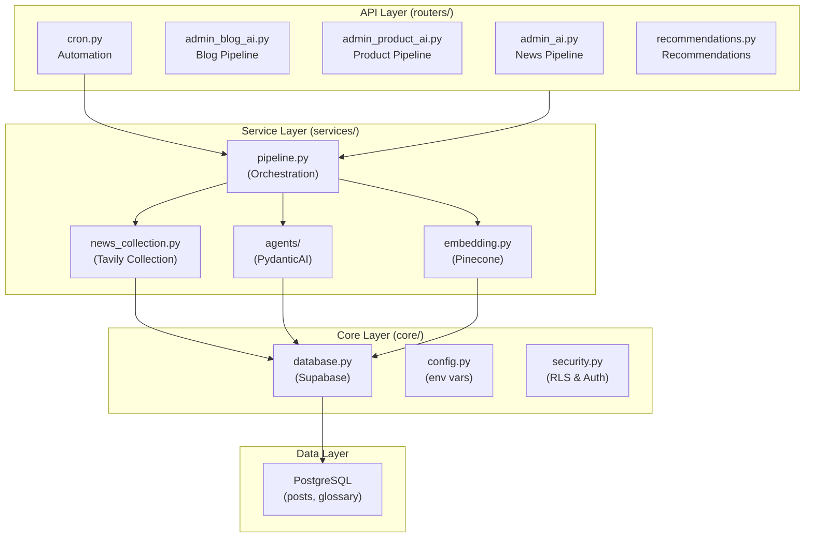
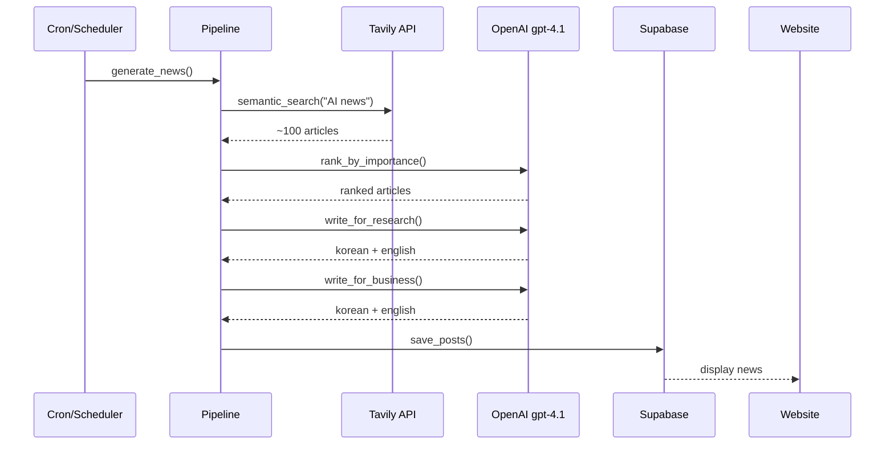
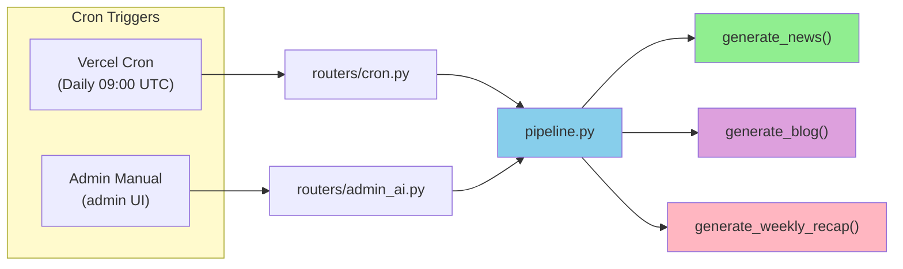

# Backend Architecture

0to1log's backend consists of **3 main pipelines**:
1. **Daily News Digest** — Automatic AI news curation
2. **AI Handbook** — Automated terminology generation
3. **Blog & AI Products** — Automated blog/product guides

Each pipeline follows an **API Layer → Service Layer → Core Layer** architecture.

---

## System Overview



---

## API Layer (routers/)

```
routers/
├── admin_ai.py           POST /api/admin/news
│   └─ Trigger pipeline.generate_news()
│
├── admin_blog_ai.py      POST /api/admin/blog
│   └─ Trigger pipeline.generate_blog()
│
├── admin_product_ai.py   POST /api/admin/products
│   └─ Trigger pipeline.generate_products()
│
├── cron.py               POST /api/cron/news (Vercel Cron)
│   └─ Auto-run daily at 09:00 UTC
│
└── recommendations.py    GET /api/recommendations?post_id=X
    └─ Find similar articles (Pinecone search)
```

---

## Service Layer (services/)

### Pipeline Orchestration

```mermaid
graph LR
    Start(["Start"]) --> Collect["1. Collect News<br/>news_collection.collect"]
    Collect --> Rank["2. Rank<br/>advisor.rank_news"]
    Rank --> WriteR["3. Write Research<br/>persona_writer"]
    WriteR --> WriteB["4. Write Business<br/>persona_writer"]
    WriteB --> Check["5. Quality Check<br/>quality_check"]
    Check --> Save["6. Save to DB<br/>database.save_posts"]
    Save --> End(["Done"])
    
    style Start fill:#90EE90
    style End fill:#FFB6C6
    style Collect fill:#87CEEB
    style Rank fill:#87CEEB
    style WriteR fill:#DDA0DD
    style WriteB fill:#DDA0DD
    style Check fill:#F0E68C
    style Save fill:#87CEEB
```



### Service Details

**📰 news_collection.py**
```
collect_news()
  ├─ Tavily API → Search AI news
  ├─ Deduplication & filtering
  └─ Extract metadata (title, URL, summary)
```

**🤖 agents/ (PydanticAI)**
```
agents/
├── persona_writer.py         Write news for Research/Business personas
│   └─ gpt-4.1 generates Korean + English
│
├── advisor.py                Evaluate news importance & rank
│   └─ gpt-4.1 curates content
│
├── fact_extractor.py         Extract key facts & citations
│   └─ gpt-4.1 structures data
│
├── blog_advisor.py           Control blog generation
├── product_advisor.py        Control product guide generation
│
└── prompts_*.py              Prompt templates
    ├── prompts_news_pipeline.py
    ├── prompts_handbook_types.py
    └── prompts_blog_advisor.py
```

**🔍 embedding.py**
```
embed_and_search(query)
  ├─ Convert query to vector
  ├─ Search Pinecone
  └─ Return similar articles
```

---

## Daily News Digest Pipeline



**File Location:**
```
backend/
├── routers/admin_ai.py           → API endpoint
├── services/pipeline.py          → Orchestration
├── services/news_collection.py   → Tavily collection
├── services/agents/
│   ├── advisor.py                → Ranking
│   ├── persona_writer.py         → Persona writing
│   └── prompts_news_pipeline.py  → Prompts
└── core/
    ├── database.py               → Supabase connection
    └── config.py                 → API keys config
```

---

## Core Layer (core/)

```
core/
├── config.py           Environment variables & settings
│   └─ OPENAI_MODEL_MAIN="gpt-4.1"
│      TAVILY_API_KEY, PINECONE_API_KEY, ...
│
├── database.py         Supabase connection & queries
│   └─ PostgreSQL wrapper with RLS
│
├── security.py         Authentication & authorization
│   └─ JWT validation, Admin protection, CRON_SECRET
│
└── rate_limit.py       API Rate Limiting (slowapi)
    └─ DDoS prevention
```

---

## Automation & Scheduling



**Execution Patterns:**
```
Daily at 09:00 UTC
  └─ Vercel Cron → POST /api/cron/news
     └─ pipeline.generate_news()
     
Weekly Monday 09:00 UTC
  └─ Vercel Cron → POST /api/cron/weekly
     └─ pipeline.generate_weekly_recap()
     
On-demand (Admin)
  └─ Admin UI → POST /api/admin/news
     └─ pipeline.generate_news()
```

---

## Tech Stack Rationale

| Component | Choice | Why |
|-----------|--------|-----|
| **FastAPI** | Python API | High performance, type-safe, auto-documentation |
| **PydanticAI** | AI agents | Type-safe LLM calls, structured outputs |
| **OpenAI gpt-4.1** | Main model | Korean understanding, news curation quality |
| **Tavily API** | News search | Semantic search, real-time updates |
| **Supabase** | Database | PostgreSQL + Auth + RLS integration |
| **Pinecone** | Vector search | Fast semantic search, recommendation engine |
| **slowapi** | Rate limiting | FastAPI-native support |

---

## Data Models

```
models/
├── posts.py              Post (news articles)
├── glossary.py           Term (terminology)
├── blog.py               BlogPost (blog articles)
└── products.py           Product (AI products)
```

**Key Tables:**
```
posts: News articles
  ├─ id, title_en/ko, content_en/ko
  ├─ research_summary, business_summary
  └─ source_url, created_at, published_at

glossary: AI terminology
  ├─ id, term_en/ko
  ├─ beginner_explanation_en/ko
  ├─ advanced_explanation_en/ko
  └─ category

blog_posts: Blog articles
  ├─ id, title_en/ko, content (MDX)
  └─ author, published_at

ai_products: AI products
  ├─ id, name, url, category
  └─ description_en/ko, review_en/ko
```

---

## Next Steps

For detailed information, refer to vault documentation:

- **Pipeline Details:** [vault/09-Implementation/plans/](vault/09-Implementation/plans/)
- **Current Sprint:** [ACTIVE_SPRINT.md](vault/09-Implementation/plans/ACTIVE_SPRINT.md)
- **Development Guide:** [backend/CLAUDE.md](backend/CLAUDE.md)
