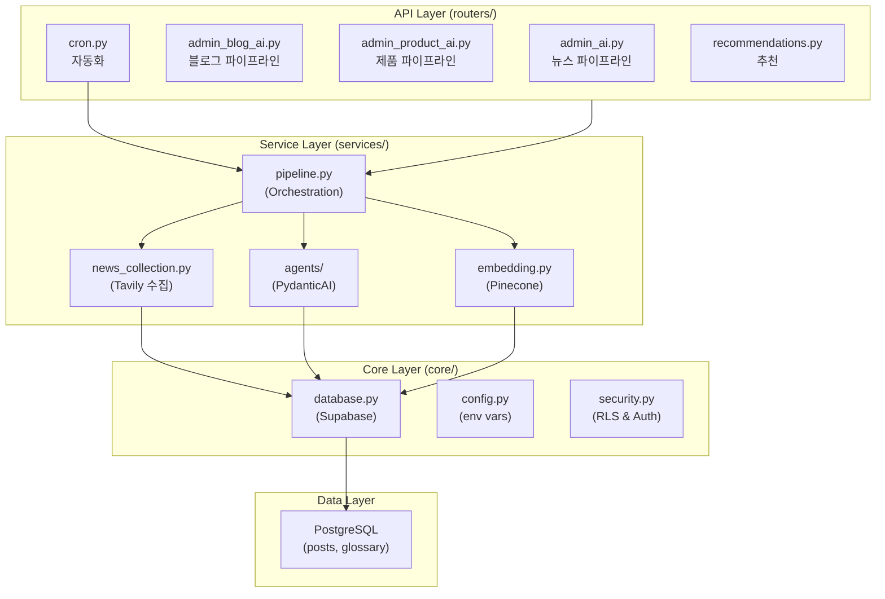
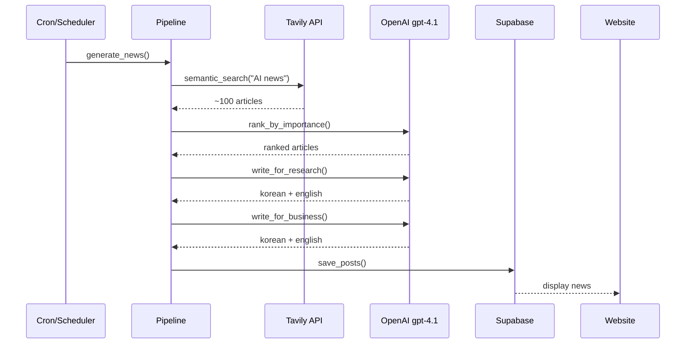
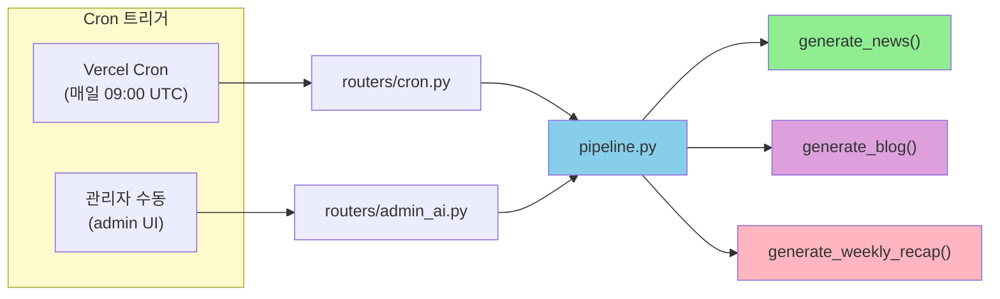

# 0to1log Backend Architecture

0to1log의 백엔드는 **3가지 주요 파이프라인**으로 구성됩니다:
1. **Daily News Digest** — AI 뉴스 자동 큐레이션
2. **AI Handbook** — 기술 용어 자동 생성
3. **Blog & AI Products** — 블로그/제품 가이드 자동 생성

각 파이프라인은 **API Layer → Service Layer → Core Layer** 구조로 작동합니다.

---

## System Overview



---

## API Layer (routers/)

```
routers/
├── admin_ai.py           POST /api/admin/news
│   └─ pipeline.generate_news() 트리거
│
├── admin_blog_ai.py      POST /api/admin/blog
│   └─ pipeline.generate_blog() 트리거
│
├── admin_product_ai.py   POST /api/admin/products
│   └─ pipeline.generate_products() 트리거
│
├── cron.py               POST /api/cron/news (Vercel Cron)
│   └─ 매일 09:00 UTC 자동 실행
│
└── recommendations.py    GET /api/recommendations?post_id=X
    └─ 유사 기사 검색 (Pinecone)
```

---

## Service Layer (services/)

### 파이프라인 오케스트레이션

```mermaid
graph LR
    Start(["시작"]) --> Collect["1. 뉴스 수집<br/>news_collection.collect"]
    Collect --> Rank["2. 랭킹<br/>advisor.rank_news"]
    Rank --> WriteR["3. Research 작성<br/>persona_writer"]
    WriteR --> WriteB["4. Business 작성<br/>persona_writer"]
    WriteB --> Check["5. 품질 검증<br/>quality_check"]
    Check --> Save["6. DB 저장<br/>database.save_posts"]
    Save --> End(["완료"])
    
    style Start fill:#90EE90
    style End fill:#FFB6C6
    style Collect fill:#87CEEB
    style Rank fill:#87CEEB
    style WriteR fill:#DDA0DD
    style WriteB fill:#DDA0DD
    style Check fill:#F0E68C
    style Save fill:#87CEEB
```



### 각 서비스 상세

**📰 news_collection.py**
```
collect_news()
  ├─ Tavily API → AI 뉴스 검색
  ├─ 중복 제거 & 필터링
  └─ 메타데이터 추출 (제목, URL, 요약)
```

**🤖 agents/ (PydanticAI)**
```
agents/
├── persona_writer.py         뉴스를 Research/Business별로 작성
│   └─ gpt-4.1로 한국어 + 영어 생성
│
├── advisor.py                뉴스 중요도 평가 & 랭킹
│   └─ gpt-4.1로 큐레이션
│
├── fact_extractor.py         주요 팩트 & 인용 추출
│   └─ gpt-4.1로 구조화
│
├── blog_advisor.py           블로그 생성 제어
├── product_advisor.py        제품 가이드 생성 제어
│
└── prompts_*.py              프롬프트 템플릿
    ├── prompts_news_pipeline.py
    ├── prompts_handbook_types.py
    └── prompts_blog_advisor.py
```

**🔍 embedding.py**
```
embed_and_search(query)
  ├─ 쿼리 벡터화
  ├─ Pinecone 검색
  └─ 유사 기사 반환
```

---

## Daily News Digest Pipeline



**파일 위치:**
```
backend/
├── routers/admin_ai.py           → API 엔드포인트
├── services/pipeline.py          → 오케스트레이션
├── services/news_collection.py   → Tavily 수집
├── services/agents/
│   ├── advisor.py                → 랭킹
│   ├── persona_writer.py         → 페르소나 작성
│   └── prompts_news_pipeline.py  → 프롬프트
└── core/
    ├── database.py               → Supabase 연결
    └── config.py                 → API 키 설정
```

**상세:** [vault/09-Implementation/plans/](vault/09-Implementation/plans/)

---

## Core Layer (core/)

```
core/
├── config.py           환경 변수 & 설정
│   └─ OPENAI_MODEL_MAIN="gpt-4.1"
│      TAVILY_API_KEY, PINECONE_API_KEY, ...
│
├── database.py         Supabase 연결 & 쿼리
│   └─ PostgreSQL 래퍼 & RLS 적용
│
├── security.py         인증 & 권한
│   └─ JWT 검증, Admin 보호, CRON_SECRET
│
└── rate_limit.py       API Rate Limiting (slowapi)
    └─ DDoS 방지
```

---

## Automation & Scheduling



**실행 패턴:**
```
매일 09:00 UTC
  └─ Vercel Cron → POST /api/cron/news
     └─ pipeline.generate_news()
     
매주 월요일 09:00 UTC
  └─ Vercel Cron → POST /api/cron/weekly
     └─ pipeline.generate_weekly_recap()
     
On-demand (관리자)
  └─ Admin UI → POST /api/admin/news
     └─ pipeline.generate_news()
```

---

## 기술 스택 선택 이유

| 컴포넌트 | 선택 | 이유 |
|---------|------|------|
| **FastAPI** | Python API | 높은 성능, 타입 안전, 자동 문서화 |
| **PydanticAI** | AI 에이전트 | 타입 안전한 LLM 호출, 구조화된 출력 |
| **OpenAI gpt-4.1** | 주요 모델 | 한국어 이해도, 뉴스 큐레이션 성능 |
| **Tavily API** | 뉴스 검색 | 의미론적 검색, 실시간 업데이트 |
| **Supabase** | 데이터베이스 | PostgreSQL + Auth + RLS 통합 |
| **Pinecone** | 벡터 검색 | 고속 의미론적 검색, 추천 기능 |
| **slowapi** | Rate Limiting | FastAPI 네이티브 지원 |

---

## Data Models

```
models/
├── posts.py              Post (뉴스)
├── glossary.py           Term (용어)
├── blog.py               BlogPost (블로그)
└── products.py           Product (제품)
```

**주요 테이블:**
```
posts: 뉴스 기사
  ├─ id, title_en/ko, content_en/ko
  ├─ research_summary, business_summary
  └─ source_url, created_at, published_at

glossary: AI 용어
  ├─ id, term_en/ko
  ├─ beginner_explanation_en/ko
  ├─ advanced_explanation_en/ko
  └─ category

blog_posts: 블로그 글
  ├─ id, title_en/ko, content (MDX)
  └─ author, published_at

ai_products: AI 제품
  ├─ id, name, url, category
  └─ description_en/ko, review_en/ko
```

---

## 다음 단계

더 깊은 정보는 vault 문서를 참조하세요:

- **파이프라인 상세:** [vault/09-Implementation/plans/](vault/09-Implementation/plans/)
- **스프린트 현황:** [ACTIVE_SPRINT.md](vault/09-Implementation/plans/ACTIVE_SPRINT.md)
- **개발 가이드:** [backend/CLAUDE.md](backend/CLAUDE.md)
