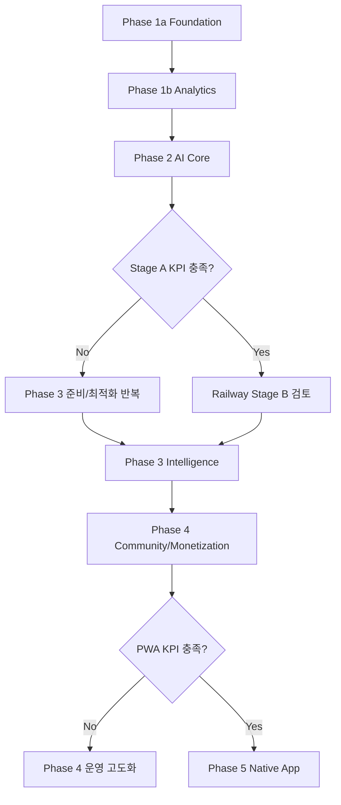
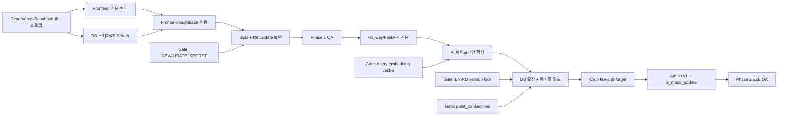
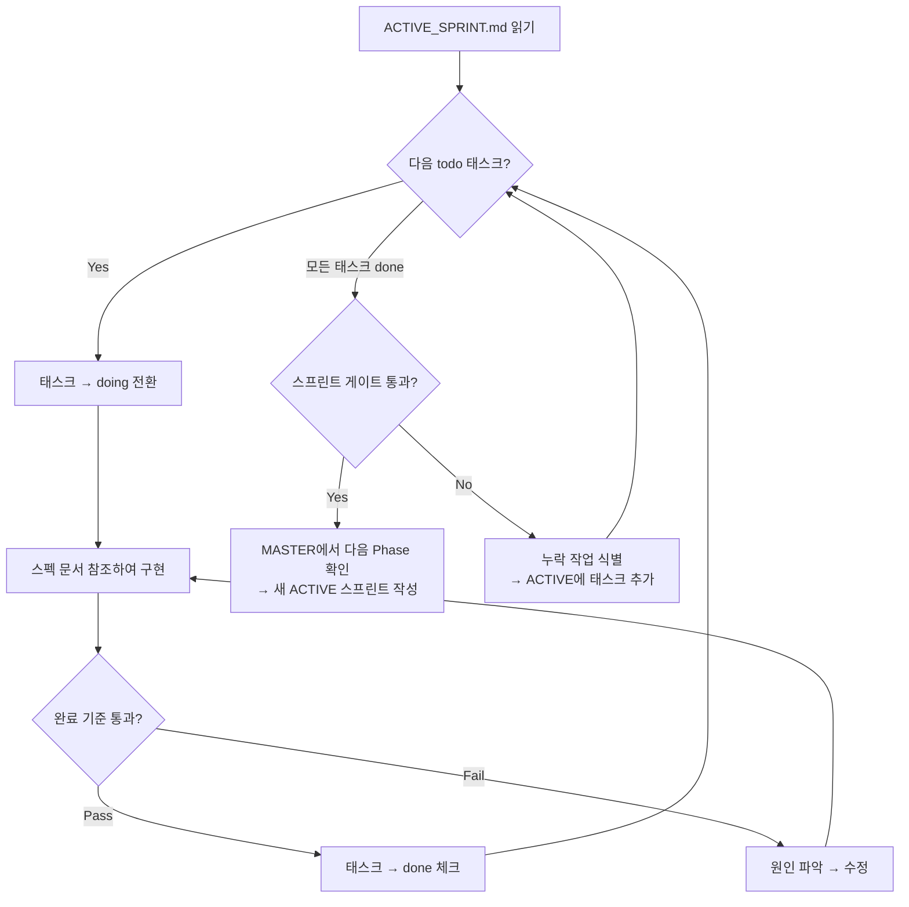

# 🚀 0to1log — Implementation Plan (MASTER)

> **문서 버전:** v2.0
> **최종 수정:** 2026-03-05
> **작성자:** Amy (Solo)
> **상태:** Active Planning
> **목적:** Phase 방향 + 게이트 조건 + 워크플로우 정본. 상세 태스크는 → `docs/plans/ACTIVE_SPRINT.md`

---

## 1) 실행 원칙

- 한 번에 하나의 업무 단위만 `doing`으로 전환한다.
- 모든 업무는 아래 필드를 반드시 가진다: 산출물, 완료 기준, 검증 방법, 참조 문서.
- 코드 구현 세션과 리뷰 세션을 분리한다.
- 기능 단위 종료 시 컨텍스트를 리셋하고 다음 단위로 이동한다.

### 상태값

- `todo`: 시작 전
- `doing`: 진행 중
- `review`: 검토 중
- `done`: 완료
- `blocked`: 외부 의존성으로 중단

---

## 2) 전체 업무 흐름 (Phase 1~5)

---

## 3) Phase별 요약 & 게이트 조건

| Phase | 목표 | 핵심 산출물 | → 다음 Phase 게이트 | 소스 |
|---|---|---|---|---|
| **1a Foundation** | 실행 기반 확보 | Astro 골격 + Supabase + SEO | `astro build` 0 error + Vercel 배포 + RLS 테스트 + sitemap 200 | P1-QA-01 |
| **1b Analytics** | 데이터 수집 시작 | GA4 + Clarity 연동 | GA4 realtime 이벤트 수신 + Clarity 세션 리플레이 확인 | P1-ANL-01/02 |
| **2 AI Core** | AI 파이프라인 가동 | FastAPI + 뉴스 파이프라인 + Admin | E2E QA 통과 + 핵심 계약 6개 충족 | P2-QA-01 |
| **3 Intelligence** | 검색/커뮤니티/분석 | 시맨틱 검색 + AARRR 대시보드 | Stage B KPI 충족 (검색량+재방문율 목표) | 06 §2.1.1 |
| **4 Community** | 수익화 + PWA | 포인트 시스템 + 프리미엄 검토 + PWA | PWA 설치율 4%+ (4주) + 유지율 25%+ | 06 §6.2 |
| **5 Native App** | Expo 앱 출시 | iOS/Android 앱 | 앱 스토어 심사 통과 | 06 §6.2 |

---

## 4) Critical Path (Phase 1~2 + 보안/동기화 게이트)

---

## 5) 바이브 코딩 세션 워크플로우

> AI 에이전트(Claude Code)가 매 세션에서 따르는 실행 흐름.

---

## 6) 리스크 반영 체크

| 항목 | 반영 상태 | 기준 문서 | 완료 조건 |
|---|---|---|---|
| EN-KO 버전 락 | todo | 03, 07 | KO 생성/발행 시 EN revision lock + version 검증 |
| Revalidate 인증 | todo | 04, 05 | `POST /api/revalidate` secret 불일치 401 |
| point_transactions 원장 | todo | 03 | 중복 방지 제약 + 트랜잭션 원칙 명시 |
| 검색 임베딩 캐시 | todo | 03 | `trim(lower(query))` + TTL 5분 + 키워드 폴백 |
| Persona 우선순위 | todo | 04 | `DB > 쿠키 > beginner` + 로그인 1회 동기화 |
| reduced-motion 검증 | todo | 04 | 접근성 성공 기준에 reduce 모드 검증 포함 |

---

## 7) 문서 정합성 테스트 시나리오

1. 03/04/05/07 문서에서 같은 정책 용어가 충돌하지 않는다.
2. `REVALIDATE_SECRET`이 04/05에 모두 존재하고 제거 문구가 없다.
3. 03/07에서 EN revision lock + `source_post_version` 검증 규칙이 일치한다.
4. 03에 `point_transactions` + 중복 방지 제약이 명시된다.
5. 04에 Persona 우선순위, 1회 동기화, 누락 폴백이 모두 존재한다.
6. 본 문서에 Mermaid 3개 + Phase 게이트 테이블 + 리스크 체크 표가 존재한다.
7. `ACTIVE_SPRINT.md`의 태스크 ID가 MASTER의 Phase 정의와 일치한다.
8. ACTIVE 스프린트 게이트 조건이 MASTER 게이트 테이블과 정합한다.

---

## 8) 운영 메모

- 이 문서(MASTER)는 Phase 방향과 게이트 조건의 정본이다.
- 상세 태스크는 `docs/plans/ACTIVE_SPRINT.md`에서 관리한다.
- 스프린트 전환 시 ACTIVE 파일을 새 Phase 태스크로 갱신한다.
- Phase 3+ 상세 작업은 해당 Phase 게이트 충족 시 ACTIVE에 작성한다.
