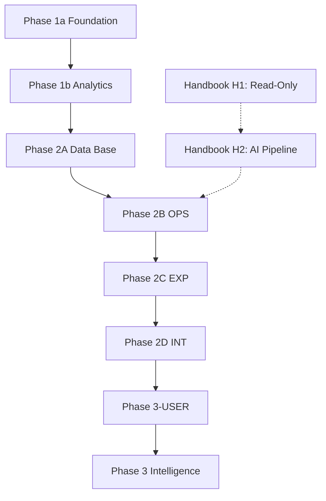

# 0to1log Implementation Plan (Core Edition)

> **문서 버전:** v2.5  
> **최종 수정:** 2026-03-08  
> **작성자:** Amy (Solo)  
> **상태:** Active Planning  
> **목적:** 바이브 코딩 속도는 유지하고, 재작업을 유발하는 핵심 리스크만 강제한다.

---

## 1) 운영 원칙 (핵심만 유지)

### Hard Gate (필수)
- OpenAPI/응답 스키마를 **2B 시작 시점에 고정**한다.
- 2C는 2B에서 고정된 스키마 기반 **Mock만 사용**한다.
- Cron은 **2B에서 endpoint skeleton만**, **2D에서 실운영 연동/E2E**를 수행한다.
- 각 태스크 완료 판정은 반드시 `검증 명령 + 통과 조건`으로 기록한다.
- ACTIVE_SPRINT 태스크 ID는 기존 Addendum과 충돌하지 않도록 신규 번호대로 발급한다.

### DoD 최소 규칙
- `상태=done`이면 반드시 `체크=[x]` + 증거 링크(PR/로그/스크린샷 중 1개 이상).
- 문서/코드 변경 후 `Current Doing` 동기화.
- 실패 시 `review` 또는 `blocked`로 전환하고 원인 1줄 기록.

### Nice-to-have (선택)
- 태스크별 성능 예산(예: INP/LCP)을 더 세분화.
- UI 회귀 스냅샷 자동화.
- 디자인 토큰 lint 자동 검사.

---

## 2) Phase 흐름 (Phase 2 분리 운영)

> **Handbook 별도 트랙:** Tech Handbook(용어 사전) 기능은 메인 Phase와 병렬 진행.
> H1(읽기 전용)은 즉시 착수 가능, H2(AI 수집 파이프라인)는 Phase 2B 이후.
> 제품 우선순위는 `/log`의 AI News 영역 + `/handbook` + `/library`를 메인 app surface로 두고, `/portfolio`는 비핵심 showcase surface로 취급한다.
> Handbook 병렬 작업은 별도 sprint 문서 `docs/plans/ACTIVE_SPRINT_HANDBOOK.md`로 운영하고, 메인 ACTIVE_SPRINT와 섞지 않는다.
> 상세 스펙 → `docs/08_Handbook.md`

### Product Language Boundary
- Public product language: `AI News`, `Handbook`, `Library`
- Internal/admin language: `Posts`, `Handbook`
- Compatibility path: public AI News continues to live under `/{locale}/log/`

### Navigation Shell Contract
- Web shell: `[Brand] [Primary Nav] [Utilities]`
- Mobile/app shell: `[Brand/Page] [Profile or Settings]` + primary nav exposed separately
- Public primary nav is fixed to `AI News | Handbook | Library`
- Language and theme controls live in the utility drawer, not inline in the public header

### Current Status Snapshot
- Mainline 구현 상태: **Phase 2D-INT 완료** (main 브랜치 반영 완료)
- **완료된 단계:** 2B-OPS, 2C-EXP, 2D-INT
- **병렬 진행:** Handbook H1은 `docs/plans/ACTIVE_SPRINT_HANDBOOK.md` 기준으로 별도 운영한다.
- **다음 메인라인 스프린트:** Phase 3-USER (일반 사용자 기능) → `docs/plans/2026-03-08-user-features-design.md`

---

## 3) Phase 2 실행 계획 (결정 완료)

### 2B-OPS (백엔드 기능 고정, 완료)
- `P2B-API-01`: AI Agent 로직 + Prompt 튜닝 (외부 API 테스트는 Mock 필수)
- `P2B-API-02`: Admin CRUD 엔드포인트 + 인증/권한 테스트
- `P2B-CRON-00`: Cron endpoint skeleton + 인증 헤더 검증 (실운영 연동 제외)

**2B Gate**
- OpenAPI 문서 고정(목록/상세/에러 응답 포함)
- `pytest` 통과
- 401/403 분리 동작 확인

### 2C-EXP (프론트 경험 고도화, 완료)
- `P2C-UI-11`: Newsprint 토큰/테마/공통 컴포넌트 정리
- `P2C-UI-12`: `/en|ko/log` 리스트/상세 + 다국어 스위처 + 화면 상태(empty/error/loading)
- `P2C-UI-13`: 썸네일 이미지 newsprint 필터 (`.img-newsprint` grayscale+sepia 기본 적용, hover 시 원본 컬러 복원 transition)
- `P2C-UI-14`: Admin Editor 화면(마크다운 작성/미리보기 + Save/Publish 액션) 구현, OpenAPI 고정 스키마 기반 mock 사용
- `P2C-UI-15`: Admin Editor 상태/권한 처리(loading/empty/404/401/403 + 저장/발행 피드백) 구현, mock-first
- `P2C-QA-11`: 반응형/접근성/성능 QA
- 2C의 인증 범위는 **mock UI/state까지**로 제한한다. 즉, admin 로그인 화면/세션 만료/unauthorized 안내는 여기서 다루되, 실제 세션 복원과 토큰 연동은 2D로 넘긴다.
- 우측 컬럼은 2C에서 fallback 기준으로 먼저 고정한다: `Editor's Note`=정적 카피, `Most Read`=latest fallback, `Focus of This Article`=category template, `More in This Issue`=latest related fallback

**2C Gate (균형형 기준)**
- 반응형: mobile/tablet/desktop 레이아웃 정상
- 접근성: `prefers-reduced-motion`, 키보드 포커스, 대비 기준 통과
- Lighthouse: Perf/Best/SEO/Acc 각각 `>= 85`
- Core Web Vitals 목표: `LCP < 2.8s`, `CLS < 0.1`, `INP < 250ms`
- `npm run build` 0 error
- Admin Editor mock 워크플로우(목록 → 상세 → 편집/미리보기 → 발행 CTA) 정상

### 2D-INT (통합/E2E, 완료)
- `P2D-SEC-01`: Frontend/SSR 보안 하드닝 (`/api/trigger-pipeline` 공개 호출 차단, markdown raw HTML 허용 제거 또는 sanitize, 공개 `/admin` mock을 실제 session guard로 전환)
- `P2D-SEC-02`: Backend/API 보안 하드닝 (slowapi 실제 적용, env loading/test isolation 정리, CORS/secret 경계 재검증)
- `P2D-AUTH-01`: Supabase Auth 실연동(admin 로그인/로그아웃/세션 복원/보호 라우트 가드 + 기본 user sign-in entry) 구현
- `P2D-SYNC-01`: 프론트 Mock 제거 후 실제 API fetch 연동(로그 + Admin Editor 포함)
- `P2D-CRON-01`: Vercel Cron -> Backend 파이프라인 실운영 연동
- `P2D-QA-01`: E2E 통합 테스트(API 호출 -> 화면 렌더링 -> 에러 폴백)
- 우측 컬럼 실데이터 치환: `Editor's Note`=admin 입력, `Most Read`=GA4/DB 집계, `Focus of This Article`=글별 admin 입력, `More in This Issue`=관련도 로직
- 언어 전환 실데이터 치환: DB에 EN/KO pair 연결 데이터(`translation_group_id`, `source_post_id`)가 존재해야 하며, 상세 페이지는 반대 언어 포스트 `slug`를 조회하고, switcher는 단순 경로 치환이 아니라 paired `slug`로 이동해야 한다. pair가 없으면 locale index로 fallback한다.
- 일반 사용자 로그인은 2D에서 **기본 진입/세션 유지 수준만** 구현하고, 댓글/구독/커뮤니티 등 로그인 활용 기능 확장은 이후 Phase 3~4에서 다룬다.
- 2026-03-08 기준 security hardening fixes까지 반영되었으며, 핵심 보안 정정은 `P2D-SEC-01/02` 범위 내에서 닫는다 (`config.py` extra ignore, test env isolation, `FASTAPI_URL` 통일, `x-vercel-cron` 우회 제거).

**2D Gate**
- 실데이터 기준 리스트/상세 렌더링 정상
- `/api/trigger-pipeline` 이 공개 대리 호출 경로로 남아 있지 않음
- 공개 포스트 markdown 렌더링에서 raw HTML 실행이 차단되거나 sanitize 됨
- Admin 로그인 후 보호된 `/admin` 경로 접근 및 세션 복원 정상
- 로그아웃/세션 만료 시 admin 경로가 로그인 또는 unauthorized 상태로 일관되게 전환
- backend 보안 테스트가 표준 `pytest` 진입점에서 환경변수 충돌 없이 실행됨
- admin/cron rate limit 이 실제 라우트에 적용됨
- 상세 페이지 언어 전환 시 동일 콘텐츠의 EN/KO pair로 이동
- Cron 수동 트리거 시 파이프라인 실행 로그 확인
- E2E 시나리오 통과

### 3-USER (일반 사용자 기능, 설계 완료)
- 소셜 로그인: GitHub + Google OAuth via Supabase Auth (`/login`)
- DB: `profiles`, `reading_history`, `bookmarks` 3개 테이블 + RLS
- 헤더: Sign In / 아바타 드롭다운 (내 서재, 설정, 로그아웃)
- 읽기 기록: 상세 페이지 방문 시 자동 기록, 리스트에서 읽은 글 `opacity: 0.55`
- 북마크: 리스트 카드 + 상세 페이지에 북마크 아이콘
- 내 서재: `/library` — 읽은 글 탭 + 저장한 글 탭
- 추후 확장: 댓글/리액션, 구독/알림 (C단계)
- 상세 설계 → `docs/plans/2026-03-08-user-features-design.md`

### 3B-SHARE (소셜 공유 버튼)
- 상세 페이지(Log + Handbook)에 간단한 공유 버튼 추가
- 대상 플랫폼: X(Twitter), LinkedIn, URL 복사
- Web Share API 지원 시 네이티브 공유 시트 우선 사용, 미지원 시 플랫폼별 버튼 폴백
- OG meta 태그 정비 (title, description, image) — 공유 시 카드 미리보기 최적화
- Phase 3 "Highlight to Share"(문장 드래그 → SNS 카드 생성)와는 별개의 기본 공유 기능
- 의존성: 없음 (로그인 불필요, 프론트엔드만)

### 3A-SEC (후속 보안 하드닝)
- CSP nonce 기반 전환으로 `unsafe-inline` 제거
- analytics/script 로딩을 nonce 또는 외부 script 로더 기준으로 재정비
- production 배포 전 보안 점검 체크리스트 재실행

---

## 4) ACTIVE_SPRINT 연동 규칙

- 2C 신규 태스크는 기존 `2C-EXP Addendum` 이후 번호 사용 (`P2C-UI-11`부터).
- 태스크 템플릿 필수 필드:
  - 체크, 상태, 목적, 산출물, 완료 기준, 검증 명령, 통과 조건, 증거, 참조, 의존성
- 같은 Phase 내 기본 참조는 ACTIVE_SPRINT 우선.
- Phase 전환 또는 게이트 판정 시에만 IMPLEMENTATION_PLAN 재조회.

---

## 5) 검증 체크리스트 (문서 운영)

1. Hard Gate 5개가 ACTIVE_SPRINT 태스크/게이트에 반영되어 있다.
2. 2B에는 Cron skeleton만 있고, 실연동/E2E는 2D에만 있다.
3. 2C QA 항목에 Lighthouse/반응형/접근성/CWV 수치 기준이 있다.
4. 모든 done 태스크가 `[x] + 증거 링크`를 갖는다.
5. OpenAPI 고정 이후 2C mock 필드(로그/상세/Admin Editor)가 계약과 일치한다.

---

## 6) 기본 가정

- 이번 문서는 구현 코드가 아니라 실행 계약 문서다.
- 2A는 완료 상태로 간주하고, 다음 실행 기준은 2B부터다.
- 목표는 "최소 규칙으로 최대 실행 속도"이며, 과도한 세부 규칙은 Nice-to-have로 분리한다.
- Backend Python virtualenv는 `backend/.venv`만 사용한다 (`backend/venv` 금지).
