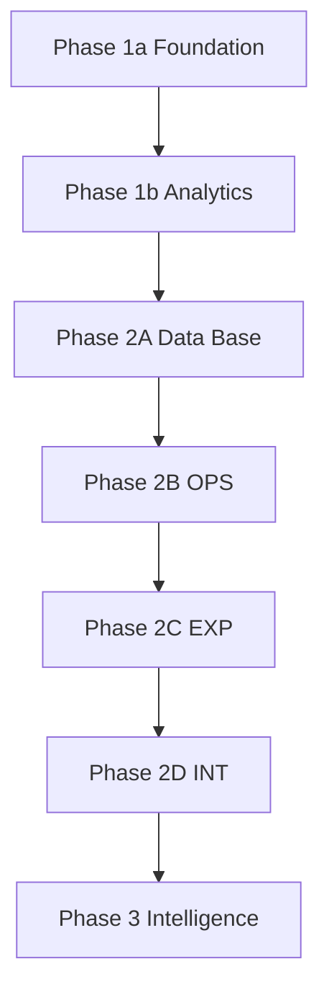

# 0to1log Implementation Plan (Core Edition)

> **문서 버전:** v2.3  
> **최종 수정:** 2026-03-07  
> **작성자:** Amy (Solo)  
> **상태:** Active Planning  
> **목적:** 바이브 코딩 속도는 유지하고, 재작업을 유발하는 핵심 리스크만 강제한다.

---

## 1) 운영 원칙 (핵심만 유지)

### Hard Gate (필수)
- OpenAPI/응답 스키마를 **2B 시작 시점에 고정**한다.
- 2C는 2B에서 고정된 스키마 기반 **Mock만 사용**한다.
- Cron은 **2B에서 endpoint skeleton만**, **2D에서 실운영 연동/E2E**를 수행한다.
- 각 태스크 완료 판정은 반드시 `검증 명령 + 통과 조건`으로 기록한다.
- ACTIVE_SPRINT 태스크 ID는 기존 Addendum과 충돌하지 않도록 신규 번호대로 발급한다.

### DoD 최소 규칙
- `상태=done`이면 반드시 `체크=[x]` + 증거 링크(PR/로그/스크린샷 중 1개 이상).
- 문서/코드 변경 후 `Current Doing` 동기화.
- 실패 시 `review` 또는 `blocked`로 전환하고 원인 1줄 기록.

### Nice-to-have (선택)
- 태스크별 성능 예산(예: INP/LCP)을 더 세분화.
- UI 회귀 스냅샷 자동화.
- 디자인 토큰 lint 자동 검사.

---

## 2) Phase 흐름 (Phase 2 분리 운영)

---

## 3) Phase 2 실행 계획 (결정 완료)

### 2B-OPS (백엔드 기능 고정)
- `P2B-API-01`: AI Agent 로직 + Prompt 튜닝 (외부 API 테스트는 Mock 필수)
- `P2B-API-02`: Admin CRUD 엔드포인트 + 인증/권한 테스트
- `P2B-CRON-00`: Cron endpoint skeleton + 인증 헤더 검증 (실운영 연동 제외)

**2B Gate**
- OpenAPI 문서 고정(목록/상세/에러 응답 포함)
- `pytest` 통과
- 401/403 분리 동작 확인

### 2C-EXP (프론트 경험 고도화)
- `P2C-UI-11`: Newsprint 토큰/테마/공통 컴포넌트 정리
- `P2C-UI-12`: `/en|ko/log` 리스트/상세 + 다국어 스위처 + 화면 상태(empty/error/loading)
- `P2C-UI-13`: 썸네일 이미지 newsprint 필터 (`.img-newsprint` grayscale+sepia 기본 적용, hover 시 원본 컬러 복원 transition)
- `P2C-UI-14`: Admin Editor 화면(마크다운 작성/미리보기 + Save/Publish 액션) 구현, OpenAPI 고정 스키마 기반 mock 사용
- `P2C-UI-15`: Admin Editor 상태/권한 처리(loading/empty/404/401/403 + 저장/발행 피드백) 구현, mock-first
- `P2C-QA-11`: 반응형/접근성/성능 QA

**2C Gate (균형형 기준)**
- 반응형: mobile/tablet/desktop 레이아웃 정상
- 접근성: `prefers-reduced-motion`, 키보드 포커스, 대비 기준 통과
- Lighthouse: Perf/Best/SEO/Acc 각각 `>= 85`
- Core Web Vitals 목표: `LCP < 2.8s`, `CLS < 0.1`, `INP < 250ms`
- `npm run build` 0 error
- Admin Editor mock 워크플로우(목록 → 상세 → 편집/미리보기 → 발행 CTA) 정상

### 2D-INT (통합/E2E)
- `P2D-SYNC-01`: 프론트 Mock 제거 후 실제 API fetch 연동(로그 + Admin Editor 포함)
- `P2D-CRON-01`: Vercel Cron -> Backend 파이프라인 실운영 연동
- `P2D-QA-01`: E2E 통합 테스트(API 호출 -> 화면 렌더링 -> 에러 폴백)

**2D Gate**
- 실데이터 기준 리스트/상세 렌더링 정상
- Cron 수동 트리거 시 파이프라인 실행 로그 확인
- E2E 시나리오 통과

---

## 4) ACTIVE_SPRINT 연동 규칙

- 2C 신규 태스크는 기존 `2C-EXP Addendum` 이후 번호 사용 (`P2C-UI-11`부터).
- 태스크 템플릿 필수 필드:
  - 체크, 상태, 목적, 산출물, 완료 기준, 검증 명령, 통과 조건, 증거, 참조, 의존성
- 같은 Phase 내 기본 참조는 ACTIVE_SPRINT 우선.
- Phase 전환 또는 게이트 판정 시에만 IMPLEMENTATION_PLAN 재조회.

---

## 5) 검증 체크리스트 (문서 운영)

1. Hard Gate 5개가 ACTIVE_SPRINT 태스크/게이트에 반영되어 있다.
2. 2B에는 Cron skeleton만 있고, 실연동/E2E는 2D에만 있다.
3. 2C QA 항목에 Lighthouse/반응형/접근성/CWV 수치 기준이 있다.
4. 모든 done 태스크가 `[x] + 증거 링크`를 갖는다.
5. OpenAPI 고정 이후 2C mock 필드(로그/상세/Admin Editor)가 계약과 일치한다.

---

## 6) 기본 가정

- 이번 문서는 구현 코드가 아니라 실행 계약 문서다.
- 2A는 완료 상태로 간주하고, 다음 실행 기준은 2B부터다.
- 목표는 "최소 규칙으로 최대 실행 속도"이며, 과도한 세부 규칙은 Nice-to-have로 분리한다.
- Backend Python virtualenv는 `backend/.venv`만 사용한다 (`backend/venv` 금지).
