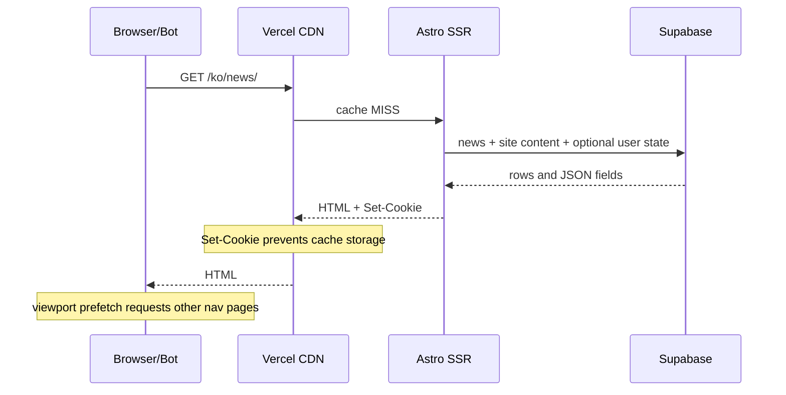
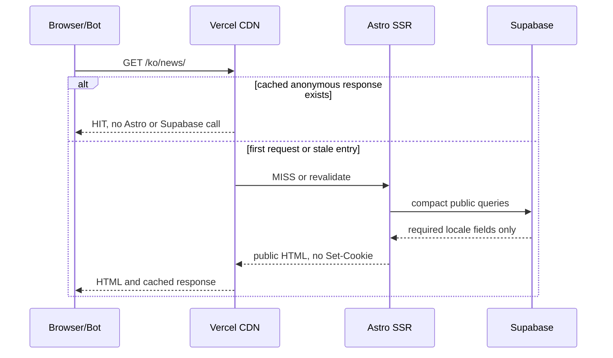

# Supabase Egress Hardening Design

**Date:** 2026-08-24

**Status:** Approved

**Scope:** Anonymous public content delivery, Vercel CDN caching, Supabase read payloads

**Related operations note:** `vault/07-Operations/Supabase-Egress-&-Public-Cache-Policy.md`

## 1. Problem

The Supabase Free organization exceeded its 5 GB egress quota and public REST requests were restricted with `exceed_egress_quota`. The stored content remains in the database, but News and Handbook pages cannot read it while the restriction is active.

Waiting for the billing-cycle reset restores request capacity but does not correct the request pattern. Production inspection showed three compounding causes:

1. Public responses repeatedly returned `X-Vercel-Cache: MISS`, `Age: 0`, and `Set-Cookie`.
2. Main navigation used viewport prefetch, so one home visit automatically requested five more SSR documents.
3. Public SSR routes fetched large row sets, both locales, long body fields, and several `.select('*')` payloads.

At the observed rate, the organization would use roughly 9-10 GB per billing cycle. The implementation therefore needs to reduce egress by at least 50%; the operating target is a 70-80% reduction with margin.

## 2. Goals

- Make repeat anonymous requests resolve from Vercel CDN instead of Supabase-backed SSR.
- Remove automatic page fan-out caused by viewport prefetch.
- Preserve locale preference without adding `Set-Cookie` to normal localized responses.
- Prevent authenticated or preview HTML from entering a shared cache.
- Reduce public query payloads without removing discoverable content.
- Define measurable egress and cache-hit gates before considering a paid plan.
- Keep existing public URLs, SEO metadata, authentication, bookmarks, read state, personas, and admin preview behavior.

## 3. Non-Goals

- No Supabase schema migration in the first hardening pass.
- No change to news generation, ranking, translation, or publishing logic.
- No immediate Supabase Pro upgrade requirement.
- No full static-generation migration in the first deployment.
- No deletion of historical articles, terms, products, or blog posts.
- No attempt to cache admin, settings, library, user APIs, or preview responses.

## 4. Considered Approaches

### Approach A: Wait for reset and reduce a few query limits

This is the smallest change, but it leaves the cache blocker and prefetch multiplier intact. It would likely repeat the incident. Rejected.

### Approach B: Staged hardening, then measure

First remove request amplification, restore safe anonymous CDN caching, and slim database payloads. Measure seven days of egress after quota recovery. Move to static delivery only if the measured budget is still exceeded.

This is the selected approach because it addresses the proven causes without forcing an auth-shell and publishing-system rewrite in the emergency pass.

### Approach C: Convert all editorial routes to SSG/ISR immediately

This offers the strongest long-term egress reduction but requires user-neutral public HTML, real cache invalidation, pipeline integration, preview bypass, and content freshness testing. The current `/api/revalidate` route is an authenticated stub and does not invalidate paths. This approach becomes Phase 2 behind a measured gate.

## 5. Current Request Flow



The locale cookie is written on every `/ko/` or `/en/` request. Vercel documents that a response containing `Set-Cookie` is not cacheable. The existing `Cache-Control` declarations therefore do not reduce origin reads.

## 6. Target Request Flow



Authenticated, preview, admin, library, settings, and user API requests remain private and must not share HTML through CDN.

## 7. Design Decisions

### 7.1 Prefetch policy

- Remove all public `data-astro-prefetch="viewport"` attributes.
- Keep `astro.config.mjs` default strategy as `hover`.
- Do not prefetch protected `/library/` from viewport.
- Keep normal link navigation and Astro View Transitions behavior unchanged.

Expected effect: a home visit requests only the home document until the user indicates navigation intent.

### 7.2 Locale preference flow

Normal `/ko/*` and `/en/*` requests must not write `site-locale`.

The explicit language switch will navigate to the translated target with `?lang=ko` or `?lang=en`. Middleware will:

1. validate the locale value;
2. set `site-locale` on a redirect response only;
3. remove `lang` from the URL;
4. redirect to the clean target URL.

The final content response has no `Set-Cookie`, is canonical, and can be cached. Unprefixed routes such as `/library/`, `/login`, and `/settings/` can continue reading the preference cookie.

### 7.3 Cache safety boundary

Create one cache-policy helper used by middleware or page responses rather than relying on overlapping `vercel.json` and page-specific policies.

| Route state | Browser policy | Vercel policy |
|---|---|---|
| anonymous Home/list | `public, max-age=0, must-revalidate` | `s-maxage=300, stale-while-revalidate=3600, stale-if-error=86400` |
| anonymous published detail | `public, max-age=0, must-revalidate` | `s-maxage=3600, stale-while-revalidate=86400, stale-if-error=604800` |
| authenticated | `private, no-store` | `private, no-store` |
| preview/admin/user API | `private, no-store` | `private, no-store` |
| data-load failure | `no-store` | no cache |

Use `Vercel-CDN-Cache-Control` for Vercel-specific TTL and a conservative browser `Cache-Control`. Vercel documents that function response headers override `vercel.json`; the implementation must remove contradictory route-level content cache rules from `vercel.json`.

The first pass uses `Vary: Cookie` on public content responses so an authenticated request cannot reuse an anonymous cache variant while public components still inspect Astro locals. This is an interim boundary, not the long-term target: unique cookie combinations can fragment the cache.

### 7.4 Personalization policy

The first pass preserves server-rendered persona and account navigation for authenticated users and marks those responses private. This avoids changing persona behavior during an egress incident.

Bookmark and read-state queries on public list pages are removed from SSR because they already have or can use client hydration. A batch status endpoint should query only the item IDs rendered on the page. Completed state is applied after `astro:page-load` and guarded against duplicate View Transition initialization.

The Phase 2 static-delivery gate requires a stronger change: Navigation authentication state, initial persona selection, admin affordances, bookmark/read state, and like state must all hydrate client-side from user-neutral HTML.

### 7.5 Error cache prevention

An upstream Supabase failure must not be stored as a successful public HTML response.

- Data loaders continue returning an explicit error field.
- Pages with a database error set a non-cacheable response status, preferably `503`.
- The cache helper never adds public cache headers to preview, auth, or error responses.
- Valid empty states remain `200`; transport/database failures are distinct from empty content.

This prevents a short Supabase outage from becoming a cached empty/error page.

### 7.6 Query payload budgets

The goal is not to hide content by applying arbitrary row limits. The goal is to fetch only the fields needed for the current surface.

#### Home

- Fetch one latest-news window and derive recent/fallback selections in memory.
- Fetch non-favourite Handbook fallback only when fewer than six favourites exist.
- Keep blog and featured product limits small.
- Select one locale's definition field instead of both.

#### News list

- Preserve daily and weekly queries so weekly content is not pushed out.
- Remove large `guide_items` if the list only needs persona title/excerpt variants; select the exact nested data or denormalized title fields actually rendered.
- Remove SSR `reading_history` and `user_bookmarks` queries.
- Keep an explicit bounded archive window and introduce URL pagination only when the current window would hide required archive access.

#### Handbook list/category

- Preserve full-term search coverage up to the current safety limit.
- Select the active locale definition only.
- Do not include basic or advanced body content in list data.
- Collapse popular-term fallback into a conditional query rather than an eager duplicate query.

#### Products list

- Replace category `.select('*')` with explicit fields.
- Remove `demo_media` from every card unless the card visibly uses its first image; prefer the existing thumbnail.
- Replace full `search_corpus` with compact list-search fields or a generated lightweight search string.
- Keep long descriptions, scenarios, pricing detail, and resources detail-only.

#### Detail pages

- Replace public `.select('*')` in News, Handbook, Blog, and Products loaders with explicit contracts.
- Select only the current locale's long body where the schema allows it.
- Keep preview loaders authorized and complete; optimization must not break admin preview.
- Limit related/sidebar queries to fields actually rendered.

### 7.7 Compact Handbook term index

News and Blog detail rendering currently fetches up to 200 terms including `body_basic_ko` and `body_basic_en`. Replace this with a locale-aware compact contract:

```ts
interface PublicTermIndexEntry {
  term: string;
  slug: string;
  korean_name: string | null;
  term_full: string | null;
  categories: string[];
  summary: string | null;
  definition: string | null;
  basic_plain: string | null;
}
```

Only one locale's `basic_plain` is fetched. Centralize this query in a helper so News and Blog cannot drift back to duplicated two-locale selects. The first pass may still query it on an SSR cache miss; Phase 2 can move it to a generated static JSON asset or runtime data cache.

## 8. Phase 2 Static-Delivery Gate

Evaluate seven complete days after the quota resets and the first hardening release is deployed.

Open Phase 2 if any condition is true for three consecutive days:

- organization egress exceeds `120 MB/day`;
- repeated public-route samples fail to reach `X-Vercel-Cache: HIT`;
- cache variants are heavily fragmented by cookies;
- anonymous/bot traffic still causes Supabase reads to grow linearly;
- another project contributes more than 20% of organization egress and cannot be isolated.

Phase 2 work includes:

- user-neutral public Navigation and content HTML;
- client hydration for auth/profile/persona/admin affordances;
- Astro/Vercel prerender or ISR for editorial routes;
- real path invalidation after publish;
- preview bypass and unpublished-content protection;
- static compact Handbook index generation.

## 9. Observability and Acceptance

### Response checks

- First anonymous request after deploy: `X-Vercel-Cache: MISS`.
- Second request to the same URL and cookie state: `X-Vercel-Cache: HIT` and `Age > 0`.
- Normal localized response: no `Set-Cookie`.
- Explicit language switch: redirect response sets cookie, clean target response does not.
- Authenticated and preview responses: `private, no-store`.
- Supabase failure response: non-cacheable and not `HIT` on retry.

### Browser checks

- One Home navigation does not automatically fetch all primary-nav documents.
- Hover prefetch still improves intentional navigation.
- Login menu, persona, bookmark, read state, likes, and admin preview remain correct.
- KO/EN switching reaches the paired detail slug and retains preference on unprefixed pages.

### Cost checks

- Supabase organization egress target: `<= 120 MB/day`.
- Monthly target: `3.5-4.0 GB`.
- Sample anonymous public-route cache hit target: `>= 90%`.
- Usage must be checked by project because the quota is organization-wide.

## 10. Risks and Mitigations

| Risk | Mitigation |
|---|---|
| Authenticated HTML enters shared cache | `private, no-store`, `Vary: Cookie`, regression tests |
| Anonymous cached HTML is served to signed-in users | cookie variant separation in Phase 1; user-neutral HTML in Phase 2 |
| Locale preference stops updating | explicit `?lang=` redirect contract and KO/EN tests |
| Old content remains visible too long | bounded TTL now; real invalidation in Phase 2 |
| Error page is cached | `503`/`no-store` on data-load errors |
| Query slimming removes a rendered field | typed field contracts and route rendering tests |
| Search loses coverage | keep compact full index; remove bodies, not terms |
| Existing unrelated work is overwritten | stage only scoped frontend tests/code and these documents |

## 11. References

- [Supabase Egress](https://supabase.com/docs/guides/platform/manage-your-usage/egress)
- [Supabase Cost Control](https://supabase.com/docs/guides/platform/cost-control)
- [Vercel Cache-Control Headers](https://vercel.com/docs/caching/cache-control-headers)
- [Vercel CDN Cache Criteria](https://vercel.com/docs/caching/cdn-cache)
