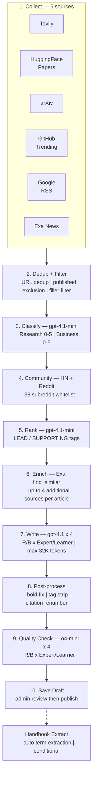

# AI News Pipeline Development Journey

> **Project:** [0to1log](https://0to1log.com) — AI News Curation + AI Glossary + IT Blog Platform
> **Duration:** Mid-February to March 30, 2026 (2 weeks planning + 26 days development)
> **Role:** Solo full-stack developer (planning, design, frontend, backend, AI, infrastructure)
> **Stack:** Astro v5 · FastAPI · Supabase · OpenAI (gpt-4.1) · Tavily · HN/Reddit APIs · Vercel · Railway

---

## At a Glance

A pipeline that collects 50–60 AI news articles daily from 6 sources, auto-classifies, ranks, enriches with multi-source context, and summarizes them into 2 digests (Research + Business) with Expert/Learner personas. Built over 26 days through 9 versions.

| | Start (v2) | v8 | Current (v9) |
|---|---|---|---|
| **Cost per run** | $0.18 | $0.25 | $0.42–0.77 |
| **Citations per digest** | 1.8 | 16.8 | 16.8 |
| **Sources per article** | 1 (original only) | 1 | up to 5 (Exa find_similar) |
| **Writer input tokens** | 14K | 57K | 132–318K |
| **News items covered** | 1.3 | 5.0 | 5.0 |
| **Collection sources** | 1 (Tavily) | 6 | 6 |
| **Quality score (Research)** | 75.8 | 91.8 | 91.8 |
| **Quality score (Business)** | 82.9 | 94.8 | 94.8 |

Through v8, quality improved 9.3x while keeping cost at $0.25/run. v9 introduced multi-source synthesis, raising cost to $0.42–0.77 because the Writer now processes full text from up to 5 sources per article — single-perspective summaries and multi-source synthesis produce fundamentally different quality. All figures measured from production databases.

Key discoveries:
1. Removing negative instructions ("don't do X") from LLM prompts improves output. Cutting the Research Expert Guide from 569 to 151 words and deleting all 9 DON'Ts increased per-item depth from 1 paragraph to 3.
2. Prompt examples determine LLM behavior. An empty-bracket citation format `[](URL)` in the prompt caused 3 of 4 personas to omit citations entirely.

---

## Table of Contents

1. [Project Overview](#1-project-overview)
2. [News Pipeline Evolution](#2-news-pipeline-evolution)
3. [Handbook Pipeline Evolution](#3-handbook-pipeline-evolution)
4. [Prompt Engineering: 8 Iterations](#4-prompt-engineering-8-iterations)
5. [Key Technical Decisions](#5-key-technical-decisions)
6. [Quantitative Results](#6-quantitative-results)
7. [Key Lessons](#7-key-lessons)
8. [Current Architecture](#8-current-architecture)

---

## 1. Project Overview

0to1log is an automated AI/IT news curation platform that collects, classifies, and summarizes the latest developments every day. It automatically extracts AI terms from news articles to build a glossary, and delivers content through two personas — Expert and Learner — tailored to different reader levels.

### Live Output

See actual daily digests at [0to1log.vercel.app](https://0to1log.vercel.app).

### Why I Built This

AI news floods in daily, but quality Korean-language technical briefings are scarce. News outlets often republish press releases verbatim or list headlines without technical context. I wanted to build a platform that automatically delivers two things: "a technical brief that a research engineer would read on their commute" and "an explanation accessible to someone new to AI."

### Current Architecture



---

## 2. News Pipeline Evolution

### Version History at a Glance

```
v1 ████████████████████████████████████████ 5 days (root cause discovery)
v2 ████████                                 1 day  (working)
v3 ████                                     half day (working)
v4 ██                                       half day (working)
v5 ████████████████                         8 days (stabilization)
v6 ██                                       1 day  (optimization)
v7 ████████                                 2 days (quality overhaul + rollback)
v8 ████████                                 2 days (structural separation)
v9 ████                                     1 day  (multi-source enrichment)
```

| | v1 | v2 | v3 | v4 | v5 | v6 | v7 | v8 | v9 |
|---|---|---|---|---|---|---|---|---|---|
| **Period** | 3/10–14 (5d) | 3/15 (1d) | 3/16 (½d) | 3/17 (½d) | 3/18–25 (8d) | 3/26 (1d) | 3/28–29 (2d) | 3/29–30 (2d) | 3/30 (1d) |
| **Outcome** | Root cause discovery | Working | Working | Working | Stabilized | Optimized | Quality overhaul | Structural separation | Multi-source enrichment |
| **Content** | Single article deep-dive | Single article, 3 personas | Digest of 3–5 articles | Digest, 2 personas | 4 sources + quality | Skeleton maps | Layered reading + CP | Ranking + Guide refactor | Exa find_similar + citation automation |
| **Daily cost** | N/A | $0.13 | $0.17–0.21 | $0.17–0.21 | $0.20 | $0.20 | $0.25 | $0.25 | $0.42–0.77 |
| **LLM calls** | 6 | 4 | 6 | 4 | 10 | 10 | 12 | 14 | 14 |

---

### v1: Finding the Root Causes (3/10–14, 5 days)

The first five days produced no publishable output — but they identified three architectural flaws that would have been invisible without building and testing the system end to end. Each flaw directly informed v2's design.

The initial strategy was straightforward: pick one news article, write an in-depth analysis in English, translate to Korean, then convert into three personas (Expert/Intermediate/Beginner).

Here's what happened over five days:

**Days 1–2:** Built the basic pipeline. Discovered that LLMs couldn't reliably generate 5,000+ character articles in a single call. Added retry logic.

**Day 3:** EN→KO translation reduced content length to 50–70% of the original. Added "maintain equal length" instructions to the translation prompt — no effect. Lowered the quality threshold from 5,000 to 3,500 characters.

**Day 4:** Intermittent JSON parsing failures. Built an artifact/resume system for mid-pipeline recovery. `pipeline.py` grew from 979 lines to 1,346 lines. Over 400 lines were purely defensive code.

**Day 5:** Lowered the quality threshold to 2,500 characters — 50% of the original target. "It works, but poorly." I stopped and deleted everything.

```
pipeline.py growth:
Day 1  ████████████████████  979 lines
Day 3  ██████████████████████████  1,200 lines
Day 5  ██████████████████████████████  1,346 lines (400+ defensive)
v2     ████████████  1,127 lines (rewritten from scratch)
```

**Root cause:** I was stacking patches on a broken architecture.

| Symptom | What I did (patch) | Root cause |
|---------|-------------------|------------|
| KO translation too short | Lowered quality bar | EN→KO sequential translation was the problem |
| LLM can't generate long text | Added retry logic | Single-call full generation was the problem |
| Mid-pipeline failures | Built artifact/resume | Pipeline was too tightly coupled |

**Cost of discovery:** $15–25 (estimated) in LLM calls with zero publishable output. But the three root causes identified here — sequential translation, monolithic generation, and hard validation — became the exact requirements for v2. Without this phase, v2's "build it in one day" would not have been possible.

---

### v2: Fix the Root Cause, Code Shrinks (3/15, 1 day)

I attacked v1's three root causes directly.

| v1 Root Cause | v2 Solution |
|---|---|
| EN generation → KO translation (length loss) | **Bilingual simultaneous generation** (no translation step) |
| Single call for entire article (unstable length) | **Fact extraction → per-persona generation** |
| Hard validation (pipeline crashes on quality) | **Draft-first** (save, let admin review) |

The key architectural change:

```
v1: Collect → Pick 1 → Generate EN → Translate KO → 3 persona variants
v2: Collect → Pick 1 → Extract facts → Per-persona EN+KO simultaneous generation
```

The **fact extraction step** was the breakthrough. Instead of asking the LLM to "understand + write" in one call, I separated the two: first extract key facts, figures, and quotes into a structured JSON (FactPack), then have each persona write their version based on that FactPack.

**Why this approach:** The alternative was improving the EN→KO translation prompt — adding length constraints, retry on short output. But the root cause was architectural: translation inherently loses content. Generating both languages from the same FactPack eliminated the problem entirely, rather than patching symptoms.

**Result:** Code shrank to 1/3, and it worked in a single day. Every line of defensive code from v1 became unnecessary.

---

### v3: Good Infrastructure Makes Product Changes Fast (3/16, half day)

With v2 working reliably, the content strategy's limitations became obvious: covering only one article per day was low-value. AI news produces dozens of stories daily; picking just one meant missing everything else.

**Decision:** Single article deep-dive → **Daily digest** (curating 3–5 articles)

Because v2 had solid infrastructure, very little needed to change:
- `rank_candidates()` → `classify_candidates()` (picking 1 → categorized classification)
- Two categories: Research (papers/models/open-source) and Business (big-tech/industry/new-tools)
- Prompt rewrite (single article analysis → digest format)

Pipeline skeleton, logging, error handling, DB schema — all unchanged. **Good infrastructure accelerates product iteration.**

---

### v4: 2-Persona Transition and Parallelization (3/17, half day)

Two major changes:

**1. Three personas → Two (Expert + Learner)**

Running three personas (Expert/Intermediate/Beginner) revealed that Intermediate and Expert were too similar. From the reader's perspective, it was also hard to self-identify: "I kind of know this stuff" fits neither Expert nor Beginner.

Expert (in-depth) and Learner (accessible) — two clear axes. "Do I want depth, or do I want understanding?"

- LLM calls: 6 → 4 (2 categories × 2 personas)
- Cost: -33%
- UX: Fewer choices, more intuitive

**Why not keep 3 personas:** Intermediate content overlapped 70%+ with Expert. The alternative was differentiating Intermediate further, but this would triple prompt maintenance cost for marginal UX value. Two clear axes (depth vs. accessibility) served readers better than three ambiguous levels.

**2. Pipeline Parallelization — 170s → 90s (47% reduction)**

All LLM calls were running sequentially. Analysis revealed three parallelization opportunities:

| Optimization | Time saved |
|-------------|-----------|
| Research + Business digests concurrently | 25s |
| Handbook Call 2 and Call 3 | 5s per term |
| 2 handbook terms simultaneously | 30s |
| **Total** | **80s (170s to 90s)** |

Same token usage, same cost — just eliminated wait time.

---

### v5: Source Diversification and Quality Framework (3/18–25, 8 days)

Through v4, the pipeline relied solely on **Tavily news search**. This created a critical bias.

**Problem discovered (3/24):** The Research digest contained zero actual research papers. Articles like "Arm AI chip announcement" and "LG Display low-power LCD" were classified as research.

**Three root causes:**
1. **Source bias** — Only Tavily (news search). No direct collection of papers, code, or models, so the candidate pool itself lacked research material
2. **Vague classification criteria** — Broad definitions like "papers: breakthrough results." No negative examples
3. **Forced quotas** — "Select 3–5 articles" rule forced subpar articles into research

**Solutions:**

**A. Four-source parallel collection**

| Source | Target | Daily candidates |
|--------|--------|-----------------|
| Tavily | General AI news | 15 |
| HuggingFace Daily Papers | Community-curated papers | 10 |
| arXiv API | Latest papers (cs.AI/cs.CL/cs.LG) | 10 |
| GitHub Trending | ML open-source repos | 10 |

Candidate pool: 30 to **45/day**. Collected via `asyncio.gather()`.

**B. Classification prompt hardening**
- Research entry criteria: must be based on technical artifacts (model weights/code/papers)
- Litmus test: "Is this article primarily about a model, code, or paper?"
- **0-to-5 rule**: empty list is allowed if nothing qualifies. No forced filling

**C. Prompt audit (52 issues)**
Full audit of all prompt files, classified into three priority levels:
- **P0 (Critical, 6):** URL hallucination prevention, citation mapping, factual error prevention
- **P1 (Important, 18):** Token efficiency, few-shot examples, score definitions
- **P2 (Nice-to-have, 28):** Code standards, structural clarity, naming

**D. Model switch: gpt-4o → gpt-4.1**
- IFEval (instruction following): 87.4% vs 81%
- Cost: input $2.00/M vs $2.50/M (20% cheaper)
- A/B test result: gpt-4.1 more consistent with identical prompts

**Alternatives considered:** gpt-4o (existing, familiar), Claude 3.5 Sonnet (strong instruction following), gpt-4.1-mini (cheaper). A/B tested gpt-4o vs gpt-4.1 — same prompts, same failure patterns, but gpt-4.1 scored 6% higher on IFEval and cost 20% less on input tokens. Claude was not tested due to SDK switching cost and existing PydanticAI + OpenAI integration.

**E. Automated quality scoring**
- 4 criteria × 25 points = 100 total
- Section Completeness, Source Citations, Technical Depth, Language Quality
- Evaluated by gpt-4.1-mini ($0.004/check)

---

### v6: Skeleton Maps — The Decisive Prompt Structure Change (3/26, 1 day)

Through v5, the prompt listed 13 writing rules. The LLM only partially followed them — especially KO content, which was consistently shorter than EN with missing sections.

**Key discovery:** Switching models (gpt-4o ↔ gpt-4.1) produced the same failure patterns. It wasn't the model — it was the prompt.

**Solution: Per-persona skeletons (complete output examples)**

Instead of listing rules, I showed the LLM the exact skeleton of the desired output. Four separate skeletons for each combination:

```
SKELETON_MAP = {
    ("research", "expert"):  RESEARCH_EXPERT_SKELETON,
    ("research", "learner"): RESEARCH_LEARNER_SKELETON,
    ("business", "expert"):  BUSINESS_EXPERT_SKELETON,
    ("business", "learner"): BUSINESS_LEARNER_SKELETON,
}
```

**Results:**

| Version | EN Biz | EN Res | KO Biz | KO Res | Avg |
|---------|--------|--------|--------|--------|-----|
| v1 (rules only) | 50 | 75 | 60 | 40 | **56** |
| v3 (1 skeleton) | 85 | 90 | 65 | 60 | **75** |
| v6 (4 skeletons) | 95 | 93 | 85 | 88 | **90** |

Automated quality scores (gpt-4.1-mini, single-run peak):
- **Business: 99** (Expert 100, Learner 98)
- **Research: 95** (Expert 95, Learner 95)

---

### v7: Quality Overhaul and Rollback Lesson (3/28–29, 2 days)

v6 scored 90/100 on automated checks. But reading the actual published content from a **user's perspective** averaged 76/100.

Five problems invisible to automated scoring:

| Problem | Automated score | User experience |
|---------|---------------|-----------------|
| Google News redirect URLs | Not checked | Readers can't reach sources |
| Filler articles | Not checked | Empty clickbait |
| Expert ≈ Learner (70% overlap) | Not checked | Why switch personas? |
| All items same depth | Not checked | No editorial hierarchy |
| No community reactions | Not checked | Missing social proof |

**v7 changes:** Layered Reading Design (Expert assumes readers read Learner), Weighted Depth (lead 3-4 paragraphs), real-comment Community Pulse (HN Algolia + Reddit JSON), 4 persona-aware quality checks, bold markdown post-processing.

**Rollback lesson:** Stacking 3 prompt changes in one commit crashed the score from 86.5 to 66.5. Rolled back to last verified state and selectively re-applied only 3 proven changes. Prompt changes must be verified one at a time.

---

### v8: Structural Separation and the DON'T Removal (3/29–30, 2 days)

v7 scored 85.3 overall, but Research Expert remained stubbornly short — 1 paragraph per item. Three structural causes:

**1. Classification and ranking coupled.** Importance scores were superficial, so all 5 items got equal depth.

**2. Research Expert Guide had too many DON'Ts.** 569 words, 9 negative instructions. LLM over-interpreted as "write less." Business Expert Guide: 201 words, zero DON'Ts, scoring 90.

**3. Skeleton placeholders taught wrong patterns.** Only first item fully written; rest were `[3 paragraphs...]`.

**Solutions:**

**A. Classification/ranking separation** — New `rank_classified()` function (gpt-4.1-mini) assigns `[LEAD]`/`[SUPPORTING]` tags. Cost: $0.00014/run.

**Why remove rather than rewrite:** The alternative was rewriting DON'Ts as positive instructions. But Business Expert was already proving fewer words + zero DON'Ts = higher scores. Per-item depth jumped from 1 to 3 paragraphs.

**B. Research Expert Guide refactoring:** 569 to 151 words, DON'Ts 9 to 0.

**C. Skeleton 2nd item fully written.** **D. Exa promoted to independent collector (5 to 6 sources).** **E. Community Pulse overhaul (mood summaries + 38-subreddit whitelist).**

**v8 result:** All 4 personas scored 90/100 — the first version where every combination scored equally.

---

### v9: Multi-Source Enrichment and Citation Automation (3/30, 1 day)

Backfill testing of v8 (3/21, 3/22) revealed two structural problems:

**1. Writer saw only 1 source.** The `raw_content[:4000]` limit passed only the original article's perspective. Other outlets covering the same story, additional benchmarks, and counterpoints never reached the Writer.

**2. Citation numbers reset per section.** The LLM treated each `###` block independently, restarting from `[1]`. source_cards had 19 entries but the body only used `[1]-[4]` repeatedly.

**Solutions:**

**A. Multi-Source Enrichment** — New `enrich_sources()` function uses Exa `find_similar_and_contents()` to collect up to 4 related sources per ranked article. Removed the 4000-char limit, passing full article text to Writer. A new "enrich" stage was added to the pipeline.

**Why this approach:** The alternative was telling the Writer to "reflect diverse perspectives." But the Writer cannot know what it wasn't given — diversifying the sources themselves is the root-cause fix.

**B. Citation renumbering via code post-processing** — LLM inserts `[N](URL)` with any numbers; `_renumber_citations()` reassigns sequential numbers by URL first-appearance. source_cards are extracted by code, LLM's `sources` JSON is ignored.

**The power of prompt examples:** An empty-bracket citation format `[](URL)` in the prompt caused 3 of 4 personas to omit citations entirely. Restoring `[1](URL)` immediately fixed it. Prompt examples are not neutral — the LLM follows the pattern literally.

**Cost impact:** $0.25 to $0.42–0.77 per run (avg $0.55). Writer input tokens grew from 57K to 132–318K. Single-source summaries and multi-source synthesis are fundamentally different in quality — an acceptable trade-off.

| Date | Version | Writer tokens | Run cost |
|------|---------|-------------|---------|
| 3/28 | v8 | 57K | $0.27 |
| 3/20 | v9 early | 153K | $0.46 |
| 3/21 | v9 | 236K | $0.62 |
| 3/22 | v9 peak | 318K | $0.77 |

---

## 3. Handbook Pipeline Evolution

The Handbook (AI glossary) is tightly coupled with the news pipeline. It automatically extracts AI terms from news articles and generates explanations at two levels: Basic (accessible to beginners) and Advanced (senior engineer reference material).

### Initial → 4-Call Split (3/15–17)

**Problem:** Generating all 16 fields (KO/EN × basic/advanced × 4 sections) in a single LLM call caused later fields to be shallow or missing entirely. LLM token limits in action.

**Solution:** Split into 4 sequential calls:

```
Call 1: Metadata + Basic KO
Call 2: Basic EN        --+  parallel
Call 3: Advanced KO     --+
Call 4: Advanced EN
```

Calls 2 and 3 are independent — run in parallel. 5s saved per term.

### 10 Term Types (3/18)

**Problem:** Using the same prompt for every term meant "BERT," "Kubernetes," and "Funding Round" all got similar-depth explanations. Algorithms need formulas; infrastructure tools need architecture diagrams; business terms need case studies.

**Solution:** Classify each term into one of 10 types using gpt-4.1-mini, then apply type-specific depth prompts:

| Type | Examples | Depth comes from |
|------|----------|-----------------|
| Algorithm/Model | BERT, Transformer | Formula derivation, complexity analysis, code |
| Infrastructure/Tool | Docker, CUDA | Architecture diagrams, configs, troubleshooting |
| Business/Industry | Funding Round | Market data, decision frameworks |
| Concept/Theory | Overfitting | Mathematical intuition, trade-offs |
| Product/Brand | GPT-4, Claude | Competitive comparison, API specs, benchmarks |
| Metric/Measure | F1, BLEU | Formula derivation, selection criteria, misuse cases |
| Technique/Method | Prompt Engineering | Variant comparison, failure patterns |
| Data Structure/Format | Parquet, ONNX | Internal structure, benchmarks |
| Protocol/Standard | OAuth 2.0, gRPC | Handshake flows, security models |
| Architecture Pattern | Microservices, RAG | Trade-off analysis, migration strategies |

Classification cost: $0.001/term (single gpt-4.1-mini call).

### Tavily Integration + Self-Critique (3/18)

**Problem:** LLMs don't know information beyond their knowledge cutoff. Terms about "a new model released in March 2026" would lack the latest details.

**Solution:**
1. **Tavily search**: Fetch 5 web results for context before generation
2. **Reference injection**: Feed Tavily results as context to all 4 generation calls
3. **Self-critique**: gpt-4.1-mini evaluates "what would a senior engineer find lacking?" Score below 75 → regenerate
4. **Quality scoring**: 4 criteria (depth/accuracy/uniqueness/completeness) × 25 points

### Confidence-Based Routing (3/23–25)

Some auto-extracted terms were common nouns, not technical terms. Marketing phrases with suffixes like "-powered" and "-driven" slipped through.

**Dual defense:**
1. **Suffix pattern matching** (first pass): Hardcoded patterns for fast filtering. Zero cost
2. **LLM second-pass filtering**: gpt-4.1-mini picks "real technical terms only." $0.01

**Confidence routing:**
- High confidence → automatic generation (4-call + quality check)
- Low confidence → `status: queued` (human reviews before generation)

---

## 4. Prompt Engineering: From 56 to 90 Points

The news prompt file (`prompts_news_pipeline.py`) accumulated **50 commits**. Prompt engineering was the most iterative — and most educational — part of this project.

### Record of 8 Iterations

| Iteration | Score | Key change | Lesson |
|-----------|-------|-----------|--------|
| v1 | **56** | 13 writing rules listed | Rules alone don't make LLMs comply |
| v2 | **48** | gpt-4o rollback (A/B test) | Same failure patterns with different model → it's the prompt, not the model |
| v3 | **75** | Added 1 few-shot skeleton | LLMs follow **complete examples** far more accurately than rules |
| v4 | **84** | Added KO skeleton + structural parity | "80% of EN length" is wrong for Korean — same content is naturally shorter |
| v5 | **84** | Structural equivalence (section/item/paragraph count) | Verify by **structure** (section count, item count), not character count |
| v6 | **90** | 4 per-persona skeletons | Sharing one skeleton across 4 personas causes style contamination |
| v7 | **85.3** | User-perspective eval + rollback | Automated scores miss real UX problems; stack prompt changes = regression |
| v8 | **90.0** | Remove DON'Ts + skeleton-rule consistency | "Don't do X" makes LLMs over-correct; skeleton beats rules when they conflict |
| v9 | **90.0** | Multi-source enrichment + citation automation | Empty bracket in prompt example killed citations; code beats LLM for formatting |

### Key Lessons

**1. "It's the prompt, not the model"**

In v2, I ran an A/B test: gpt-4o vs gpt-4.1. Both failed identically — ignored section headers, dropped citations, abbreviated KO content. Before switching models, restructure the prompt.

**2. Few-shot skeletons >> rule lists**

13 rules (v1, 56 points) vs. same rules + 1 skeleton (v3, 75 points). LLMs understand "do it like this" far better than "follow these rules."

**3. Per-persona skeletons are essential**

In v3–v5, one Business Expert skeleton was shared across all 4 combinations. Research Learner wrote like Business Expert — jargon instead of analogies, dense analysis instead of accessible explanation. After splitting skeletons, Research Learner began producing: "Instead of reading one character at a time, it processes the entire page at once — this is called parallel diffusion decoding."

**4. Korean quality requires structural parity, not character counting**

"At least 80% of EN length" is the wrong metric for Korean. Korean expresses the same content more concisely than English. Switching to "same number of ## sections, ### items, and paragraphs" equalized KO/EN coverage.

**5. Sandwich pattern: checklist at the end of the prompt**

Placing a FINAL CHECKLIST (8 verification items) at the bottom of the prompt improved compliance with citation format, section presence, and KO=EN parity. The LLM reads it just before finishing output.

**6. Code post-processing > prompt instructions**

Asking the LLM to link handbook terms in-text: 70% accuracy. Doing it in code post-processing: 100%. Knowing the boundary between "what LLMs do well" and "what code should handle" is critical.

---

## 5. Key Technical Decisions

### 3-Tier Model Structure

| Tier | Model | Usage | Price (input/output per 1M tokens) |
|------|-------|-------|-------------------------------------|
| Main | gpt-4.1 | Digest generation, handbook content | $2.00 / $8.00 |
| Light | gpt-4.1-mini | Classification, SEO, review, quality eval | $0.40 / $1.60 |
| Reasoning | o4-mini | News ranking, fact-checking | $1.10 / $4.40 |

Why gpt-4.1: IFEval (instruction following) 87.4% — 6 points higher than gpt-4o, and 20% cheaper on input tokens.

### Draft-First Principle

> "Never stop the pipeline for content quality. Only retry for infrastructure errors."

If quality is below threshold, save as draft and let admin review. The pipeline itself never stops. This was the biggest architectural shift from v1 to v2.

### The 0-to-5 Rule

If no news article qualifies for the Research category, **allow an empty list**. The "select 3–5 articles" forced quota actually degraded quality — it pushed subpar articles into the digest.

### Cost Optimization: What I Chose NOT to Do

| Considered | Decision | Reason |
|-----------|----------|--------|
| Use gpt-4.1-mini for classification | Rejected | $0.03/day savings but classification quality risk |
| Remove quality checks | Rejected | $0.004/day savings but prerequisite for auto-publish |
| Remove handbook self-critique | Rejected | $0.02/term savings but needed to guarantee quality floor |

---

## 6. Quantitative Results

All numbers below are measured from production databases (`pipeline_logs` for costs, `news_posts` for quality metrics), not estimates.

### Cost per Run (pipeline_logs, failed runs excluded)

| Period | Runs | Avg cost/run | Range | Key change |
|--------|------|-------------|-------|-----------|
| v2–v4 | 13 | **$0.18** | $0.13–$0.21 | Single source, 4000 char limit |
| v5–v6 | 10 | **$0.20** | $0.11–$0.28 | 4 sources + skeleton maps |
| v7–v8 | 4 | **$0.25** | $0.20–$0.27 | Ranking separation + DON'T removal |
| v9 | 3 | **$0.55** | $0.42–$0.77 | Multi-source enrichment (Writer 5.6x) |

### Quality: Same Cost, Better Output (news_posts, EN)

| Metric | | v2–v4 | v5–v6 | v7–v8 |
|--------|---|-------|-------|-------|
| **Quality score** | Research | 75.8 | 92.2 | **91.8** |
| | Business | 82.9 | 94.1 | **94.8** |
| **Expert citations** | Research | 1.8 | 12.9 | **16.8** |
| | Business | 2.7 | 13.9 | **14.2** |
| **News items covered** | Research | 1.3 | 4.6 | **5.0** |
| | Business | 2.7 | 3.6 | **4.5** |
| **Avg cost/run** | All | $0.18 | $0.20 | $0.25 | **$0.55** |

*Quality scores are automated LLM evaluation (100-point scale). From v5 onward, evaluation switched to 4 persona-specific prompts — a stricter standard — yet scores improved.*

**Summary:** Through v8, cost stayed at $0.18–$0.25 while citations grew 9.3x and coverage 3.8x. v9 introduced multi-source synthesis, raising cost to $0.55 avg — because the Writer now processes full text from up to 5 sources per article. Single-perspective summaries and multi-source synthesis produce fundamentally different results.

### Codebase Scale

| Component | Lines |
|-----------|-------|
| Frontend (Astro + TS) | 54,000 |
| Backend (Python) | 11,000 |
| AI agent code | 5,700 (52% of backend) |
| Tests | 64, all passing |
| Design/plan documents (Vault) | 204 .md files |

---

## 7. Key Lessons

### When quality thresholds go down, the architecture is wrong

In v1, I kept lowering the quality bar: 5,000 chars → 3,500 → 2,500. That was the signal to stop patching and redesign. When v2 fixed the architecture, v1's 400 lines of defensive code became entirely unnecessary.

### Removing DON'Ts makes LLMs perform better

Deleting all 9 DON'Ts from the Research Expert Guide improved per-item depth from 1 paragraph to 3. LLMs over-interpret negative instructions. The Business Expert Guide was already scoring 90 with 201 words and zero DON'Ts — applying the same pattern to Research confirmed it.

### Skeletons beat rules when they conflict

Even with "minimum 3 paragraphs" stated in 6 places, if the skeleton shows `[2-3 paragraphs]`, the LLM picks 2. Rules, skeletons, and quality checks must be consistent for the LLM to follow intent.

### Prompt changes must be verified one at a time

In v7, stacking 3 prompt changes in one commit caused a score drop from 86.5 to 66.5. Impossible to isolate the cause. "Rollback + selective re-apply" is safer than "patch the patches."

### Accept LLM limitations, compensate with code

Handbook term linking: prompt accuracy 70%, code post-processing 100%. Citation renumbering: LLM resets per section, code handles it perfectly. The boundary between "what LLMs do well" (writing, classifying) and "what code does well" (exact matching, format enforcement) became one of the most valuable intuitions from this project.

### Prompt examples are not neutral

In v9, an empty-bracket citation format `[](URL)` in the prompt caused 3 of 4 personas to omit citations entirely. Restoring `[1](URL)` fixed it immediately. LLMs follow example patterns literally — examples are effectively stronger instructions than rules.

---

## 8. Current Architecture

The full news pipeline flow is shown in the [architecture diagram](#current-architecture) (Mermaid) above.

### Handbook Term Generation Flow

```
Term input
    |
    +-- Tavily search (5 results)        --+  parallel
    +-- gpt-4.1-mini type classification --+
                |
                v
    Select type-specific depth prompt
                |
    +-------------------------------+
    | Call 1: Meta + Basic KO       |
    | Call 2+3: Basic EN // Adv KO  |  <-- parallel
    | Call 4: Advanced EN           |
    +-------------------------------+
                |
    Self-Critique (gpt-4.1-mini)
    score < 75 --> regenerate
                |
    Quality Check (4 criteria x 25 points)
    score < 60 --> warning flag
                |
                v
    Save (draft / queued)
```

### Tech Stack Overview

| Layer | Technology | Hosting |
|-------|-----------|---------|
| Frontend | Astro v5 + Tailwind CSS v4 + TypeScript | Vercel |
| Backend | FastAPI + PydanticAI | Railway |
| AI | OpenAI (gpt-4.1 / gpt-4.1-mini / o4-mini) + Tavily | - |
| Database | Supabase (PostgreSQL + Auth + RLS) | Supabase |

---

> This document chronicles the AI pipeline development journey of 0to1log.
> 9 pipeline versions, evolving from single-source summaries to multi-source synthesis,
> and the discoveries that removing instructions improves output,
> and that a single prompt example can determine the entire output.
> As a solo project, I handled every stage from planning to deployment.
