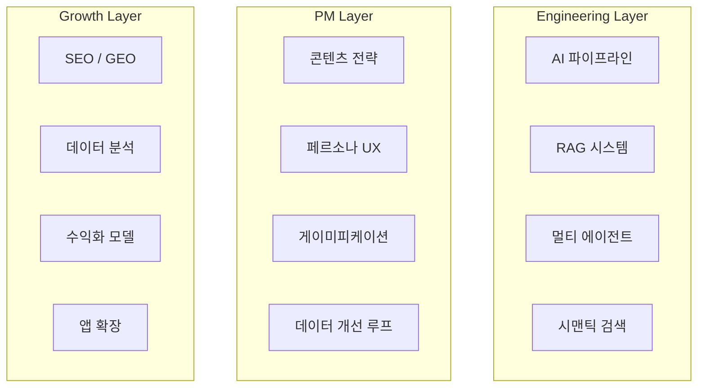

# Project Vision

**0to1log**는 무(0)에서 유(1)를 창조하는 AI 엔지니어의 성장 기록이자, 최신 LLM 에이전트 기술이 집약된 ==지능형 콘텐츠 플랫폼==이다.

## 세 가지 목표

- **포트폴리오** — AI 파이프라인 설계, 에이전트 시스템 구현, 제품 기획 역량을 실제 작동하는 서비스로 증명
- **콘텐츠 플랫폼** — AI 뉴스와 기술 학습 콘텐츠를 독자 수준별로 재가공하여 실질적 가치 전달
- **비즈니스 성장** — 데이터 기반 그로스 전략과 수익화를 통해 사이드 프로젝트를 지속 가능한 프로덕트로 발전

> [!tip] Global-to-Local 확장 비전
> 영문 원천 데이터와 한국/글로벌 독자를 연결하는 상위 전략 → [[Global-Local-Intelligence]]

## 핵심 역량 구조

## 제약 조건

| 항목 | 내용 |
|------|------|
| **인원** | 1인 개발 & 운영 (Solo) — Claude Code (Opus 4.6) 바이브코딩 활용 |
| **예산** | Stage A: 무료/저비용 → Stage B: Railway Always-on 상향 |
| **시간** | Phase 1~2 MVP 우선, 이후 점진적 확장 |
| **비용 최적화** | 단순 분류 `gpt-4o-mini`, 품질 중요 `gpt-4o`로 분리 |
| **수익화 순서** | SEO 오가닉 → AdSense → 프리미엄 구독 |

## Related
- [[Target-Audience]] — 이 비전이 서비스하는 대상

## See Also
- [[Phase-Flow]] — 비전을 실현하는 단계별 Phase/Gate (09-Implementation)
- [[System-Architecture]] — 비전을 구현하는 기술 아키텍처 (02-Architecture)
