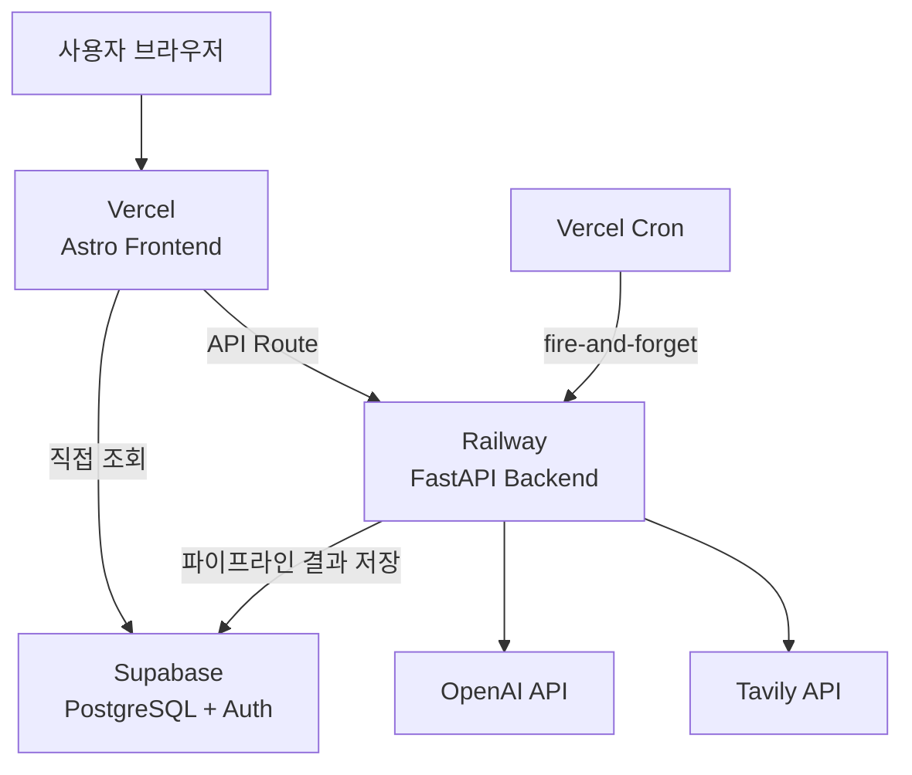

# System Architecture

0to1log의 전체 시스템 아키텍처.

## 서비스 구조

- **[[Frontend-Stack\|Astro 프론트엔드]]** → Vercel (SSG/SSR, 도메인, Cron)
- **[[Backend-Stack\|FastAPI 백엔드]]** → Railway (AI 파이프라인, 검색, 커뮤니티)
- **[[Database-Schema-Overview\|Supabase DB]]** → PostgreSQL + pgvector + Auth

## 데이터 흐름

1. [[AI-News-Pipeline-Overview\|뉴스 파이프라인]]: 수집 → 랭킹 → 생성 → 검수
2. Research → 자동 발행 / Business → [[Admin]] 수동 발행
3. [[Persona-System]]이 Business를 3페르소나 버전으로 변환
4. [[Database-Schema-Overview#news_posts\|news_posts]] 테이블에 저장

## 핵심 ADR

- **Railway 범용 API 백엔드:** Phase 3~4 검색/커뮤니티를 위해 범용 구조 선택
- **fire-and-forget 패턴:** Vercel 10초 제한 우회, Railway 비동기 실행
- **댓글 Supabase 직결:** 단순 CRUD는 RLS로 충분, FastAPI 미경유

## Related

- [[AI-News-Pipeline-Overview]] — AI 파이프라인 상세
- [[Backend-Stack]] — 백엔드 스택 + API 목록
- [[Frontend-Stack]] — 프론트엔드 스택
- [[Deployment-Pipeline]] — 배포 파이프라인
- [[Cost-Model-&-Stage-AB]] — 비용 모델
