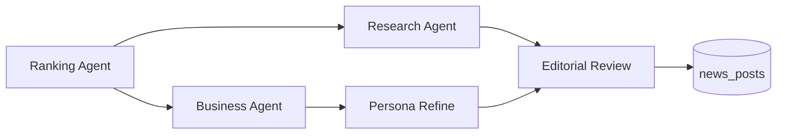

# Daily Dual News

매일 2개 AI NEWS 발행: ==Research==(기술 심화, 자동) + ==Business==(시장 분석, 수동 검수).

## 두 가지 뉴스 트랙

| 카테고리 | AI 워크플로우 | 설명 |
|---|---|---|
| **AI NEWS (Research)** | 단일 버전 (자동 발행) | 기술 심화 분석 — 모델, 논문, 오픈소스 중심. 뉴스 없는 날은 "없음" 공지 + 최근 동향 보충 |
| **AI NEWS (Business)** | 3페르소나 (수동 검수) | 시장 분석 — [[Persona-System|3페르소나 버전]] + Related News 3카테고리 (Big Tech / Industry / New Tools) |

## URL 구조

- `/en/news/` → EN AI 뉴스 리스트
- `/en/news/[slug]` → EN 뉴스 상세
- `/ko/news/` → KO AI 뉴스 리스트
- `/ko/news/[slug]` → KO 뉴스 상세

> [!info] DB 테이블
> `news_posts` 테이블에서 `post_type`으로 Research/Business 구분. 좋아요/댓글은 `news_likes`/`news_comments`로 분리.

## AI 파이프라인 흐름

## Related

- [[AI-News-Pipeline-Overview]] — 뉴스를 생성하는 멀티 에이전트 시스템
- [[Persona-System]] — Business 뉴스의 3단계 페르소나 재가공
- [[AI-NEWS-Research-Writing]] — Research 뉴스 작성 가이드
- [[AI-NEWS-Business-Writing]] — Business 뉴스 작성 가이드
- [[Content-Strategy]] — 뉴스 콘텐츠의 상위 전략
