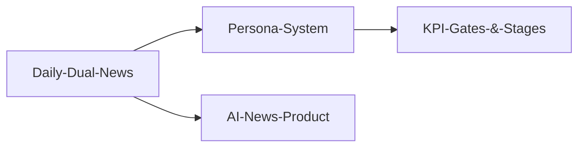

# Features

> 0to1log 제품 기능: 뉴스 큐레이션, 페르소나, 용어집, 커뮤니티.

## Core (Tier 1 — MVP)

- [[Daily-Dual-News]] — 핵심 기능: 기술+비즈니스 듀얼 뉴스
- [[AI-News-Product]] — AI 뉴스 제품 전체 정의
- [[Persona-System]] — 3단계 페르소나 콘텐츠 (입문자/학습자/현직자)
- [[IT-Blog]] — IT 블로그 기능
- [[Admin]] — 관리자 대시보드 + 에디터 시스템
- [[Handbook]] — AI 용어집 (AI Glossary) — 데이터 모델, 공개/Admin 페이지, 피드백

## Advanced (Tier 2)

- [[MyLibrary]] — 내 서재 (북마크, 읽기 기록)

## Community (Tier 3)

- [[Community-&-Gamification]] — 커뮤니티 + 게이미피케이션 시스템

## Feature Dependencies

## Related

- [[04-AI-System/_MOC|AI System]] — 기능을 구동하는 AI 파이프라인
- [[05-Content/_MOC|Content]] — 기능에 담기는 콘텐츠 전략
- [[08-Design/_MOC|Design]] — 기능의 UI/UX 디자인
