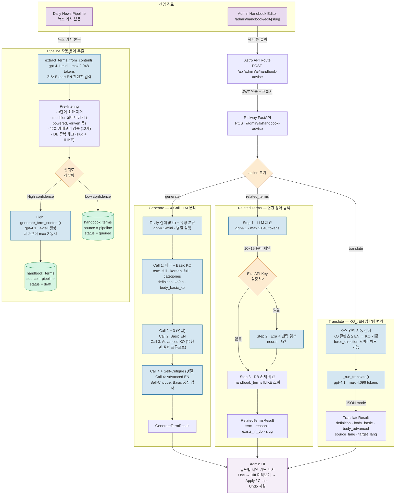
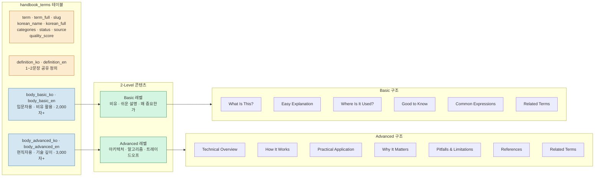
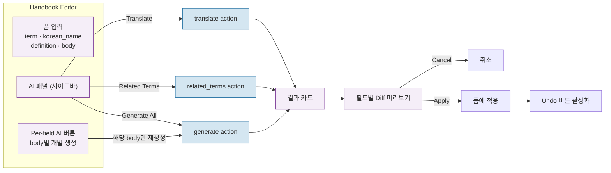

# AI Handbook Pipeline Overview (v5)

Handbook(AI 용어집) 콘텐츠의 AI 생성·번역·연관 용어 탐색 파이프라인. Admin 에디터에서 수동 트리거하는 ==어드바이저 모드==와, 뉴스 파이프라인에서 자동으로 용어를 추출하는 ==파이프라인 모드==로 구분된다.

> [!note] v5 변경 (2026-03-23~25)
> - 모델: gpt-4o → **gpt-4.1** (main), gpt-4o-mini → **gpt-4.1-mini** (light)
> - Pipeline 추출: 상세 pre-filtering 추가 (긴 용어, modifier 접미사, 카테고리 검증)
> - 신뢰도 기반 라우팅: High → 자동 생성, Low → queued (수동 리뷰)
> - 동시성 제한: 세마포어 max 2 병렬 생성

## Handbook AI 전체 흐름



### 데이터 모델 & 콘텐츠 구조



## Action 1: Generate — 4-Call LLM 분리 생성

`_run_generate_term()` · `GENERATE_BASIC_PROMPT` / `GENERATE_ADVANCED_PROMPT`

KO/EN 누락 버그 해결을 위해 4회 LLM 호출로 분리 구현됨. Advanced는 Tavily 검색 + 유형 분류 기반 심화 프롬프트 사용.

| Call | 모델 | 생성 필드 | 병렬 | 특이사항 |
|---|---|---|---|---|
| **전처리** | Tavily + gpt-4.1-mini | 검색 컨텍스트 + 유형 분류 | 병렬 | Call 3-4에 주입 |
| **Call 1** | gpt-4.1 | `term_full`, `korean_full`, `categories`, `definition_ko/en`, `body_basic_ko` | — | 메타 + KO Basic, KO 누락 시 재시도 |
| **Call 2** | gpt-4.1 | `body_basic_en` | Call 2+3 병렬 | EN Basic (Call 1 definition 컨텍스트 전달) |
| **Call 3** | gpt-4.1 | `body_advanced_ko` | Call 2+3 병렬 | Tavily + 유형분류 + 유형별 심화 프롬프트 |
| **Call 4** | gpt-4.1 | `body_advanced_en` | Call 4+SC 병렬 | Call 3와 동일 컨텍스트 사용 |
| **Self-Critique** | gpt-4.1 | 품질 경고 | Call 4+SC 병렬 | Basic 섹션 품질 검사, score < 70 시 경고 |

- ==비어있는 필드만 생성==, 기존 콘텐츠가 있으면 해당 필드는 그대로 유지
- body_basic: 비유 중심, 일상 언어, 2,000자 이상
- body_advanced: 기술적 깊이, 아키텍처·알고리즘·복잡도 분석, 3,000자 이상
- 10개 카테고리: `ai-ml`, `db-data`, `backend`, `frontend-ux`, `network`, `security`, `os-core`, `devops`, `performance`, `web3`
- term_full: 영문 풀네임 (예: "Long Short-Term Memory") / korean_full: 한국어 풀네임 (예: "장단기 기억 네트워크")

## Advanced Quality System

`HANDBOOK-ADV-01` (2026-03-18) 구현. Advanced 콘텐츠를 시니어 개발자 레퍼런스 수준으로 끌어올리는 4단계 파이프라인.

### 흐름 (Call 3-4 전처리)

```
Tavily 검색 (5건) ─┐
                    ├─ 병렬 실행 ─→ combined_context → Advanced 프롬프트 주입
gpt-4.1-mini 유형분류 ─┘
         ↓
유형별 심화 프롬프트 (10가지 TYPE_DEPTH_GUIDES 중 1개 선택)
         ↓
Call 3 (KO Advanced) 생성
         ↓
Self-critique (score < 75 시 약점 피드백 + 재생성)
         ↓
Quality scoring (0~100, gpt-4.1-mini) → DB 저장
```

### 10가지 용어 유형 분류

| 유형 | 예시 |
|---|---|
| `algorithm_model` | BERT, Transformer, GAN, Gradient Descent |
| `infrastructure_tool` | Docker, Kubernetes, CUDA, TensorFlow |
| `business_industry` | Funding Round, SaaS, Product-Market Fit |
| `concept_theory` | Overfitting, Bias-Variance Tradeoff, CAP Theorem |
| `product_brand` | GPT-4o, Claude, Midjourney, GitHub Copilot |
| `metric_measure` | AUC, F1 Score, BLEU, Perplexity |
| `technique_method` | Data Augmentation, Prompt Engineering, A/B Testing |
| `data_structure_format` | Parquet, B-Tree, Protocol Buffers, ONNX |
| `protocol_standard` | OAuth 2.0, HTTP/3, gRPC, WebSocket |
| `architecture_pattern` | Microservices, Event Sourcing, CQRS, RAG |

### 비용 영향

- 추가 비용: ~$0.07/용어 (22% 증가, $0.32 → $0.39)
- Tavily 검색: ~5 API 호출/용어
- Self-critique: 조건부 (score < 75인 경우만 재생성)

**핵심 파일:**
- `backend/services/agents/prompts_handbook_types.py` — 유형 분류 프롬프트 + 10가지 심화 가이드 + Self-critique 프롬프트

---

## Action 2: Related Terms — 연관 용어 탐색

`_run_related_terms()` · `RELATED_TERMS_PROMPT`

3단계 파이프라인:

1. **LLM 제안** (gpt-4.1, 2,048 tokens) — 10~15개 연관 용어 + 이유
2. **Exa 시맨틱 검색** (선택, `exa_api_key` 설정 시) — neural 검색 5건, LLM 제안과 중복 제거 후 병합
3. **DB 존재 확인** — 각 용어를 `handbook_terms`에서 ILIKE 조회 → `exists_in_db` + `slug` 반환

> [!tip] Admin UI 활용
> `exists_in_db=true`인 용어는 클릭하면 해당 용어 편집 페이지로 이동. `false`인 용어는 "새 용어 만들기" 액션으로 연결.

## Action 3: Translate — KO↔EN 양방향 번역

`_run_translate()` · `TRANSLATE_PROMPT`

| 항목 | 값 |
|---|---|
| **모델** | gpt-4.1 |
| **max_tokens** | 4,096 |
| **temperature** | 0.2 |
| **소스 언어 감지** | KO 콘텐츠 길이 ≥ EN → KO→EN, 그 반대면 EN→KO |
| **오버라이드** | `force_direction`: `"ko2en"` 또는 `"en2ko"` |
| **출력** | `TranslateResult` — definition + body_basic + body_advanced + source/target_lang |

- 마크다운 포맷 보존
- basic은 비유·일상 톤 유지, advanced는 기술적 정밀 톤 유지
- 비어있는 필드는 번역하지 않음

## Pipeline 자동 용어 추출 (v5)

뉴스 파이프라인 실행 후 기사 본문에서 기술 용어를 자동 추출하여 Handbook 초안을 생성한다.

### 추출 & 필터링

| 단계 | 함수 | 모델 | 설명 |
|---|---|---|---|
| **Extract** | `extract_terms_from_content()` | gpt-4.1-mini | Expert EN 다이제스트 콘텐츠에서 기술 용어 추출 |
| **Filter** | Pre-filtering | — | 3단어 초과 제거, modifier 접미사 제거 (-powered, -driven, -based 등), 유효 카테고리 12개 검증 |
| **Dedup** | DB batch check | — | slug + ILIKE 배치 쿼리로 기존 용어 스킵 |
| **Route** | 신뢰도 기반 | — | High → 자동 생성, Low → `status=queued` (수동 리뷰) |
| **Generate** | `generate_term_content()` | gpt-4.1 | 4-call 생성 (세마포어 max 2 동시) |
| **Save** | DB insert | — | `source='pipeline'`, `status='draft'` 또는 `'queued'` |

> [!note] 검수 필요
> 파이프라인이 자동 생성한 용어는 항상 ==draft 또는 queued 상태==로 저장되어, Admin이 검토 후 수동 발행한다.

### 유효 카테고리 (12개)

`ai-ml`, `db-data`, `backend`, `frontend-ux`, `network`, `security`, `os-core`, `devops`, `performance`, `web3`, `product`, `business`

## Admin UI 인터랙션



## 에이전트 함수 명세

| 함수 | 모델 | max_tokens | temperature | 역할 |
|---|---|---|---|---|
| `_run_generate_term()` | gpt-4.1 | 16,000×4 | 0.3 | 4-call 생성 오케스트레이터 |
| `_run_related_terms()` | gpt-4.1 | 2,048 | 0.3 | 연관 용어 탐색 (LLM + Exa + DB) |
| `_run_translate()` | gpt-4.1 | 4,096 | 0.2 | KO↔EN 번역 |
| `extract_terms_from_content()` | gpt-4.1-mini | 2,048 | 0.2 | 뉴스 기사에서 기술 용어 추출 |
| `generate_term_content()` | gpt-4.1 | 16,000 | 0.3 | 파이프라인 자동 추출용 생성 |
| `_search_term_context()` | Tavily API | — | — | Advanced 전처리 — 웹 검색 5건 |
| `_classify_term_type()` | gpt-4.1-mini | 100 | 0 | Advanced 전처리 — 10유형 분류 |
| `_self_critique_advanced()` | gpt-4.1 | 2,000 | 0.2 | Advanced 검토 + 재생성 판단 |
| `_check_handbook_quality()` | gpt-4.1-mini | 500 | 0 | 0~100 품질 점수 산정 |

## 품질 검증

### Generate 검증 게이트

`GenerateTermResult`에 `Field(min_length=...)` 적용:

| 필드 | 최소 길이 |
|---|---|
| `definition_ko/en` | 80자 |
| `body_basic_ko/en` | 2,000자 |
| `body_advanced_ko/en` | 3,000자 |

- 검증 실패 시 `success: false` + `validation_warnings: list[str]` 반환 (결과 데이터는 그대로 포함)
- Frontend에서 warning 토스트 표시

### 발행 게이트

`status.ts`에서 publish 전 검증:
- `term`, `slug`, `definition_ko` 필수
- `categories` 빈 배열 거부
- `body_basic_ko` 또는 `body_advanced_ko` 최소 1개 필수

### Soft Delete

삭제 시 `status='archived'`로 변경 (hard delete 아님). Admin 리스트에서 기본 표시, 필터로 구분.

### Pipeline 용어 배치 중복 체크

`_extract_and_create_terms()`에서 추출된 용어를 `in_()` 배치 쿼리로 한 번에 DB 존재 확인 → 이미 있는 용어는 `generate_term_content()` 호출 없이 스킵.

## 핵심 파일

| 파일 | 역할 |
|---|---|
| `backend/services/agents/advisor.py` | Handbook AI 함수 구현 |
| `backend/services/agents/prompts_advisor.py` | 프롬프트 상수 |
| `backend/services/agents/prompts_handbook_types.py` | 유형 분류 + 10가지 심화 가이드 |
| `backend/models/advisor.py` | Request/Response Pydantic 스키마 |
| `backend/routers/admin_ai.py` | `/admin/ai/handbook-advise` 엔드포인트 |
| `backend/tests/test_handbook_advisor.py` | Handbook AI 테스트 (8개) |
| `frontend/src/pages/admin/handbook/edit/[slug].astro` | 에디터 UI + AI 패널 |
| `frontend/src/pages/admin/handbook/index.astro` | 리스트 + 일괄 액션 + 완성도 도트 |
| `frontend/src/pages/api/admin/ai/handbook-advise.ts` | 프록시 API Route |
| `frontend/src/pages/api/admin/handbook/bulk-action.ts` | 일괄 발행/아카이브 API |

## Related

- [[Prompt-Guides]] — 프롬프트 엔지니어링 가이드
- [[Quality-Gates-&-States]] — 품질 게이트
- [[AI-News-Pipeline-Design]] — 뉴스 파이프라인 (같은 패턴)

## See Also

- [[Handbook]] — Handbook 기능 상세 (03-Features)
