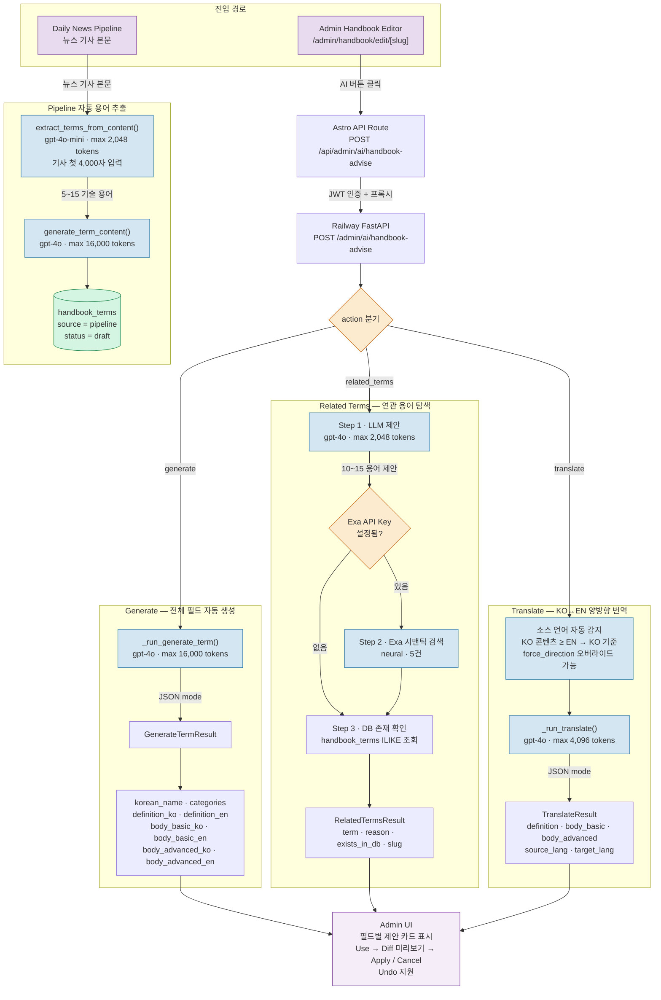
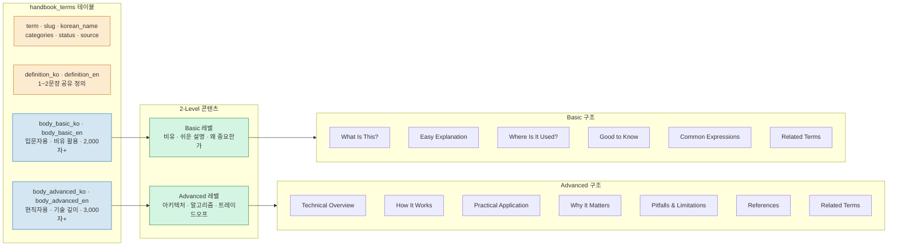
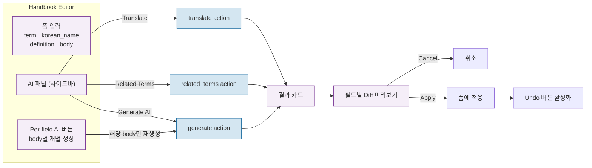

# AI Handbook Pipeline Overview

Handbook(AI 용어집) 콘텐츠의 AI 생성·번역·연관 용어 탐색 파이프라인. Admin 에디터에서 수동 트리거하는 ==어드바이저 모드==와, 뉴스 파이프라인에서 자동으로 용어를 추출하는 ==파이프라인 모드==로 구분된다.

## Handbook AI 전체 흐름

### 데이터 모델 & 콘텐츠 구조

## Action 1: Generate — 전체 필드 자동 생성

`_run_generate_term()` · `GENERATE_TERM_PROMPT`

| 항목 | 값 |
|---|---|
| **모델** | gpt-4o |
| **max_tokens** | 16,000 |
| **temperature** | 0.3 |
| **입력** | term + korean_name + categories + 기존 content (비어있지 않은 필드) |
| **출력** | `GenerateTermResult` — 8개 필드 (definition/body × ko/en) + korean_name + categories |
| **검증** | `GenerateTermResult.model_validate()` (soft-fail: 경고만 기록) |

- ==비어있는 필드만 생성==, 기존 콘텐츠가 있으면 해당 필드는 그대로 유지
- body_basic: 비유 중심, 일상 언어, 2,000자 이상
- body_advanced: 기술적 깊이, 아키텍처·알고리즘·복잡도 분석, 3,000자 이상
- 10개 카테고리: `ai-ml`, `db-data`, `backend`, `frontend-ux`, `network`, `security`, `os-core`, `devops`, `performance`, `web3`

## Action 2: Related Terms — 연관 용어 탐색

`_run_related_terms()` · `RELATED_TERMS_PROMPT`

3단계 파이프라인:

1. **LLM 제안** (gpt-4o, 2,048 tokens) — 10~15개 연관 용어 + 이유
2. **Exa 시맨틱 검색** (선택, `exa_api_key` 설정 시) — neural 검색 5건, LLM 제안과 중복 제거 후 병합
3. **DB 존재 확인** — 각 용어를 `handbook_terms`에서 ILIKE 조회 → `exists_in_db` + `slug` 반환

> [!tip] Admin UI 활용
> `exists_in_db=true`인 용어는 클릭하면 해당 용어 편집 페이지로 이동. `false`인 용어는 "새 용어 만들기" 액션으로 연결.

## Action 3: Translate — KO↔EN 양방향 번역

`_run_translate()` · `TRANSLATE_PROMPT`

| 항목 | 값 |
|---|---|
| **모델** | gpt-4o |
| **max_tokens** | 4,096 |
| **temperature** | 0.2 |
| **소스 언어 감지** | KO 콘텐츠 길이 ≥ EN → KO→EN, 그 반대면 EN→KO |
| **오버라이드** | `force_direction`: `"ko2en"` 또는 `"en2ko"` |
| **출력** | `TranslateResult` — definition + body_basic + body_advanced + source/target_lang |

- 마크다운 포맷 보존
- basic은 비유·일상 톤 유지, advanced는 기술적 정밀 톤 유지
- 비어있는 필드는 번역하지 않음

## Pipeline 자동 용어 추출

뉴스 파이프라인 실행 중 기사 본문에서 기술 용어를 자동 추출하여 Handbook 초안을 생성한다.

| 단계 | 함수 | 모델 | 설명 |
|---|---|---|---|
| **Extract** | `extract_terms_from_content()` | gpt-4o-mini | 기사 첫 4,000자에서 5~15개 기술 용어 추출 |
| **Generate** | `generate_term_content()` | gpt-4o | 추출된 용어별 전체 콘텐츠 자동 생성 |
| **Save** | DB insert | — | `handbook_terms`에 `source='pipeline'`, `status='draft'`로 저장 |

> [!note] 검수 필요
> 파이프라인이 자동 생성한 용어는 항상 ==draft 상태==로 저장되어, Admin이 검토 후 수동 발행한다.

## Admin UI 인터랙션

## 에이전트 함수 명세

| 함수 | 모델 | max_tokens | temperature | 입력 | 출력 스키마 |
|---|---|---|---|---|---|
| `_run_generate_term()` | gpt-4o | 16,000 | 0.3 | term + 기존 content | `GenerateTermResult` |
| `_run_related_terms()` | gpt-4o | 2,048 | 0.3 | term + definition | `RelatedTermsResult` |
| `_run_translate()` | gpt-4o | 4,096 | 0.2 | source content + direction | `TranslateResult` |
| `extract_terms_from_content()` | gpt-4o-mini | 2,048 | 0.2 | 기사 본문 (4,000자) | `ExtractTermsResult` |
| `generate_term_content()` | gpt-4o | 16,000 | 0.3 | term_name + korean_name | `GenerateTermResult` |

## 핵심 파일

| 파일 | 역할 |
|---|---|
| `backend/services/agents/advisor.py` | Handbook AI 함수 구현 |
| `backend/services/agents/prompts_advisor.py` | 프롬프트 상수 |
| `backend/models/advisor.py` | Request/Response Pydantic 스키마 |
| `backend/routers/admin_ai.py` | `/admin/ai/handbook-advise` 엔드포인트 |
| `frontend/src/pages/admin/handbook/edit/[slug].astro` | 에디터 UI + AI 패널 |
| `frontend/src/pages/api/admin/ai/handbook-advise.ts` | 프록시 API Route |

## Related

- [[AI-News-Pipeline-Overview]] — 뉴스 수집·생성 파이프라인
- [[Handbook]] — Handbook 기능 상세 (데이터 모델, 피드백, 검증)
- [[Handbook-Content-Rules]] — 콘텐츠 작성 규칙
- [[Prompt-Guides]] — 프롬프트 엔지니어링 가이드
- [[Admin]] — Admin 대시보드 기능
