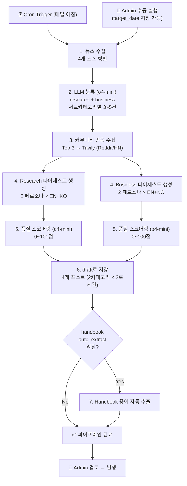
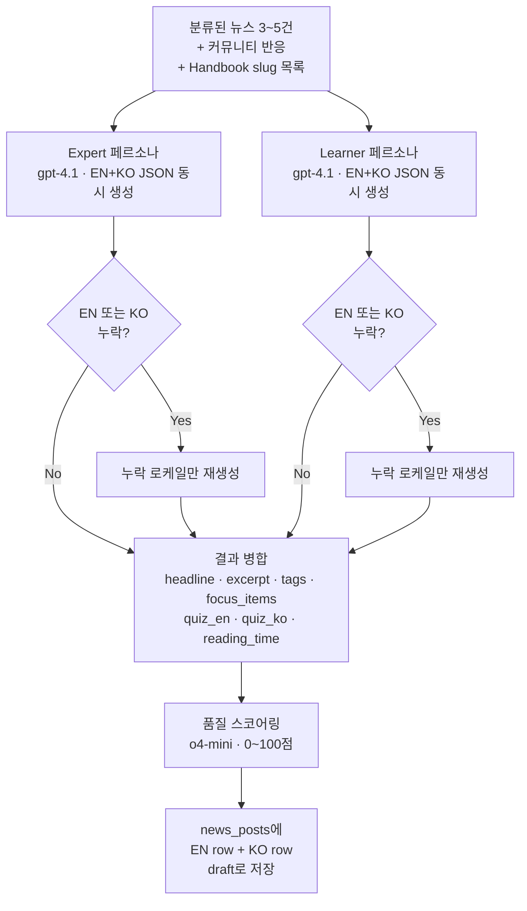
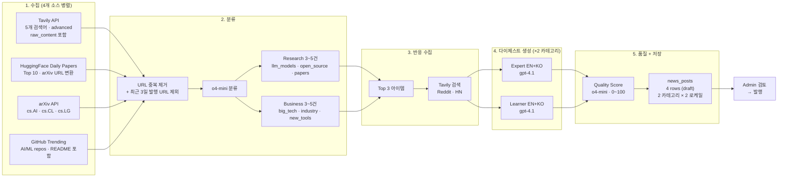

# AI News Pipeline — 설계 (v5)

> 비전: [[AI-News-Feature-Design]]
> 콘텐츠 구조: [[AI-News-Content-Structure]]
> 운영: [[AI-News-Pipeline-Operations]]
> 상태: 운영 중 (v5, 2026-03-25~)

---

## 버전 히스토리

| 버전 | 날짜 | 핵심 변경 |
|---|---|---|
| v1~v3 | ~2026-03-16 | 초기 → 구조화 → 다이제스트 오케스트레이션 |
| v4 | 2026-03-17 | 3→2 페르소나 (Beginner 제거), Expert+Learner 독립 생성 |
| **v5** | 2026-03-23~25 | 멀티소스 4개, gpt-4.1 family, 품질 스코어링, 커뮤니티 반응 통합 |

---

## 파이프라인 전체 흐름

## 다이제스트 1건 생성 상세 흐름

Research와 Business 동일 구조. 카테고리 1건당 **2 페르소나 × 2 로케일 = 최소 2 LLM 호출**.

## 데이터 흐름

---

## 수집 & 분류

### 뉴스 소스 (4개 병렬)

| 소스 | API | 수집 방식 | 비고 |
|---|---|---|---|
| **Tavily** | Tavily Search API | 5개 검색어, `search_depth=advanced`, `max_results=10`, `include_raw_content=True` | 메인 소스, 백필 시 별도 쿼리 4개 |
| **HuggingFace** | Daily Papers API | Top 10, arXiv URL 변환 | 최신 AI 논문 |
| **arXiv** | arXiv Search API | `cat:cs.AI OR cs.CL OR cs.LG`, target_date 필터 | 학술 논문 |
| **GitHub** | Search API | AI/ML topics, 3일 윈도우, README 발췌 포함 | 오픈소스 트렌딩 |

- **중복 제거**: URL 기준 + 최근 3일 발행 URL 제외
- **백필**: `target_date` 지정 시 Tavily에 `start_date/end_date` 전달, 시간 표현 없는 별도 쿼리 사용

### 분류 (Classification)

- **모델**: `o4-mini` (reasoning model)
- **재시도**: MAX_RETRIES = 2 (총 3회)
- **출력**: `ClassificationResult`
  - **Research**: `llm_models`, `open_source`, `papers` (각 서브카테고리 3~5건)
  - **Business**: `big_tech`, `industry`, `new_tools` (각 서브카테고리 3~5건)
- **교차 중복**: 같은 URL이 양쪽에 나오면 높은 점수 카테고리에만 유지

### 커뮤니티 반응

- Research + Business 합산 Top 3 아이템에 대해 Tavily 검색
- 검색 형식: `"article_title" site:reddit.com OR site:news.ycombinator.com`
- URL 기준으로 매핑하여 다이제스트 생성 시 주입

---

## 콘텐츠 생성 — 2 페르소나 독립 생성 (v5)

### 카테고리 1건당 LLM 호출 구조

| 순서 | 호출 | 모델 | 입력 | 출력 |
|---|---|---|---|---|
| Call 1 | **Expert 페르소나** | gpt-4.1 | 분류된 뉴스 + 커뮤니티 반응 + Handbook slugs | Expert EN+KO 동시 JSON (headline, excerpt, tags, focus_items, quiz, content) |
| Call 2 | **Learner 페르소나** | gpt-4.1 | 동일 입력 | Learner EN+KO 동시 JSON |
| Recovery | **누락 로케일 재생성** | gpt-4.1 | 기존 결과 + 누락 로케일 지정 | 누락된 EN 또는 KO만 |
| Quality | **품질 스코어링** | o4-mini | 생성된 다이제스트 전문 | 0~100점 (Sections/Sources/Accuracy or Analysis/Language 각 25점) |

### 왜 이 전략인가 (v4→v5 변경)

- **v4까지**: 팩트 추출 → 3 페르소나 독립 생성 (4 LLM 호출/카테고리)
- **v5**: 팩트 추출 제거, 2 페르소나 직접 생성 (2+α LLM 호출/카테고리)
- **이유**: 팩트 추출 단계가 병목이었고, 모델 성능 향상으로 원문에서 직접 양질의 다이제스트 생성 가능
- **로케일 복구**: EN 또는 KO가 비어있으면 해당 로케일만 재생성 (전체 재생성 X)

### 품질 스코어링

- **모델**: `o4-mini` (reasoning)
- **평가 기준** (각 25점, 총 100점):
  - Research: Sections(25) + Sources(25) + Accuracy(25) + Language(25)
  - Business: Sections(25) + Sources(25) + Analysis(25) + Language(25)
- **저장**: `fact_pack.quality_score`에 점수 기록

### 포스트 출력 구조

카테고리당 2개 포스트 (EN + KO) = **일일 총 4개 포스트**:

| slug 형식 | 카테고리 | 로케일 | 페르소나 컬럼 |
|---|---|---|---|
| `{batch_id}-research-digest` | research | EN | `content_expert`, `content_learner` |
| `{batch_id}-research-digest-ko` | research | KO | `content_expert`, `content_learner` |
| `{batch_id}-business-digest` | business | EN | `content_expert`, `content_learner` |
| `{batch_id}-business-digest-ko` | business | KO | `content_expert`, `content_learner` |

- 모든 포스트: `status=draft`, 부가 필드 자동 생성 (excerpt, tags, focus_items, reading_time)
- Reading time: KO = chars ÷ 500, EN = words ÷ 200
- `translation_group_id`로 EN-KO 쌍 연결

---

## 스테이지별 로깅

각 LLM 호출마다 `pipeline_logs`에 기록:

| 필드 | 내용 |
|---|---|
| `run_id` | pipeline_runs FK |
| `pipeline_type` | 스테이지명 (classify, digest_expert, digest_learner, quality_check, ...) |
| `status` | success / failed |
| `duration_ms` | 호출 소요 시간 |
| `model_used` | gpt-4.1, o4-mini 등 |
| `tokens_used` | input + output 합계 |
| `cost_usd` | 비용 (모델별 가격 테이블 기준) |
| `post_type` | research / business |
| `locale` | en / ko |
| `attempt` | 재시도 횟수 |
| `debug_meta` | JSON — LLM 입출력, 상세 컨텍스트 |

---

## 3-Tier 모델 구조 (v5)

| 역할 | 모델 | 용도 |
|---|---|---|
| **Main** | `gpt-4.1` | 다이제스트 생성, Handbook 생성 |
| **Light** | `gpt-4.1-mini` | 용어 추출, 유형 분류, 품질 스코어링 보조 |
| **Reasoning** | `o4-mini` | 뉴스 분류, 다이제스트 품질 스코어링 |

> [!note] o-series 차이
> o4-mini는 `temperature`와 `response_format` 미지원. `max_completion_tokens` 사용. `build_completion_kwargs()`에서 자동 분기.

---

## Related

- [[Quality-Gates-&-States]] — 스키마 검증 + 에러 핸들링
- [[Prompt-Guides]] — 파이프라인 프롬프트
- [[AI-News-Pipeline-Operations]] — 운영 가이드

## See Also

- [[Persona-System]] — 2페르소나 시스템 (03-Features)
