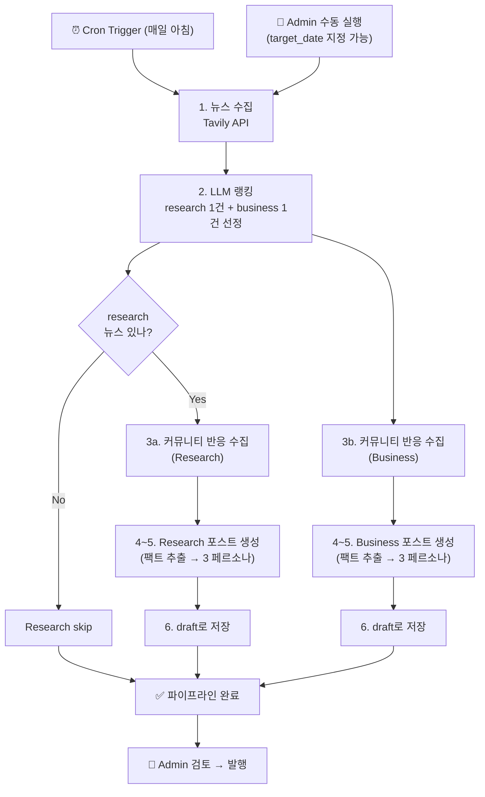
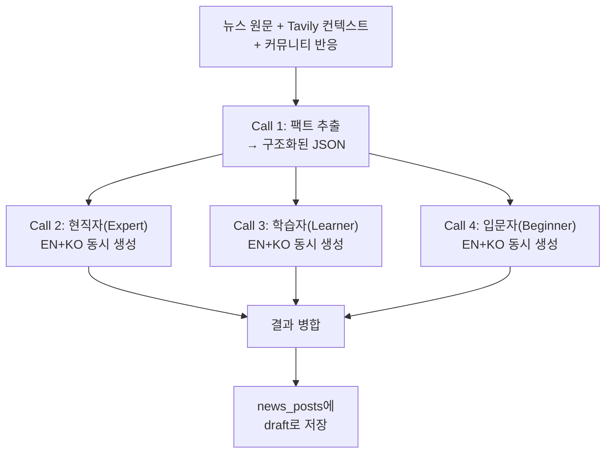
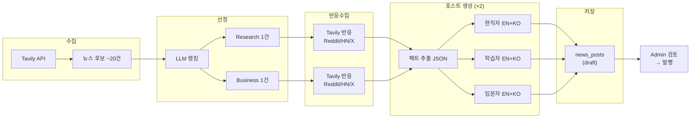

# AI News Pipeline — 설계

> 비전: [[AI-News-Feature-Design]]
> 콘텐츠 구조: [[AI-News-Content-Structure]]
> 운영: [[AI-News-Pipeline-Operations]]
> 상태: 설계 확정, 구현 대기

---

## 파이프라인 전체 흐름

## 포스트 1건 생성 상세 흐름

Research와 Business 모두 동일한 구조. 포스트 1건당 4 LLM 호출.

## 데이터 흐름

---

## 수집 & 선정

- **소스**: Tavily API (AI 관련 키워드 검색)
  - 기본: `days=2` (오늘+어제)
  - 백필: `start_date` / `end_date` 지정 (admin이 `target_date` 선택 시)
  - `include_raw_content=True`로 뉴스 원문 전체 수집
- **선정**: LLM이 후보 뉴스를 랭킹
  - **Research**: 기술/논문/모델 중심 1건
  - **Business**: 시장/투자/전략 중심 1건
- **커뮤니티 반응**: 선정된 뉴스에 대해 Tavily로 Reddit, Hacker News, X 등의 반응 추가 수집 → 팩트 추출에 입력

---

## 콘텐츠 생성 — 전략 C: 팩트 추출 → 3개 독립

### 포스트 1건당 LLM 호출 구조

| 순서 | 호출 | 입력 | 출력 |
|------|------|------|------|
| Call 1 | **팩트 추출** | 뉴스 원문 + Tavily 컨텍스트 + 커뮤니티 반응 | 구조화된 팩트 JSON (핵심 사실, 수치, 출처, 반응 요약) |
| Call 2 | **현직자(Expert)** | 팩트 JSON | Expert EN+KO 동시 출력 (JSON) |
| Call 3 | **학습자(Learner)** | 팩트 JSON | Learner EN+KO 동시 출력 (JSON) |
| Call 4 | **입문자(Beginner)** | 팩트 JSON | Beginner EN+KO 동시 출력 (JSON) |

### 왜 이 전략인가

- **팩트 일관성**: 모든 페르소나가 같은 구조화된 팩트에서 출발 → 수치/사실 불일치 방지
- **독립 품질**: 각 페르소나가 독립적으로 작성됨 → "파생 = 축약" 문제 없음
- **팩트 재활용**: 추출된 팩트를 프론트엔드(출처 카드, 커뮤니티 반응 표시)에도 활용
