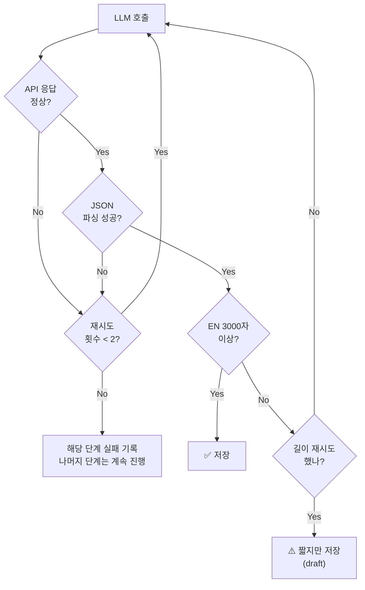

# AI News Pipeline — 운영

> 파이프라인: [[AI-News-Pipeline-Design]]
> 콘텐츠: [[AI-News-Content-Structure]]

---

## 발행 정책

- 모든 포스트는 **draft**로 저장 → admin 확인 후 발행
- 매일 자동 생성되지만 사람의 검토를 거쳐 발행

---

## 에러 처리

### 원칙
> 콘텐츠 품질로 파이프라인을 멈추지 않는다. 인프라 에러만 재시도.

### Business 포스트
- 페르소나 1개당 **EN 3000자 미만**이면 → 1회 재시도
- 재시도 후에도 미달이면 → draft로 저장 (admin 확인 후 판단)
- 파이프라인 자체는 절대 멈추지 않음

### Research 포스트
- 뉴스 없는 날은 **skip** (research는 선택적)
- 뉴스 있으면 길이 무관 → draft로 저장

### 인프라 에러 (API 타임아웃, JSON 파싱 실패 등)
- 최대 2회 재시도
- 재시도 실패 시 해당 단계만 실패 기록, 나머지 단계는 진행

### 에러 처리 흐름 (Business 페르소나 기준)

---

## 일일 호출 예산

| 항목 | 호출 수 |
|------|---------|
| 2 posts × 4 gen calls (EN+KO 동시) | 8 |
| 번역 호출 | 0 |
| **총** | **8 calls/day** |

- 예상 비용: **~$0.30~0.40/day** (gpt-4o 기준, raw_content 입력으로 input 토큰 증가)

> [!note] raw_content로 인한 비용 변동
> 팩트 추출에 전체 기사(최대 8000자)를 입력하므로, snippet(300자) 대비 input 토큰이 증가. 그러나 출력 품질이 크게 향상됨.

---

## Handbook 링크 전략

### v1: LLM 생성 시 링크
- 페르소나 생성 시 LLM에게 handbook_terms 목록을 제공
- LLM이 글의 맥락에서 자연스러운 위치에 `[용어](/handbook/slug/)` 링크 삽입

### v1.5: 프론트엔드 동적 보완
- 렌더링 시 현재 handbook_terms DB와 매칭하여 LLM이 놓친 용어 추가 링크
- 새 용어가 추가되면 과거/미래 모든 글에 **자동 반영**
- DB 원본을 건드리지 않음

---

## DB 스키마 방향

- Research도 3 페르소나 → `content_beginner`, `content_learner`, `content_expert` 컬럼 재활용
- `content_original` 불필요 (이전 research 전용)
- `title` 컬럼: EN row → `fact_pack.headline`, KO row → `fact_pack.headline_ko` (팩트 추출 시 EN+KO 동시 생성)

---

## 백필 (Backfill) 운영

### 목적

사이트에 이전 날짜의 뉴스를 채워 넣고 싶을 때, 과거 날짜를 지정하여 파이프라인을 실행.

### 사용 방법

1. 어드민 대시보드 (`/admin/`) → Pipeline Status 영역
2. 날짜 선택기에서 원하는 과거 날짜 선택
3. "Run Pipeline" 또는 "Force Refresh" 클릭
4. Pipeline Runs에서 실행 결과 확인 → Open details에서 스테이지별 로그

### 동작 방식

| 항목 | 일반 실행 (날짜 미선택) | 백필 실행 |
|------|----------------------|----------|
| batch_id | 오늘 날짜 | 선택한 날짜 |
| Tavily 검색 | `days=2` | `start_date=(날짜-1일)`, `end_date=날짜` |
| 검색 쿼리 | SEARCH_QUERIES ("today", "latest" 포함) | BACKFILL_QUERIES (시간 표현 제거) |
| slug 형식 | `2026-03-15-headline` | `2026-03-10-headline` |

### 주의사항

- **미래 날짜**: 백엔드에서 400 에러로 거부
- **같은 날짜 재실행**: slug 기반 upsert → 기존 포스트를 덮어씀 (중복 생성 없음)
- **Tavily 한계**: 너무 오래된 날짜는 결과가 적을 수 있음
- **검증**: Run Detail 페이지에서 "Run Context" 섹션으로 백필 파라미터 확인

---

## 유지되는 프론트엔드

- newsprint 스타일 UI 셸
- 페르소나 탭 전환 (Research에도 추가 필요)
- 뉴스 상세/리스트 페이지
- `news_posts` 테이블 스키마 (컬럼 재활용)
- EN/KO 언어 전환

## Related

- [[AI-News-Pipeline-Design]] — 파이프라인 설계
- [[Quality-Gates-&-States]] — 품질 게이트

## See Also

- [[Infrastructure-Topology]] — 운영 인프라 (07-Operations)
