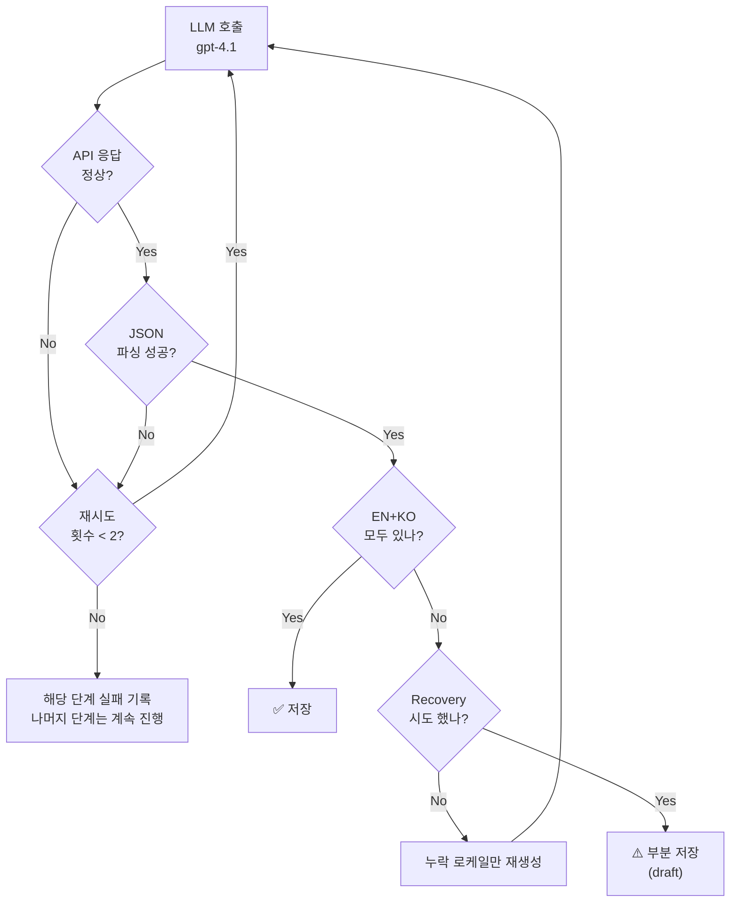

# AI News Pipeline — 운영 (v5)

> 파이프라인: [[AI-News-Pipeline-Design]]
> 콘텐츠: [[AI-News-Content-Structure]]

---

## 발행 정책

- 모든 포스트는 **draft**로 저장 → admin 확인 후 발행
- 매일 자동 생성되지만 사람의 검토를 거쳐 발행

---

## 에러 처리

### 원칙
> 콘텐츠 품질로 파이프라인을 멈추지 않는다. 인프라 에러만 재시도.

### 다이제스트 페르소나 (Expert/Learner)
- EN 또는 KO가 비어있으면 → 해당 로케일만 1회 재생성 (recovery)
- 재시도 후에도 미달이면 → draft로 저장 (admin 확인 후 판단)
- 파이프라인 자체는 절대 멈추지 않음

### Research 다이제스트
- 뉴스 없는 날은 **skip** (research는 선택적)
- 뉴스 있으면 → Expert/Learner 독립 생성 → draft로 저장

### 인프라 에러 (API 타임아웃, JSON 파싱 실패 등)
- 최대 2회 재시도
- 재시도 실패 시 해당 단계만 실패 기록, 나머지 단계는 진행

### 에러 처리 흐름 (페르소나 기준)

---

## 일일 호출 예산 (v5)

| 항목 | 호출 수 | 모델 |
|---|---|---|
| 분류 (Classification) | 1 | o4-mini |
| 커뮤니티 반응 수집 | ~3 | Tavily API |
| 다이제스트 생성 (2 카테고리 × 2 페르소나) | 4 | gpt-4.1 |
| 로케일 복구 (조건부) | 0~4 | gpt-4.1 |
| 품질 스코어링 (2 카테고리) | 2 | o4-mini |
| Handbook 용어 추출 (조건부) | 1 | gpt-4.1-mini |
| Handbook 용어 생성 (조건부, 용어당 4 calls) | 0~8 | gpt-4.1 |
| **기본 총** | **~10 calls/day** | |

- 예상 비용: **~$0.50~0.80/day** (gpt-4.1 기준, 멀티소스 raw_content 입력)
- Handbook 추출까지 포함 시: **~$1.00~1.50/day**

> [!note] v5 비용 변동 요인
> - gpt-4.1은 gpt-4o보다 input 토큰 비용이 낮으나, 4개 소스에서 수집하여 입력량 증가
> - o4-mini (분류 + 품질 스코어링) 호출 추가
> - Handbook 자동 추출은 `admin_settings.handbook_auto_extract` 토글로 제어

---

## Handbook 링크 전략

### v1: LLM 생성 시 링크
- 페르소나 생성 시 LLM에게 handbook_terms slug 목록을 제공
- LLM이 글의 맥락에서 자연스러운 위치에 `[용어](/handbook/slug/)` 링크 삽입

### v1.5: 프론트엔드 동적 보완
- 렌더링 시 현재 handbook_terms DB와 매칭하여 LLM이 놓친 용어 추가 링크
- 새 용어가 추가되면 과거/미래 모든 글에 **자동 반영**
- DB 원본을 건드리지 않음

---

## DB 스키마

- 2 페르소나: `content_expert`, `content_learner` 컬럼
- EN/KO 분리: 별도 row (`locale` 컬럼), `translation_group_id`로 쌍 연결
- `title` 컬럼: EN row → `headline`, KO row → `headline_ko`
- 부가 필드: `excerpt`, `tags`, `focus_items`, `reading_time` — 파이프라인에서 자동 생성
- `pipeline_batch_id`: 일자별 배치 식별자
- `fact_pack`: 품질 스코어, 메타데이터 JSON

---

## 백필 (Backfill) 운영

### 목적

사이트에 이전 날짜의 뉴스를 채워 넣고 싶을 때, 과거 날짜를 지정하여 파이프라인을 실행.

### 사용 방법

1. 어드민 대시보드 (`/admin/`) → Pipeline Status 영역
2. 날짜 선택기에서 원하는 과거 날짜 선택
3. "Run Pipeline" 또는 "Force Refresh" 클릭
4. Pipeline Runs에서 실행 결과 확인 → Open details에서 스테이지별 로그

### 동작 방식

| 항목 | 일반 실행 (날짜 미선택) | 백필 실행 |
|---|---|---|
| batch_id | 오늘 날짜 | 선택한 날짜 |
| Tavily 검색 | `days=2` | `start_date=(날짜-1일)`, `end_date=날짜` |
| 검색 쿼리 | SEARCH_QUERIES ("today", "latest" 포함) | BACKFILL_QUERIES (시간 표현 제거) |
| 기타 소스 | HuggingFace/arXiv/GitHub 모두 수집 | target_date 기준 필터링 |
| slug 형식 | `2026-03-25-headline` | `2026-03-10-headline` |
| URL 제외 | 최근 3일 발행 URL 제외 | 동일 |

### 주의사항

- **미래 날짜**: 백엔드에서 400 에러로 거부
- **같은 날짜 재실행**: slug 기반 upsert → 기존 포스트를 덮어씀 (중복 생성 없음)
- **Tavily 한계**: 너무 오래된 날짜는 결과가 적을 수 있음
- **검증**: Run Detail 페이지에서 "Run Context" 섹션으로 백필 파라미터 확인

---

## 유지되는 프론트엔드

- newsprint 스타일 UI 셸
- 페르소나 탭 전환 (Expert/Learner)
- 플로팅 페르소나 전환 pill (스크롤 시)
- 뉴스 상세/리스트 페이지
- `news_posts` 테이블 스키마
- EN/KO 언어 전환

## Related

- [[AI-News-Pipeline-Design]] — 파이프라인 설계
- [[Quality-Gates-&-States]] — 품질 게이트

## See Also

- [[Infrastructure-Topology]] — 운영 인프라 (07-Operations)
