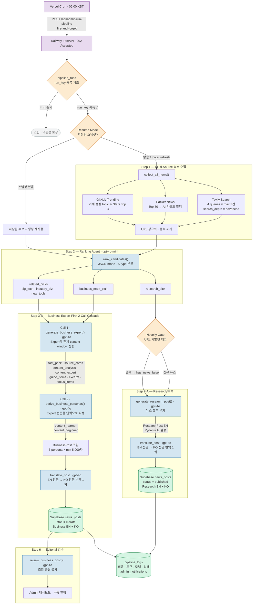
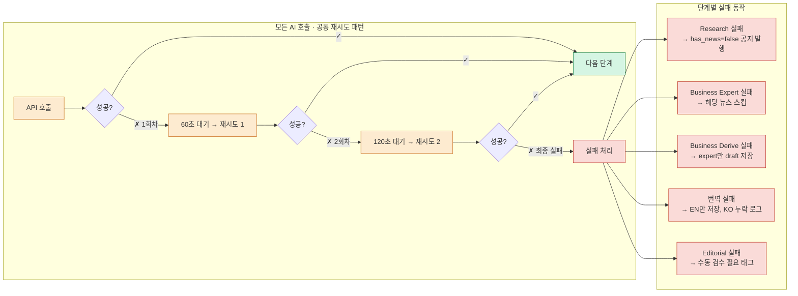

# AI News Pipeline Overview

매일 06:00 KST 자동 실행. 뉴스 수집 → 랭킹 → 포스트 생성 (Expert-First Cascade + 전문 번역) → 검수의 순차 파이프라인.

## Daily News Pipeline 흐름

### 에러 핸들링 & 재시도 흐름

## Step 1: Multi-Source 뉴스 수집

`collect_news()` → `list[dict]`

| 소스 | 방식 | 수량 |
|---|---|---|
| **Tavily** | 4개 영어 쿼리 병렬 (search_depth=advanced, 24h) | 쿼리당 max 3건 |
| **Hacker News** | Top 80개 중 AI 키워드 필터 | 가변 |
| **GitHub Trending** | 어제 생성된 `topic:ai` Stars 상위 | 3개 |

- URL 정규화 중복 제거: `url.split("#")[0].split("?")[0].rstrip("/")`
- 실패 처리: Tavily 30초 후 1회 재시도, HN/GitHub 실패 시 빈 리스트

## Step 2: Ranking Agent (gpt-4o-mini)

`rank_news()` → `NewsRankingResult`

5가지 타입으로 분류 + 중요도 평가 (0~1):

| 타입 | 용도 |
|---|---|
| `research` | Top 1 기술 심화 뉴스 |
| `business_main` | Top 1 분석 가치 뉴스 |
| `big_tech` | Related News — 빅테크 |
| `industry_biz` | Related News — 업계/투자 |
| `new_tools` | Related News — 새 도구 |

## Step 3: 포스트 생성 (순차)

> [!note] v4 변경
> Research → Business 순차 실행. Business는 ==Expert-First 2-Call Cascade==로 생성, 번역은 ==전문 번역== (포스트 전체 1회 호출).

### Step 3-A: Research EN (gpt-4o)

`generate_research_post()` → `ResearchPost`

- **뉴스 있음:** 기술 심화 포스트 + 5블록 → ==자동 발행==
- **뉴스 없음:** "없음" 공지 + 최근 동향 보충 → 자동 발행

### Step 3-A-KO: Research 번역 (gpt-4o)

`translate_post()` — EN 전문을 KO로 1회 호출 번역.
- 동적 threshold: `max(KO_MIN, int(en_len × 0.65))` — EN이 길수록 KO도 비례
- 프롬프트에 실제 EN 글자 수와 KO 목표치 명시
- `finish_reason=length` 감지 시 truncation 경고

### Step 3-B: Business Expert-First 2-Call Cascade (gpt-4o)

| Call | 함수 | 입력 | 출력 |
|---|---|---|---|
| **Call 1** | `generate_business_expert()` | 뉴스 원문 + 분석 지시 | `fact_pack` + `source_cards` + `content_analysis` + `content_expert` |
| **Call 2** | `derive_business_personas()` | expert 전문 | `content_learner` + `content_beginner` |

- Expert에 전체 context window 집중 → 깊이 있는 분석
- Learner/Beginner는 expert 기반 파생 — ==길이 동일 (min 5,000자)==, 서술 방식만 차별화
- [[Persona-System\|3페르소나]] + [[Prompt-Guides\|5블록]] → ==검수 대기 (draft)==

### Step 3-B-KO: Business 번역 (gpt-4o)

`translate_post()` — Business EN 전문 (3 persona + analysis)을 KO로 1회 호출 번역.
- 각 필드별 동적 threshold: `max(KO_MIN, int(en_len × 0.65))`
- 프롬프트에 필드별 EN 글자 수 → KO 최소치 명시

## Step 4-5: 검증 & 저장

- [[Quality-Gates-&-States\|PydanticAI]] 스키마 검증
- `save_post()`: Pydantic → Supabase `news_posts` 테이블
- guide_items → JSONB, related_news → JSONB, persona → 개별 컬럼
- 멱등 저장: `upsert(on_conflict="slug")`

## Step 6: Editorial Agent (gpt-4o)

`review_business_post()` → `EditorialFeedback`

Business 초안 품질 검수 → [[Admin]] 대시보드에서 확인 후 수동 발행.

## 오케스트레이터 핵심 규칙

| 규칙 | 설명 |
|---|---|
| **batch_id** | KST 기준 `YYYY-MM-DD` |
| **중복 방지** | `pipeline_runs` 테이블 `run_key = "daily:{batch_id}"` 락 |
| **순차 실행** | Research EN → KO → Business Expert → Derive → KO (v4) |
| **slug 패턴** | `{batch_id}-research-daily`, `{batch_id}-business-daily` |
| **로그** | `pipeline_logs`에 결과 기록, 실패 시 `admin_notifications` |

## 성공 기준

1. `collect_news()` 중복 URL 0개
2. 1회 실행 → Research(published) 1행 + Business(draft) 1행
3. 동일 batch_id 2회 트리거 → 2번째 스킵 (run_key 락)
4. `pipeline_logs` 최종 행 `status=success`

## Related

- [[AI-Handbook-Pipeline-Overview]] — Handbook AI 어드바이저 파이프라인
- [[Prompt-Guides]] — 에이전트 프롬프트 상세
- [[Quality-Gates-&-States]] — PydanticAI 검증 + 에러 핸들링
- [[Backend-Stack]] — 파이프라인이 동작하는 백엔드
- [[Database-Schema-Overview]] — 파이프라인 결과 저장 스키마
- [[Daily-Dual-News]] — 파이프라인이 생성하는 콘텐츠
- [[Cost-Model-&-Stage-AB]] — 파이프라인 실행 비용
