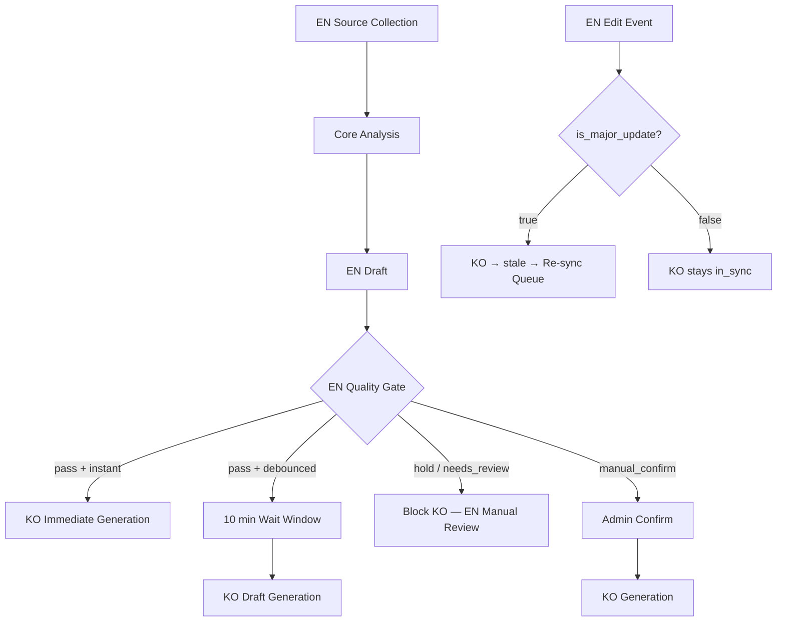

# Global-Local Intelligence

EN-KO 이중 언어 인텔리전스 전략. 단순 번역이 아닌 "해석+판단 기반 인텔리전스 미디어"로서의 운영 원칙, 소싱, 품질 게이트, 티어링, 거버넌스를 정의한다.

## 1. Vision & Positioning

### Slogan

**Global-to-Local Insight Bridge**

### Core Positioning

| Target | Value Delivered | Problem Solved |
|---|---|---|
| **KO users** | 영문 원천 뉴스 + 커뮤니티 반응을 한국어로 해석한 인사이트 | 영어 접근 장벽으로 인한 ==정보 비대칭 해소== |
| **Global users** | 빠르게 핵심만 파악할 수 있는 고밀도 큐레이션 | 정보 과잉 속에서 중요한 ==신호 선별== |

> [!note] ADR: 해석 기반 인텔리전스
> 0to1log는 "번역 블로그"가 아니라 **해석+판단 기반 인텔리전스 미디어**로 운영한다.
>
> - 원문 요약만 제공하지 않고, ==Why it matters==와 ==Actionable takeaways==를 함께 제공
> - 커뮤니티 반응(HN/Reddit)까지 반영해 뉴스의 실제 온도(체감도)를 함께 전달
> - 한국 시장 맥락과 글로벌 관점을 분리 운영하여 독자별 읽기 가치를 최적화

---

## 2. Content Value Structure

### 3-Layer Model

| Layer | Definition | Required Output |
|---|---|---|
| **Layer 1: 사실 요약** | 출처 기반 핵심 사실 정리 | 핵심 주장, 근거 링크, 발표 주체 |
| **Layer 2: 해석/의미** | 기술/시장 맥락에서 의미 해석 | Why it matters, 제한점/리스크 |
| **Layer 3: 실행 인사이트** | 독자가 바로 적용 가능한 판단/행동 제시 | Action items, 의사결정 체크포인트 |

> [!tip] Operating Principle
> 번역 자체는 가치의 시작점일 뿐이며, ==최종 가치는 해석과 판단에서 발생한다.==

---

## 3. Sourcing Strategy

### Multi-Source Retrieval

| Source | Role | Expected Signal |
|---|---|---|
| **Tavily** | 공식 발표, 기술 블로그, 뉴스 수집 | 발표 사실/사양/출처 링크 |
| **Hacker News** | 엔지니어 커뮤니티 반응 수집 | 기술적 반론, 운영 관점, 업보트 기반 관심도 |
| **Reddit** | 실무 체감/트러블슈팅 수집 | 현업 이슈, 사용성 피드백, 한계 사례 |

### Community Quantitative Signals

| Signal | Definition | Source |
|---|---|---|
| `score` | 게시물 추천/업보트 절대값 | HN, Reddit |
| `comments` | 댓글 수 | HN, Reddit |
| `age_normalized_velocity` | 시간 경과 대비 반응 증가 속도 | HN 중심 |
| `upvote_ratio` | 업보트 비율 | Reddit |
| `subreddit_weight` | 서브레딧 신뢰/전문성 가중치 | Reddit |
| `sentiment_polarity` | 반응 감성 극성 (-1.0 ~ 1.0) | 공통 |
| `controversy_index` | 찬반 분산/논쟁도 | 공통 |

### Topic Selection Principles

- 단순 최신순이 아닌 **최신성 + 커뮤니티 반응 + 신뢰도 가중치** 기반으로 우선순위를 정한다.
- 동일 이슈는 소스 간 중복 클러스터링으로 묶고, 대표 이슈 단위로 발행 후보를 만든다.
- 커뮤니티 반응은 정성 텍스트만 사용하지 않고 `community_signals` 기반 정량 점수를 함께 반영한다.
- 저신뢰/낮은 근거 이슈는 후보에서 제외하거나 `hold` 상태로 보류한다.

---

## 4. Dual-Path Intelligence

### Concept Flow

### Channel Finalization

| Channel | Target Reader | Emphasis | Tone | Canonical? |
|---|---|---|---|---|
| **EN** | 바쁜 글로벌 개발자/빌더 | 핵심 신호 압축, 맥락 연결, 빠른 판단 지원 | 간결/밀도 중심 | **Canonical** |
| **KO** | 영어 뉴스 접근이 부담되는 한국 사용자 | 한국 시장/제품/비용 체감 맥락 | 명료/친절 중심 | **Localized Derivative** |

> [!note] ADR: EN-Canonical 운영 규칙
> - EN is the canonical source language.
> - KO is a localized derivative anchored to EN versioning.
> - Trigger mode is tier-dependent (`A=debounced`, `B=instant`).
> - EN `hold`/`needs_review` 상태에서는 KO 생성을 금지한다.
> - EN 수정 시 KO stale 전환은 `is_major_update=true`인 경우에만 수행한다.

---

## 5. Content Tiering

| Tier | Scope | Quality Level | Language Ops | Default Trigger Mode |
|---|---|---|---|---|
| **Tier A (핵심 이슈)** | 고파급 뉴스/분석 | 고품질 심층 분석 + 검수 강화 | EN/KO 모두 publish 전 수동 검수 필수 | `debounced` (10 min) |
| **Tier B (다이제스트)** | 일일 요약/보조 이슈 | 압축 요약 + 실무 포인트 | EN 우선 운영, KO draft 자동 생성 + publish 전 경량 검수 | `instant` |

> [!important] Resource Principle
> 모든 글을 동일한 고비용 파이프라인으로 처리하지 않는다. ==핵심 이슈에 품질 자원을 집중한다.==

---

## 6. SEO/i18n Principles

- 기본 언어는 **영어(EN)** 로 운영
- URL은 언어별 명확 분리: `/en/log/[slug]`, `/ko/log/[slug]`
- `x-default`는 `/en/`을 가리킨다
- `hreflang` (`ko`, `en`, `x-default`)과 canonical을 일관 설정
- EN/KO는 상호 `hreflang` 페어링 유지
- 각 언어 페이지는 자기 canonical 유지
- locale sitemap 운영으로 검색엔진이 언어별 페이지를 명확히 인식
- 자동 강제 번역/자동 리다이렉트 남용 지양 — 언어 스위처 중심 UX 기본

> [!note] Cross-reference
> 상세 전략은 [[SEO-&-GEO-Strategy]] 참조.

---

## 7. Governance & Risk

### 저작권/인용 정책

- 원문 기사 본문 전재는 지양한다.
- 요약/해석 중심으로 작성하고, 출처 링크를 명시한다.
- 커뮤니티 반응은 최소 인용 원칙을 적용한다.

### 환각/오인 리스크 대응

- 출처 없는 단정 문장은 발행 금지
- 수치/비용/성능 주장에는 근거 링크 필수
- 불확실한 정보는 "가정" 또는 "관측"으로 명시

### Prompt Cultural Tuning

| Channel | Writing Guide |
|---|---|
| **EN** | 증거 우선, 과장 금지, 리스크/한계 명시, 짧고 밀도 높은 서술 |
| **KO** | 번역투 금지, 자연스러운 한국어 문장, 국내 맥락(시장/비용/도입 현실) 연결 |

**Common Guardrails:**

- 근거 없는 단정 금지
- 수치/비용 주장은 출처 링크 필수
- 의견과 사실을 문장에서 분리 표기

### 댓글 언어 정책

- **Default:** 댓글은 locale 분리 노출 (`ko`, `en`)
- **Extension:** "글로벌 베스트 반응 요약 카드"는 선택 기능 (수동/주간 큐레이션)
- **Risk:** 민감/저품질 코멘트 자동 확대 노출 금지, 커뮤니티 인용 최소화 유지

---

## 8. Roadmap

| Stage | Operation Mode | Goal |
|---|---|---|
| **Stage 0** | EN canonical 정착 + KO 로컬라이즈 실험 | 트리거/동기화/품질 게이트 검증 |
| **Stage 1** | EN-first 티어 기반 이중언어 운영 | 효율/품질 균형 확립 |
| **Stage 2** | KPI 충족 시 EN 확대 + KO 정밀화 | 글로벌 확장 본격화 |

---

## 9. Interface/Type Candidates

> [!note] Direction-Level Candidates
> 아래 항목은 **향후 반영 후보**이며, 본 문서에서는 방향만 정의한다. 구현 명세가 아닌 계약 레벨.

### Data Model Candidates

| Field | Type | Purpose |
|---|---|---|
| `posts.locale` | `text` (`ko`/`en`) | 언어 버전 구분 |
| `posts.translation_group_id` | `uuid`/`text` | 동일 콘텐츠 언어군 묶음 |
| `posts.source_post_id` | `uuid`/`text` | KO가 참조하는 EN 원본 포스트 ID |
| `posts.source_post_version` | `text`/`int` | KO가 참조한 EN 기준 버전 |
| `posts.en_revision_id` | `uuid`/`text` | EN 원본 리비전 식별 |
| `posts.locked_en_revision_id` | `uuid`/`text` | KO 생성 트랜잭션에서 잠근 EN 리비전 값 |
| `posts.localization_job_id` | `uuid`/`text` | KO 로컬라이즈 작업 단위 추적 ID |
| `posts.is_major_update` | `boolean` (default `false`) | EN 수정이 KO 재동기화를 유발할 major 변경인지 표시 |
| `posts.major_update_note` | `text` | major 변경 사유/범위 기록 |
| `posts.sync_status` | `text` (`in_sync`/`stale`/`pending`) | EN-KO 동기화 상태 |
| `posts.trigger_mode` | `text` (`instant`/`debounced`/`manual_confirm`) | KO 생성 트리거 방식 |
| `posts.localization_wait_sec` | `int` (default `600`) | 디바운스 대기 시간 |
| `posts.localization_trigger_at` | `timestamptz` | EN pass 시 KO 생성 트리거 시각 |
| `posts.localization_generated_at` | `timestamptz` | KO draft 실제 생성 시각 |
| `posts.localization_latency_sec` | `int` | EN pass → KO draft 생성 지연 측정 |
| `posts.source_attributions` | `jsonb` | 출처/인용 메타데이터 |
| `posts.community_signals` | `jsonb` | HN/Reddit 정량 반응 신호 저장 |
| `posts.quality_score` | `numeric` | 품질 게이트 점수 저장 |
| `posts.publish_gate_status` | `text` (`pass`/`hold`/`needs_review`/`stale`) | 발행/동기화 상태 제어 |

### Routing/Search Interface Candidates

- locale-aware route: `/en/log/[slug]`, `/ko/log/[slug]`
- `x-default -> /en/`
- locale-aware semantic search: 언어 필터 + 교차 추천 규칙
- 검색 평가 메타: `cross_lingual_recall_at_k`, `locale_ndcg_at_k`

### Operational Interface Candidates

- 품질 게이트 상태값: `pass`, `hold`, `needs_review`, `stale`
- 동기화 상태값 (`sync_status`): `in_sync`, `pending`, `stale`
- 발행 티어 값: `A`, `B`
- 로컬라이즈 운영 옵션: `confirm_to_localize` (`on`/`off`)
- EN 수정 분류 옵션: `is_major_update` (`true`/`false`)

---

## Related

- [[Content-Strategy]] — GLI가 서비스하는 콘텐츠 전략
- [[Handbook-Content-Rules]] — 핸드북 콘텐츠 규칙

## See Also

- [[Quality-Gates-&-States]] — 발행 품질 게이트 (04-AI-System)
