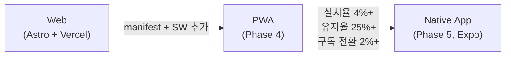

# Business Strategy

0to1log의 전체 비즈니스 전략. **Global-to-Local Insight Bridge** 포지셔닝을 기반으로, **콘텐츠 → 트래픽 → 수익**의 순서로 설계된 성장 전략이다.

## Core Principles

> [!note] 5대 핵심 원칙
> 비즈니스의 모든 의사결정은 이 원칙에 기반한다.

| 원칙 | 설명 |
|---|---|
| **Organic First** | SEO와 바이럴로 유기 트래픽을 먼저 확보한다. 유료 광고 집행은 수익 발생 후. |
| **Phased Monetization** | 무료 콘텐츠로 신뢰를 쌓은 뒤, 광고 → 프리미엄 구독 순서로 수익화한다. |
| **Data-Driven Decisions** | GA4와 MS Clarity로 유저 행동을 수집하고, AARRR 지표로 그로스를 측정한다. |
| **EN Canonical** | EN을 기준 원본으로 두고 KO는 localized derivative로 운영한다. |
| **Validate Then Scale** | PWA로 앱 경험을 검증한 뒤에만 네이티브 앱을 개발한다. |

## App Expansion Strategy

앱 확장은 **PWA → Native** 순서로, 검증 후 확장 원칙을 따른다.

### Phase 4: PWA (Progressive Web App)

네이티브 앱 전에 PWA를 먼저 배포하여 "앱 경험"을 검증한다.

**PWA 구현 항목:**

| 항목 | 설명 |
|---|---|
| **Web App Manifest** | 앱 이름, 아이콘, 테마 컬러 설정 |
| **Service Worker** | 오프라인 캐싱 — 저장한 글을 오프라인에서 읽기 |
| **설치 프롬프트** | "홈 화면에 추가" UX |
| **푸시 알림** | Web Push API — 일일 AI 뉴스 알림 (선택적) |

**PWA의 장점:**

- 개발 비용이 거의 제로 — Astro 위에 manifest + service worker만 추가
- 앱 스토어 없이 "앱처럼 설치" 경험 제공
- 네이티브 앱 개발 전 "사람들이 정말 앱을 원하는가"를 데이터로 검증

**측정 지표:**

| 지표 | 목표 |
|---|---|
| PWA 설치율 | 4%+ (설치 프롬프트 노출 대비) |
| 설치자 4주 유지율 | 25%+ |
| 푸시 알림 수신 동의율 | 35%+ |
| 푸시 알림 클릭률 | 8%+ |

### Phase 5: Native App (React Native / Expo)

> [!important] Phase 5 진입 기준
> 아래 조건을 **모두** 충족해야 네이티브 앱 개발에 착수한다.
> - PWA 설치율 4%+가 4주 연속 유지
> - 설치자 4주 유지율 25%+ 달성
> - 프리미엄 구독 전환율 2%+ 검증 완료
> - 웹 플랫폼이 안정화 상태 (주요 버그 없음, 콘텐츠 파이프라인 안정 운영)

**Expo 앱 핵심 기능:**

| 기능 | 설명 |
|---|---|
| **AI 뉴스 피드** | 웹과 동일한 Daily Dual News + 페르소나 전환 |
| **푸시 알림** | 일일 AI 뉴스 알림, 맞춤 콘텐츠 추천 |
| **오프라인 읽기** | 저장한 글을 오프라인에서 열람 |
| **인앱 결제** | Polar 연동 — 프리미엄 구독 |
| **다크/라이트 모드** | 웹과 동일한 Pink Theme 디자인 시스템 |

**앱 스토어 출시:** App Store (iOS) + Google Play (Android), Expo EAS Build로 빌드 후 각 스토어 심사 제출.

> [!note] ADR — 왜 PWA를 먼저 하는가
> 네이티브 앱은 개발과 유지보수 비용이 크다. PWA로 최소한의 비용으로 "앱 설치 경험"을 먼저 제공하고, 실제 사용 데이터로 네이티브 앱의 필요성을 검증한다. "앱을 만들었는데 아무도 안 쓰는" 상황을 방지하기 위한 전략이다.

## Excluded Items

명확하게 0to1log에 포함하지 않기로 결정한 항목들. 포트폴리오 리뷰어와 이해관계자에게 "의도적 배제"임을 보여주는 중요한 맥락이다.

| 항목 | 배제 이유 |
|---|---|
| **별도 AI API 프로덕트** | 0to1log는 "AI 뉴스 콘텐츠 플랫폼"이지 "사용자가 AI API를 호출하는 SaaS"가 아니다. 기술 스택, 비용 구조, 타겟이 완전히 다르므로 프로젝트 정체성을 흐린다. |
| **React + Vite 프론트엔드** | Astro + Tailwind로 프론트엔드 스택이 확정됨. 아키텍처가 꼬이므로 별도 프로젝트에서 사용할 스택. |
| **Phase 4 이전 유료 광고** | 수익 전 광고비 지출은 Solo 프로젝트에서 리스크가 큼. 오가닉 트래픽 확보가 우선. |

## Related

- [[Monetization-Roadmap]] — 수익화 단계별 계획
- [[KPI-Gates-&-Stages]] — 비즈니스 KPI와 Stage 게이트
- [[Growth-Loop-&-Viral]] — 바이럴 루프와 그로스 전략
- [[SEO-&-GEO-Strategy]] — 검색 최적화 전략
- [[Project-Vision]] — 비즈니스 전략의 기반이 되는 비전
- [[Phases-Roadmap]] — Phase별 전체 로드맵
