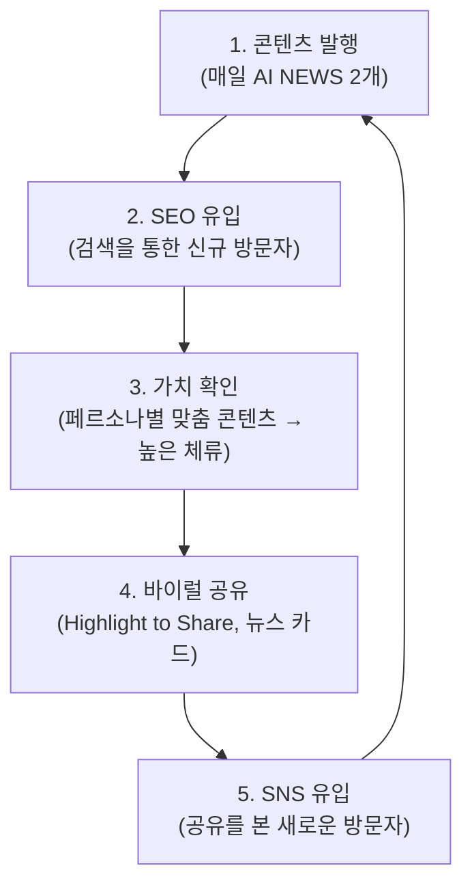

# Growth Loop & Viral

바이럴 루프와 오가닉 그로스 전략. 별도의 바이럴 캠페인이 아닌 기존 기능에 바이럴 관점을 녹여 자연스러운 공유를 유도한다.

## Growth Loop

콘텐츠 발행부터 SNS 바이럴까지 순환하는 플라이휠 구조.

**플라이휠 핵심 요소:**

- **콘텐츠 엔진** -- 매일 발행되는 AI 뉴스가 루프의 연료
- **SEO/GEO** -- 검색을 통한 지속적 신규 유입
- **페르소나 맞춤** -- 입문자/현직자 전환으로 체류 시간 극대화
- **공유 도구** -- 자연스러운 SNS 공유 장치 내장
- **소셜 유입** -- 공유된 콘텐츠가 새로운 방문자를 다시 데려옴

## Viral Mechanisms

> [!note] 설계 원칙
> - 공유 행위가 자연스러워야 함 -- 강제가 아닌 "이걸 공유하고 싶다"는 충동
> - 공유된 콘텐츠가 그 자체로 가치가 있어야 함 (단순 링크가 아닌 정보성 카드)
> - SNS 플랫폼별 최적화: X(Twitter), LinkedIn이 주요 채널

| 기능 | 바이럴 효과 | Phase |
|---|---|---|
| **Highlight to Share** | 인상적인 문장을 드래그 → SNS 공유 카드 자동 생성 | Phase 3 |
| **AI 뉴스 요약 카드** | Dynamic OG Image + 핵심 요약을 카드 형태로 공유 | Phase 3 |
| **페르소나 비교 공유** | "입문자/현직자는 이렇게 봤다" 비교 카드 | Phase 3 |
| **Prediction Game** | 퀴즈 결과 → 소셜 공유 (리더보드 경쟁) | Phase 4 |
| **Newsletter / RSS** | 구독자 리텐션 루프 -- 정기 발행으로 재방문 유도 | Phase 2+ |
| **커뮤니티 포인트** | 참여 인센티브 → 오가닉 공유 촉진 | Phase 3+ |

## Channel Strategy

### Organic

- **SEO** -- Astro SSG 기반 구조화 데이터(JSON-LD), 사이트맵, 메타 태그 최적화
- **GEO** -- AI 검색 엔진(Google AI Overview, Perplexity)에서 인용되는 콘텐츠 구조 (Phase 3)
- **RSS** -- 개발자 커뮤니티 피드 구독 유입

### Social

- **X (Twitter)** -- 개발자/AI 커뮤니티 주요 채널. 뉴스 카드 + Highlight 공유
- **LinkedIn** -- 테크 오디언스 타깃. 페르소나 비교 카드가 특히 효과적

### Community

- **댓글 참여** -- 커뮤니티 액션량이 충성도 상승 신호 (포인트/게임 기능 확대 트리거)
- **Prediction Game 리더보드** -- 경쟁 요소를 통한 재방문 + 결과 공유
- **커뮤니티 포인트** -- 활동 보상으로 참여도 선순환

## Growth Metrics

그로스 루프 효과를 측정하기 위한 핵심 지표:

| 지표 | 설명 | 비고 |
|---|---|---|
| **Share rate per post** | 포스트당 공유 횟수 | Highlight to Share + 카드 공유 합산 |
| **Viral coefficient (K-factor)** | 1명의 유저가 데려오는 신규 유저 수 | K > 1 이면 자체 성장 |
| **Time to first share** | 첫 공유까지 걸리는 시간 | 짧을수록 콘텐츠 임팩트 높음 |
| **Referral traffic %** | SNS/공유 기반 유입 비율 | GA4로 추적 |
| **재방문율** | 28일 기준 재방문 비율 `[28D]` | 25%+ 목표 |
| **AI 검색 유입** | GEO 기반 AI 검색 세션 수 | 300+/월 목표 (Phase 3) |

> [!note] 집계 윈도우 규칙
> - 기본: 최근 28일 `[28D]`
> - 프리미엄 검토: 최근 8주 이동평균 `[8W-MA]`
> - 유지율: 4주 코호트 `[4W-Cohort]`

## Related
- [[Business-Strategy]] — 상위 비즈니스 전략
- [[KPI-Gates-&-Stages]] — 그로스 KPI
- [[Newsletter-&-Email-Strategy]] — RSS/뉴스레터 리텐션 루프 상세
