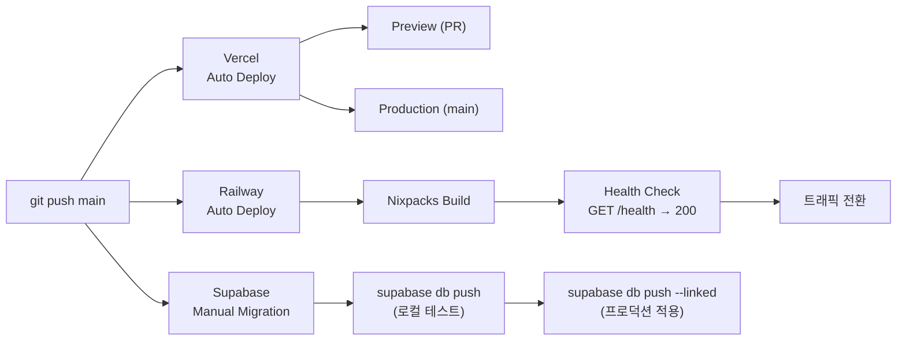

# Deployment Pipeline

0to1log의 CI/CD 워크플로우. Vercel(Frontend), Railway(Backend), Supabase(DB) 세 서비스에 대한 배포 파이프라인, GitHub Actions CI, 개발 환경 구성, 스키마 마이그레이션 전략을 다룬다.

## Deploy Workflow



### Vercel (Frontend)

| 설정 | 값 | 비고 |
|---|---|---|
| Production 브랜치 | `main` | main push 시 자동 프로덕션 배포 |
| Preview 브랜치 | 사용 안 함 (main only) | 단일 main 브랜치 워크플로우 |
| 빌드 캐시 | 활성화 (기본) | `node_modules`, `.astro` 캐시로 빌드 시간 단축 |
| Auto-cancel | 활성화 | 같은 브랜치에 연속 push 시 이전 빌드 취소 |
| Cron | `/api/trigger-pipeline` | `0 21 * * *` (매일 21:00 UTC) |

빌드 흐름: `npm install` → `astro build` (SSG 정적 생성) → Serverless Functions 패키징 (SSR) → Edge Network CDN 배포

> [!warning] Vercel Hobby 타임아웃
> Serverless Function 최대 실행 시간은 **10초**. Cron에서 Railway를 호출할 때 fire-and-forget 패턴(202 즉시 반환)을 사용하는 이유이다. 상세는 `03_Backend_AI_Spec.md` 섹션 1 참조.

### Railway (Backend)

| 설정 | 값 |
|---|---|
| 빌드 감지 | Nixpacks (자동) |
| 시작 명령어 | `uvicorn main:app --host 0.0.0.0 --port $PORT` |
| 헬스체크 | `GET /health` → `{"status": "ok", "timestamp": "..."}` |
| 자동 배포 | main 브랜치 push 시 |
| 재시작 정책 | 크래시 시 자동 재시작 (기본) |

> [!note] 배포 순서 원칙
> Frontend와 Backend가 동시에 변경되는 경우: **Backend(Railway) 먼저 배포 → 헬스체크 통과 확인 → Frontend(Vercel) 배포**. 새 API가 준비된 뒤 Frontend가 호출해야 에러를 방지할 수 있다.

## CI/CD (GitHub Actions)

### 워크플로우 구조

```
.github/workflows/
├── frontend-ci.yml    # PR 시 린트 + 빌드 체크
├── backend-ci.yml     # PR 시 린트 + 테스트
└── lighthouse.yml     # main 머지 후 성능 체크
```

### CI 워크플로우 요약

| 워크플로우 | 파일 | 트리거 | 스텝 |
|---|---|---|---|
| **Frontend CI** | `frontend-ci.yml` | PR (`src/**`, `public/**`, `astro.config.*`, `package.json`) | `npm ci` → `npm run lint` → `npm run build` → `npx astro check` |
| **Backend CI** | `backend-ci.yml` | PR (`backend/**`, `requirements.txt`) | `pip install` → `pytest tests/ -v --tb=short` → `ruff check backend/` |
| **Lighthouse** | `lighthouse.yml` | main push | `treosh/lighthouse-ci-action@v12` → `/`, `/log` 체크 |

**Lighthouse 예산:** LCP < 1,500ms, 스크립트 리소스 < 10개 (`lighthouse-budget.json`)

> [!note] Solo 프로젝트에 CI가 필요한 이유
> CI가 자동으로 체크하면 기본 품질이 보장되고, 포트폴리오로 보여줄 때 CI/CD 파이프라인 자체가 역량 증명이 된다.

### 성공 기준

1. **Vercel:** main push → 프로덕션 자동 배포 성공, Preview Deployment URL 생성
2. **Railway:** main push → Nixpacks 빌드 성공, `GET /health` → 200 OK
3. **CI:** Frontend PR → lint + build + astro check 통과 / Backend PR → pytest + ruff 통과

## Development Environment

### 로컬 개발 세팅

**Frontend:**
```bash
git clone <repo>
cd frontend
npm install
cp .env.example .env
npm run dev          # http://localhost:4321
```

**Backend** (별도 터미널):
```bash
cd backend
python -m venv .venv
pip install -r requirements.txt
cp .env.example .env
uvicorn main:app --reload --port 8000
```

### 개발 도구

| 도구 | 용도 |
|---|---|
| **VS Code** | 에디터 |
| **Astro VS Code Extension** | Astro 구문 강조, 타입 체크 |
| **Tailwind CSS IntelliSense** | 클래스 자동 완성 |
| **ESLint + Prettier** | 코드 포맷팅 |
| **Ruff** | Python 린트 |
| **Supabase CLI** | 로컬 DB 스키마 관리, 마이그레이션 |

### Git 브랜치 전략

Solo 프로젝트이므로 `main` 하나만 사용한다. 별도 `develop`, `feature/*`, `fix/*` 브랜치는 기본 전략에 포함하지 않는다.

- 모든 변경은 `main`에서 작은 단위로 커밋하고, 로컬 검증 후 push
- Preview Deployment는 필요 시 선택적으로만 사용
- 커밋 메시지: `feat:`, `fix:`, `docs:`, `chore:` prefix (Conventional Commits)

### 스테이징 환경 전략

별도 스테이징 서버를 두지 않고, Vercel Preview + Supabase 로컬 환경으로 대체한다.

| 레이어 | 스테이징 대체 수단 |
|---|---|
| **Frontend** | Vercel Preview Deployment (PR별 자동 생성) |
| **Backend** | 로컬 FastAPI (`--reload`) |
| **DB** | `supabase start` → `supabase db reset` → `supabase db push` (로컬 PostgreSQL) |
| **프로덕션 데이터 테스트** | `pg_dump` → `pg_restore` (로컬 54322 포트) |

## Supabase Schema Migration

### 마이그레이션 전략

Supabase CLI로 스키마 변경 버전 관리:

```bash
supabase migration new <name>    # 마이그레이션 파일 생성
# SQL 편집
supabase db push                 # 로컬 테스트
supabase db push --linked        # 프로덕션 적용
```

### 마이그레이션 파일 구조

```
supabase/
├── config.toml
├── migrations/
│   ├── 00001_initial_schema.sql       # posts + admin_users (uid-based RLS)
│   ├── 00002_pipeline_tables.sql      # pipeline infra (uid-based RLS)
│   ├── 00003_handbook_terms.sql       # handbook (multi-category + uid-based RLS)
│   └── 00004_user_tables.sql          # profiles, bookmarks, reading_history, learning_progress
└── seed.sql                           # 개발용 더미 데이터
```

### 마이그레이션 안전 규칙

> [!important] 프로덕션 적용 전 반드시 로컬에서 테스트한다
> `supabase start` → `supabase db reset` 으로 로컬 환경에서 먼저 검증한 뒤에 프로덕션에 적용할 것.

- **파괴적 변경** (DROP, 컬럼 삭제)은 마이그레이션 전에 수동 백업을 먼저 한다
- **마이그레이션 파일은 Git에 커밋한다** — 스키마 변경 이력이 곧 문서
- **롤백 SQL은 같은 마이그레이션 파일에 주석으로 포함한다**
  ```sql
  ALTER TABLE ... ADD COLUMN ...;
  -- Rollback: ALTER TABLE ... DROP COLUMN ...;
  ```

## Related
- [[Infrastructure-Topology]] — 서비스 토폴로지
- [[Monitoring-&-Logging]] — 배포 모니터링

## See Also
- [[Backend-Stack]] — 배포 대상 백엔드 (02-Architecture)
