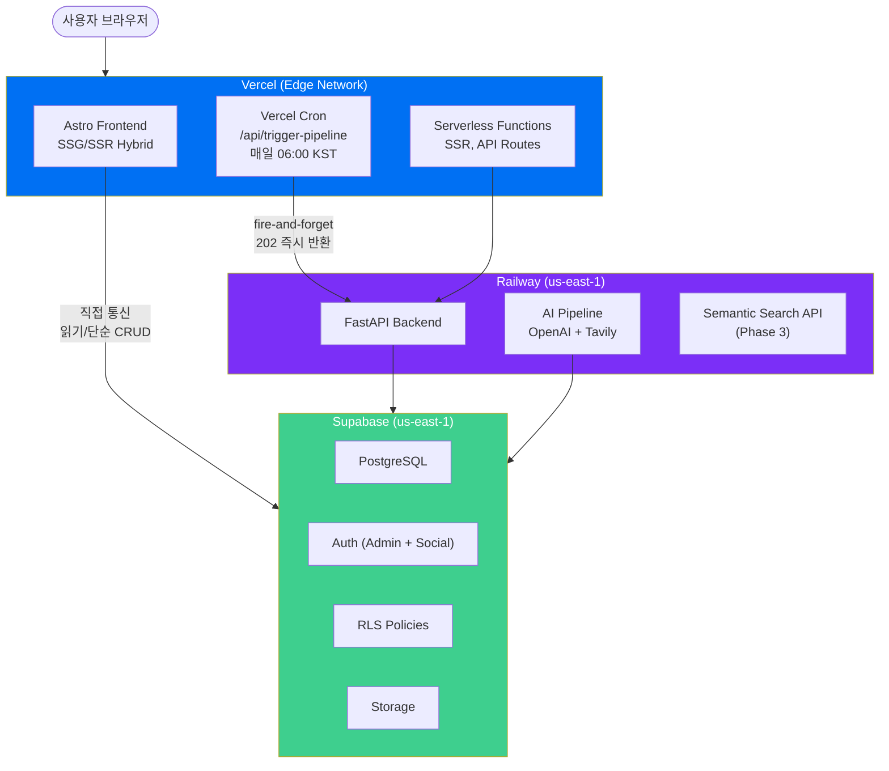

# Infrastructure Topology

0to1log는 **Vercel + Railway + Supabase** 3-서비스 아키텍처로 구성된다. 프론트엔드(Vercel)가 CDN과 Cron 트리거를 담당하고, 백엔드(Railway)가 AI 파이프라인과 API를 처리하며, Supabase가 데이터 저장과 인증을 맡는다. 모든 서비스는 us-east-1 리전에 통일하여 서비스 간 지연을 최소화한다.

## Service Architecture



## Service Roles

| Service | Role | Free Tier | Phase |
|---|---|---|---|
| **Vercel** | Frontend 호스팅, CDN, SSG/SSR, Cron 트리거, Serverless Functions | Hobby (무료) — 월 100GB 대역폭, 10초 타임아웃, Cron 2개 | Phase 1~ |
| **Railway** | FastAPI 백엔드, AI 파이프라인, 시맨틱 검색 API, 커뮤니티 API | Starter ($5/월 크레딧) → Stage B 시 Developer | Phase 2~ |
| **Supabase** | PostgreSQL, Auth, RLS, 댓글 CRUD, Storage, pgvector (Phase 3) | Free — 500MB DB, 50K MAU | Phase 1~ |
| **OpenAI** | gpt-4o / gpt-4o-mini API | 종량제 (~$4.5/월) | Phase 2~ |
| **Tavily** | 뉴스 수집 API (시맨틱 검색) | Free (1,000 calls/월) | Phase 2~ |
| **GitHub** | 소스 코드, CI/CD (Actions) | Free (2,000분/월) | Phase 1~ |

## Hybrid Data Boundary

프론트엔드와 백엔드 사이의 데이터 흐름은 **하이브리드 경계** 원칙을 따른다.

**Frontend → Supabase (직접 통신)**
- 글 조회 (PostgREST)
- 댓글 CRUD (PostgREST + RLS)
- 인증 (Supabase Auth)
- 단순 읽기 및 CRUD 작업

**Frontend → FastAPI (Railway 경유)**
- 시맨틱 검색 (Phase 3)
- AI 파이프라인 트리거
- 커뮤니티/포인트 API (Phase 4)
- 구독 권한 검증 (Phase 4)
- Admin 관리 API

> [!important] Fire-and-Forget 패턴
> Vercel Cron이 Railway를 호출할 때 **202 즉시 반환** 패턴을 사용한다. Vercel Serverless Function의 10초 타임아웃 제한을 우회하기 위해, Railway가 요청을 수신하면 즉시 202를 응답하고 파이프라인을 백그라운드에서 실행한다.

**FastAPI → Supabase**
- AI 파이프라인 결과 저장
- Service Role Key를 사용한 RLS 우회 (서버 전용)

## Environment Variables

### Vercel (Frontend)

| Variable | Type | Description |
|---|---|---|
| `PUBLIC_SUPABASE_URL` | Public | Supabase 프로젝트 URL (클라이언트 노출 OK) |
| `PUBLIC_SUPABASE_ANON_KEY` | Public | Supabase Anon Key (클라이언트 노출 OK) |
| `PUBLIC_SITE_URL` | Public | 사이트 URL (https://0to1log.com) |
| `CRON_SECRET` | Private | Railway 호출 시 인증 토큰 |
| `FASTAPI_URL` | Private | Railway FastAPI URL |
| `REVALIDATE_SECRET` | Private | ISR revalidation 인증 |

### Railway (Backend)

| Variable | Type | Description |
|---|---|---|
| `SUPABASE_URL` | Private | Supabase 프로젝트 URL |
| `SUPABASE_SERVICE_KEY` | Private | Supabase Service Role Key (RLS 우회) |
| `OPENAI_API_KEY` | Private | OpenAI API 키 |
| `OPENAI_MODEL_MAIN` | Private | 메인 모델 (gpt-4o) |
| `OPENAI_MODEL_LIGHT` | Private | 경량 모델 (gpt-4o-mini) |
| `TAVILY_API_KEY` | Private | Tavily 뉴스 수집 API 키 |
| `ADMIN_EMAIL` | Private | 관리자 이메일 |
| `CRON_SECRET` | Private | Cron 호출 인증 토큰 |
| `FASTAPI_URL` | Private | 자기 참조 URL |
| `REVALIDATE_SECRET` | Private | Vercel revalidation 호출용 |

### Supabase

Supabase 환경 변수는 대시보드에서 자동 관리된다. 수동 설정 불필요.

> [!warning] Service Role Key 보안
> `SUPABASE_SERVICE_KEY`는 RLS를 우회하는 강력한 키이다. **절대로 프론트엔드에 노출하지 않는다.** Frontend에는 `PUBLIC_SUPABASE_ANON_KEY`만 사용한다. `.env` 파일은 Git에 커밋하지 않으며, `.env.example`에는 키 이름만 나열한다.

> [!note] 환경 분리 원칙
> - `PUBLIC_*` 접두사: 클라이언트 번들에 포함 OK → `import.meta.env.PUBLIC_*`
> - Private (Frontend): Serverless에서만 접근 → `process.env.*`
> - Private (Backend): Railway에서만 접근 → `os.environ["*"]`
> - `CRON_SECRET`은 Vercel과 Railway **양쪽에 동일한 값**을 설정한다.
> - 시크릿 값은 최소 32자 랜덤 문자열 사용: `openssl rand -hex 32`

## Domain & SSL

| Item | Value |
|---|---|
| **Domain** | `0to1log.com` |
| **Registrar** | Cloudflare Registrar |
| **Nameservers** | Vercel (도메인 연결 시 설정) |
| **SSL** | Vercel 자동 발급 (Let's Encrypt) |
| **www Redirect** | `www.0to1log.com` → `0to1log.com` (301) |

### DNS Records

```
Type    Name    Value                   TTL
A       @       76.76.21.21             300    (Vercel)
CNAME   www     cname.vercel-dns.com    300    (Vercel)
```

### Railway URL

Railway 백엔드는 `*.up.railway.app` 기본 URL을 사용한다. 커스텀 도메인(`api.0to1log.com`)은 Phase 3 이후 필요 시 설정 예정.

### Subdomain Plan

| Subdomain | Purpose | Timeline |
|---|---|---|
| `api.0to1log.com` | FastAPI 엔드포인트 (현재 Railway 기본 URL) | 필요 시 |
| `admin.0to1log.com` | Admin 분리 (현재 `/admin` 경로) | 예정 없음 |

## Related

- [[Deployment-Pipeline]] — 배포 워크플로우
- [[Backend-Stack]] — Railway FastAPI 상세
- [[Frontend-Stack]] — Vercel Astro 상세
- [[Security]] — 보안 정책
- [[Cost-Model-&-Stage-AB]] — 서비스 비용
