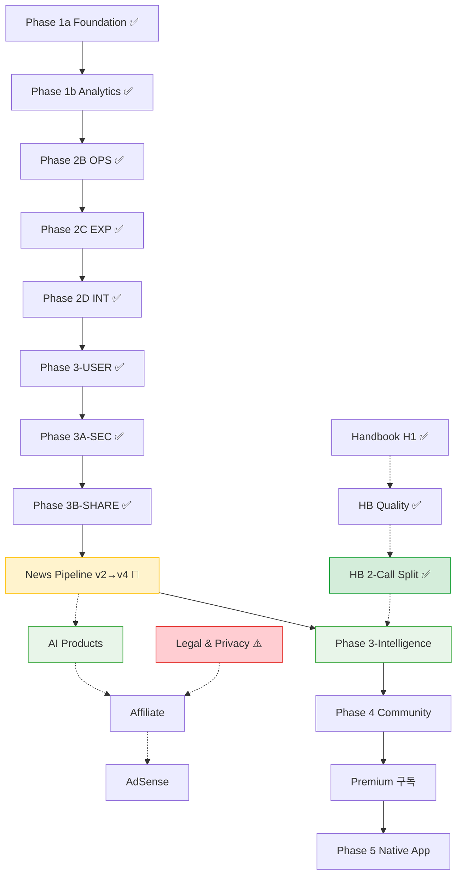

# Implementation Plan

> 바이브 코딩 속도는 유지하고, 재작업을 유발하는 핵심 리스크만 강제하는 ==실행 계약==.

---

## 운영 원칙

### Hard Gates

> [!important] 필수 게이트 — 모든 Phase에서 강제한다.

1. API 스키마 변경은 프론트/백 동시 반영한다 (한쪽만 변경 금지).
2. 각 태스크 완료 판정은 반드시 `검증 명령 + 통과 조건`으로 기록한다.
3. [[plans/ACTIVE_SPRINT]] 태스크 ID는 기존 번호대와 충돌하지 않도록 신규 번호대로 발급한다.

**DoD 최소 규칙**
- `상태=done`이면 반드시 `체크=[x]` + 증거 링크(PR/로그/스크린샷 중 1개 이상)
- 문서/코드 변경 후 `Current Doing` 동기화
- 실패 시 `review` 또는 `blocked`로 전환하고 원인 1줄 기록

### Nice-to-have

1. 태스크별 성능 예산(예: INP/LCP)을 더 세분화
2. UI 회귀 스냅샷 자동화
3. 디자인 토큰 lint 자동 검사

---

## Phase 흐름

### Current Status

> [!important] 현재 스프린트: ==News Pipeline v4 Quality Stabilization== (NP4-Q)
> **마지막 업데이트:** 2026-03-26 17:45 (+27 commits since 2026-03-19)

- **완료:** 1a → 1b → 2B → 2C → 2D → 3-USER → 3A-SEC → 3B-SHARE ✅
- **병렬 완료:** Handbook H1 + 품질 강화 + 2-Call Split + Daily Digest v3 전환 + v4 2-페르소나 전환 ✅
- **진행 중:** NP v4 Quality Stabilization (50+ 태스크 중 48+ 완료) — [[plans/ACTIVE_SPRINT]]

  **완료된 주요 작업 (2026-03-20 이후):**
  - [x] Per-persona skeleton refactor + Research Learner accessibility (fc517fa)
  - [x] Prompt structural parity rules (412ec85)
  - [x] Persona-specific source citations (3133567)
  - [x] Weekly Recap backend 완성 + parallelize generation (ceb295c)
  - [x] Quality score Y-axis scaling fix (63c7e9d)
  - [x] Citation format 표준화 → Perplexity style (8af5625)
  - [x] Analytics tab 확장 (quiz performance, feedback, traffic) (80f2560)
  - [x] Handbook admin override 토글 (e14aa7d)
  - [x] KaTeX math 렌더링 보안 개선 (24aa89a)
  - [x] 총 11개 prompt quality fix + 16개 아키텍처/QA 개선

  **남은 것:**
  - [ ] `PROMPT-AUDIT-01`: 52개 이슈 중 11개 fix 배포됨, 41개 남음 (rolling fix 중)
  - [ ] `COMMUNITY-01`: Reddit/HN/X 반응 수집 (계획서는 작성됨)
  - [ ] `DIGEST-04`: Daily Digest 프론트엔드 최종 검증
  - [ ] `WEEKLY-01`: Weekly Recap 프론트엔드 + integrate (backend done)
  - [ ] ruff check + pytest 통과 (PROMPT-AUDIT 완료 후)

- **다음:** Phase 3-Intelligence (기준: NP4 quality stabilization 완료 + PROMPT-AUDIT 70% 이상 완료 예상 2026-03-30)

### Product Language Boundary

| 구분 | 용어 |
| --- | --- |
| Public | `AI News`, `Handbook`, `Library` |
| Internal / Admin | `Posts`, `Handbook` |
| Route | `/{locale}/log/` (AI News 호환 경로) |

### Navigation Shell Contract

| Shell | 구조 |
| --- | --- |
| Web | `[Brand] [Primary Nav] [Utilities]` |
| Mobile / App | `[Brand/Page] [Profile or Settings]` + primary nav 별도 노출 |
| Primary Nav | `AI News \| Handbook \| Library` (고정) |
| Utility Drawer | Language, Theme 컨트롤 (공개 헤더 인라인 아님) |

---

## ACTIVE_SPRINT 연동 규칙

- 태스크 템플릿 필수 필드 (10개):
  1. 체크
  2. 상태
  3. 목적
  4. 산출물
  5. 완료 기준
  6. 검증 명령
  7. 통과 조건
  8. 증거
  9. 참조
  10. 의존성
- 같은 Phase 내 기본 참조는 ==[[plans/ACTIVE_SPRINT]] 우선==
- Phase 전환 또는 게이트 판정 시에만 이 문서(Implementation Plan)를 재조회

---

## 기본 가정

- 이 문서는 구현 코드가 아니라 ==실행 계약 문서==다.
- Phase별 상세 범위/태스크/게이트는 [[Phase-Flow]]에서 관리한다.
- 목표는 "최소 규칙으로 최대 실행 속도"이며, 과도한 세부 규칙은 Nice-to-have로 분리한다.
- Backend Python virtualenv는 `backend/.venv`만 사용한다 (`backend/venv` 금지).

---

## Related

- [[plans/ACTIVE_SPRINT]] — 현재 스프린트 태스크
- [[Phase-Flow]] — Phase별 상세 범위 + 완료 기준
- [[Checklists-&-DoD]] — 완료 기준 + 검증 체크리스트
- [[Phases-Roadmap]] — 전체 로드맵
