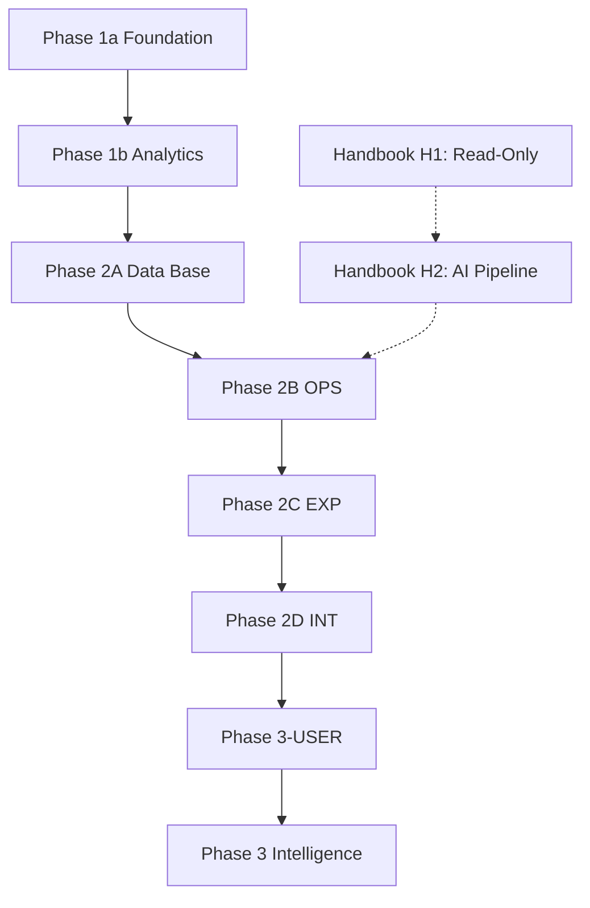

# Implementation Plan

> 바이브 코딩 속도는 유지하고, 재작업을 유발하는 핵심 리스크만 강제하는 ==실행 계약==.

---

## 운영 원칙

### Hard Gates

> [!important] 5개 필수 게이트 -- 모든 Phase에서 강제한다.

1. OpenAPI/응답 스키마를 ==2B 시작 시점에 고정==한다.
2. 2C는 2B에서 고정된 스키마 기반 ==Mock만 사용==한다.
3. Cron은 ==2B에서 endpoint skeleton만==, ==2D에서 실운영 연동/E2E==를 수행한다.
4. 각 태스크 완료 판정은 반드시 `검증 명령 + 통과 조건`으로 기록한다.
5. [[Active-Sprint]] 태스크 ID는 기존 Addendum과 충돌하지 않도록 신규 번호대로 발급한다.

**DoD 최소 규칙**
- `상태=done`이면 반드시 `체크=[x]` + 증거 링크(PR/로그/스크린샷 중 1개 이상)
- 문서/코드 변경 후 `Current Doing` 동기화
- 실패 시 `review` 또는 `blocked`로 전환하고 원인 1줄 기록

### Nice-to-have

1. 태스크별 성능 예산(예: INP/LCP)을 더 세분화
2. UI 회귀 스냅샷 자동화
3. 디자인 토큰 lint 자동 검사

---

## Phase 흐름

### Handbook 별도 트랙

> [!note] Handbook은 메인 Phase와 병렬 진행한다.

- **H1** (읽기 전용) -- 즉시 착수 가능
- **H2** (AI 수집 파이프라인) -- Phase 2B 이후
- 제품 우선순위: `/log` AI News + `/handbook` + `/library`가 메인 app surface, `/portfolio`는 비핵심 showcase surface
- 병렬 작업은 별도 sprint 문서 `docs/plans/ACTIVE_SPRINT_HANDBOOK.md`로 운영
- 상세 스펙 --> `docs/08_Handbook.md`

### Product Language Boundary

| 구분 | 용어 |
| --- | --- |
| Public | `AI News`, `Handbook`, `Library` |
| Internal / Admin | `Posts`, `Handbook` |
| Route | `/{locale}/log/` (AI News 호환 경로) |

### Navigation Shell Contract

| Shell | 구조 |
| --- | --- |
| Web | `[Brand] [Primary Nav] [Utilities]` |
| Mobile / App | `[Brand/Page] [Profile or Settings]` + primary nav 별도 노출 |
| Primary Nav | `AI News \| Handbook \| Library` (고정) |
| Utility Drawer | Language, Theme 컨트롤 (공개 헤더 인라인 아님) |

### Current Status

> [!important] Mainline 구현 상태: ==Phase 3A-SEC 완료== (main 반영 완료)

- **완료된 단계:** 2B-OPS, 2C-EXP, 2D-INT, 3-USER, 3A-SEC
- **병렬 진행:** Handbook H1은 `docs/plans/ACTIVE_SPRINT_HANDBOOK.md` 기준 별도 운영
- **다음 메인라인 스프린트:** Phase 3-Intelligence (AI 추천 + 학습 고도화)

### Phase 3-Intelligence Draft Backlog

| ID | 내용 | 설명 |
| --- | --- | --- |
| `P3I-REC-01` | AI News 개인화 추천 | 읽기 기록, 북마크, 카테고리 선호 기반 리스트/상세 rail 추천 고도화 |
| `P3I-LIB-01` | My Library 재방문 흐름 고도화 | 저장한 뉴스/용어 resurfacing 규칙 + 재방문 UI |
| `P3I-HBK-01` | Handbook feedback 집계 | `term_feedback`의 helpful/confusing 신호 admin 집계 + 보완 우선순위 |
| `P3I-HBK-02` | Handbook advanced body AI 보강 | `body_advanced_*`를 AI 초안/보강 파이프라인과 연결 (H2 핵심) |
| `P3I-QA-01` | 추천/학습 기능 QA 및 측정 | 추천 클릭률, feedback 반응률, 재방문율 지표 정의 + QA 시나리오 |

---

## Phase 실행 계획

### 2B-OPS (완료)

> [!note] 백엔드 기능 고정

| 태스크 | 내용 |
| --- | --- |
| `P2B-API-01` | AI Agent 로직 + Prompt 튜닝 (외부 API 테스트는 Mock 필수) |
| `P2B-API-02` | Admin CRUD 엔드포인트 + 인증/권한 테스트 |
| `P2B-CRON-00` | Cron endpoint skeleton + 인증 헤더 검증 (실운영 연동 제외) |

**2B Gate**
- [x] OpenAPI 문서 고정 (목록/상세/에러 응답 포함)
- [x] `pytest` 통과
- [x] 401/403 분리 동작 확인

### 2C-EXP (완료)

> [!note] 프론트 경험 고도화

| 태스크 | 내용 |
| --- | --- |
| `P2C-UI-11` | Newsprint 토큰/테마/공통 컴포넌트 정리 |
| `P2C-UI-12` | `/en\|ko/log` 리스트/상세 + 다국어 스위처 + 화면 상태 (empty/error/loading) |
| `P2C-UI-13` | 썸네일 이미지 newsprint 필터 (`.img-newsprint` grayscale+sepia, hover 시 원본 복원) |
| `P2C-UI-14` | Admin Editor 화면 구현 (마크다운 작성/미리보기 + Save/Publish), mock 사용 |
| `P2C-UI-15` | Admin Editor 상태/권한 처리 구현, mock-first |
| `P2C-QA-11` | 반응형/접근성/성능 QA |

- 인증 범위: ==mock UI/state까지== 제한 (실제 세션 복원/토큰 연동은 2D)
- 우측 컬럼 fallback 기준 고정: `Editor's Note`=정적 카피, `Most Read`=latest fallback, `Focus of This Article`=category template, `More in This Issue`=latest related fallback

**2C Gate**
- [x] 반응형: mobile/tablet/desktop 레이아웃 정상
- [x] 접근성: `prefers-reduced-motion`, 키보드 포커스, 대비 기준 통과
- [x] Lighthouse: Perf/Best/SEO/Acc >= 85
- [x] Core Web Vitals: LCP < 2.8s, CLS < 0.1, INP < 250ms
- [x] `npm run build` 0 error
- [x] Admin Editor mock 워크플로우 정상

### 2D-INT (완료)

> [!note] 통합 / E2E

| 태스크 | 내용 |
| --- | --- |
| `P2D-SEC-01` | Frontend/SSR 보안 하드닝 |
| `P2D-SEC-02` | Backend/API 보안 하드닝 |
| `P2D-AUTH-01` | Supabase Auth 실연동 |
| `P2D-SYNC-01` | 프론트 Mock 제거 후 실제 API fetch 연동 |
| `P2D-CRON-01` | Vercel Cron --> Backend 파이프라인 실운영 연동 |
| `P2D-QA-01` | E2E 통합 테스트 |

추가 범위:
- 우측 컬럼 실데이터 치환
- 언어 전환 실데이터 치환 (`translation_group_id`, `source_post_id` -- pair 없으면 locale index fallback)
- 일반 사용자 로그인은 ==기본 진입/세션 유지 수준만== (확장은 Phase 3~4)
- 보안 정정: `P2D-SEC-01/02` 범위 내에서 닫음 (`config.py` extra ignore, test env isolation, `FASTAPI_URL` 통일, `x-vercel-cron` 우회 제거)

**2D Gate**
- [x] 실데이터 기준 리스트/상세 렌더링 정상
- [x] `/api/trigger-pipeline` 공개 호출 차단
- [x] markdown raw HTML 차단/sanitize
- [x] Admin 로그인/세션 복원/보호 경로 정상
- [x] 로그아웃/세션 만료 일관 전환
- [x] backend 보안 테스트 환경변수 충돌 없이 실행
- [x] admin/cron rate limit 적용
- [x] 언어 전환 EN/KO pair 이동
- [x] Cron 파이프라인 실행 로그 확인
- [x] E2E 시나리오 통과

### 3-USER (완료)

> [!note] 일반 사용자 기능

- **소셜 로그인:** GitHub + Google OAuth via Supabase Auth (`/login`)
- **DB:** `profiles`, `user_bookmarks`, `reading_history`, `learning_progress` 4개 테이블 + RLS
- **profiles 확장:** username, bio, preferred_locale, is_public, onboarding_completed
- **헤더:** Sign In / 아바타 드롭다운 (내 서재, 설정, 로그아웃)
- **읽기 기록:** 상세 페이지 방문 시 자동 기록, 리스트에서 읽은 글 `opacity: 0.55`
- **북마크:** 리스트 카드 + 상세 페이지 북마크 아이콘 (기사 + 용어 통합)
- **학습 진도:** Handbook 카테고리별 용어 학습 현황
- **내 서재:** `/library` -- 읽은 글 탭 + 저장한 글 탭 + 학습 현황 탭
- **추후 확장:** 댓글/리액션, 사이트 내부 알림 (C단계)
- 상세 설계 --> `docs/plans/2026-03-08-user-features-design.md`

### 3B-SHARE (완료)

> [!note] 소셜 공유 버튼

- X(Twitter), LinkedIn, URL 복사
- Web Share API 지원 시 네이티브 공유 시트 우선, 미지원 시 플랫폼별 폴백
- OG meta 태그 정비 (title, description, image) -- 카드 미리보기 최적화
- Phase 3 "Highlight to Share"와는 별개의 기본 공유 기능
- 의존성: 없음 (로그인 불필요, 프론트엔드만)

### 3A-SEC (완료)

> [!note] 후속 보안 하드닝

- CSP nonce 기반 전환 (`unsafe-inline` 제거)
- analytics/script 로딩 nonce 재정비 (`strict-dynamic` 포함)
- Web Interface Guidelines 기반 보안 리뷰 수정 5건 (Open Redirect, lang, color-scheme, 버튼 로딩)

---

## ACTIVE_SPRINT 연동 규칙

- 2C 신규 태스크는 기존 `2C-EXP Addendum` 이후 번호 사용 (`P2C-UI-11`부터)
- 태스크 템플릿 필수 필드 (10개):
  1. 체크
  2. 상태
  3. 목적
  4. 산출물
  5. 완료 기준
  6. 검증 명령
  7. 통과 조건
  8. 증거
  9. 참조
  10. 의존성
- 같은 Phase 내 기본 참조는 ==[[Active-Sprint]] 우선==
- Phase 전환 또는 게이트 판정 시에만 이 문서(Implementation Plan)를 재조회

---

## 기본 가정

- 이 문서는 구현 코드가 아니라 ==실행 계약 문서==다.
- 2A는 완료 상태로 간주하고, 다음 실행 기준은 2B부터다.
- 목표는 "최소 규칙으로 최대 실행 속도"이며, 과도한 세부 규칙은 Nice-to-have로 분리한다.
- Backend Python virtualenv는 `backend/.venv`만 사용한다 (`backend/venv` 금지).

---

## Related

- [[Active-Sprint]] -- 현재 스프린트 태스크
- [[Checklists-&-DoD]] -- 완료 기준 + 검증 체크리스트
- [[Phase-Flow]] -- 프론트엔드 Phase별 구현 범위
- [[Phases-Roadmap]] -- 전체 로드맵
