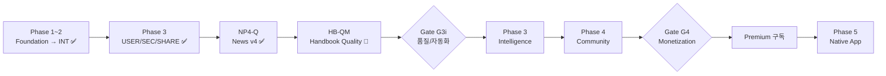

# Phase Flow

> Phase별 구현 범위, 진입/완료 기준, Gate 정량 지표를 관리하는 운영 지도.
> 실행 계약은 [[Implementation-Plan]]. 현재 스프린트는 [[plans/ACTIVE_SPRINT]].
>
> **마지막 업데이트:** 2026-04-16 (Phase 3-Intelligence G3i Gate 정량화)

---

## 전체 흐름

---

## 완료 Phase (요약)

> 상세 회고는 [[12-Journal-&-Decisions/]] 참조.

| Phase | 기간 | 핵심 | 회고 |
|-------|------|------|------|
| Phase 1a Foundation | 2025-11 ~ 12 | Astro v5 + Tailwind + 3테마 + Vercel 배포 | — |
| Phase 1b Data Connection | 2025-12 | Supabase 연동 + Hybrid SSR/SSG | — |
| Phase 2B OPS | 2026-01 | FastAPI + OpenAPI + Agent 로직 + Cron | — |
| Phase 2C EXP | 2026-01 ~ 02 | Lighthouse ≥85, CWV, 반응형/접근성 | — |
| Phase 2D INT | 2026-02 | Supabase Auth + Rate limit + CSP + E2E | — |
| Phase 3-USER | 2026-02 | OAuth, /library, 북마크/읽기기록 | — |
| Phase 3A-SEC | 2026-03-09 | CSP nonce, Open Redirect, 5개 보안 리뷰 | — |
| Phase 3B-SHARE | 2026-03-13 | Web Share API, OG 최적화 | — |
| Handbook H1 | 2026-03-09 ~ 10 | 용어집 기초 + Admin 에디터 + AI Advisor | — |
| Handbook Quality | 2026-03-13 ~ 16 | 4-call 분리, Tavily, self-critique, 점수 | — |
| Handbook Redesign (HB-REDESIGN) | 2026-04-09 ~ 10 | Basic 13→7 + Advanced 11→7 + Hero/Refs/Checklist | [[2026-04-10-handbook-section-redesign-shipped]] |
| News Pipeline v4 (NP4-Q) | 2026-03-15 ~ 04-10 | Skeleton-map, Expert+Learner, AUTOPUB, 100+ commits | [[2026-04-10-np4q-sprint-close]] |
| News Pipeline Hardening (NP-HARDEN) | 2026-04-15 ~ 16 | 4-file split, URL 검증, SEO-spam blocklist, API diet -46%, token -1956 | [[2026-04-17-news-pipeline-hardening-retro]] |

---

## 현재: Handbook Quality & Content Migration (HB-QM) 🔄

> **기간:** 2026-04-10 ~ 진행 중
> **상세:** [[plans/ACTIVE_SPRINT]]

### 스프린트 목표

핸드북 콘텐츠 품질 및 규모 확장 — 138개 전량 재생성 + P0 품질 수정 + SEO 구조화 데이터.

### 게이트 (BLOCKING)

- [ ] **HB-MIGRATE-138** — 138개 published 용어 v4 7섹션 구조 + redesign 필드로 regenerate
- [ ] **HQ-01** — Hallucination 즉시 수정 (stereo matching, ecosystem integration adv)
- [ ] **HQ-02** — 비기술 용어 archived 처리
- [ ] **HQ-11** — SEO 구조화 데이터 (DefinedTerm + FAQPage + BreadcrumbList)
- [ ] **최종 검증** — `ruff check .` + `pytest tests/ -v`

### 스프린트 중 완료 (mid-sprint ship)

- [x] **NP-HARDEN-01~03 + NP-DIET-01 + NP-AUDIT-01** (2026-04-15~16) — 뉴스 파이프라인 3-phase 하드닝. `pipeline.py` 3794→2149줄, URL 검증, SEO-spam blocklist, API -46%, token -1956. 34 commits. [[2026-04-17-news-pipeline-hardening-retro|회고]]
- [x] **HB-MEASURE-01** (2026-04-16) — Objective handbook quality check layer (5 checks + 테스트). NP-HARDEN의 measurement-first 패턴을 핸드북에 적용. [[2026-04-16-handbook-quality-measurement-plan|plan]]

### 진행 중 — HB-MEASURE Phase 2

- [ ] **HB-MEASURE-02** — Measurement CLI + production DB baseline 출력
- [ ] **HB-MEASURE-03** — Baseline report → `vault/09-Implementation/plans/measurements/2026-04-16-handbook-baseline.md`
- [ ] **HB-MEASURE-04** — 데이터 기반 HQ/HB-QUALITY 스코프 재평가

### 관찰 중 (~2026-04-30)

- [ ] **NP-OBSERVE-01~04** — NP-HARDEN 후 4개 long-tail metric 추적 (Exa candidate pool, token runtime, measurement v2 failure mode, Business digest 길이)

### 선택 목표

HQ-03, HQ-05, HQ-12, HQ-13, GPT5-01~05, Weekly Recap 프론트 통합.

### 실패 시 점검 포인트

- 138개 재생성 비용/시간이 초과되는가
- HB-MEASURE baseline이 예상 대비 너무 좋거나/나쁘면 스코프 재설계
- GPT5 마이그레이션이 HB-MIGRATE-138을 blocking하는가 (어느 모델로 재생성할지)
- HQ-13 term type 재설계 범위가 너무 커졌는가

---

## 다음: Phase 3-Intelligence 🎯

> HB-QM 게이트 통과 후 시작. **AI 추천 + 학습 고도화.**

### 진입 Gate (G3i) — 품질/자동화 지표

**정량 기준 (4개 모두 충족):**

| ID | 지표 | 기준 | 근거 |
|----|------|------|------|
| G3i-1 | 핸드북 평균 quality_score (최근 30일 published) | ≥ 85 | AUTOPUB-01 기준과 일치 |
| G3i-2 | 주간 뉴스 자동 발행 비율 | ≥ 70% | HITL 개입 30% 이하 = 파이프라인 신뢰도 |
| G3i-3 | 7일 평균 pipeline 실패율 | < 5% | checkpoint 도입 후 안정성 측정 |
| G3i-4 | 핸드북 published 용어 수 | ≥ 200 | HB-MIGRATE-138(138개) + 확장 |

**정성 기준 (동시 충족):**

- [x] News Pipeline v4 완료 (NP4-Q)
- [x] HB-REDESIGN ship (2026-04-10)
- [ ] HB-MIGRATE-138 완료
- [ ] HQ P0 (01, 02, 11) 배포
- [ ] `ruff check` + `pytest tests/` 통과

### 핵심 태스크 (Wave)

**Wave 1: 개인화 기초**
- 개인 학습 프로필 (사용자 선호도 저장)
- 뉴스 추천 알고리즘 (관심 기반)
- Weekly Recap 프론트엔드 통합

**Wave 2: 커뮤니티 기반**
- COMMUNITY-01 — Reddit/HN/X 반응 수집
- 사용자 피드백 수집 (퀴즈, 북마크, 댓글)
- 트렌드 분석 및 핫이슈 추천

**Wave 3: 자동화 확장**
- 스마트 발행 스케줄 (최적 시간)
- A/B 테스트 자동화

### 실패 시 점검 포인트

- 품질이 아니라 양에 집착하고 있지 않은가 (G3i-1 vs G3i-4)
- 자동화가 편집자 개입의 필요성을 가리고 있지 않은가
- 추천/학습 Wave가 core loop(뉴스 읽기 → 핸드북 학습)를 복잡하게 만들고 있지 않은가

---

## Phase 4 — Community & Monetization

> Phase 3-Intelligence 완료 후.

### 진입 Gate (G4)

> 상세: [[KPI-Gates-&-Stages]]

- WAU 500+ (4주 연속)
- 재방문 30%+
- 페르소나 전환 15%+
- 웨이트리스트 100+
- paywall 완독률 35%+
- 결제 전환율 2%+

### 핵심 범위

| 기능 | 비고 |
|------|------|
| AI Semantic Search (Cmd+K → pgvector) | |
| Dynamic OG Image | |
| Highlight to Share | 바이럴 장치 |
| 포인트 시스템 UI | [[Community-&-Gamification]] |
| Prediction Game UI | 퀴즈/베팅/투표 |
| 학습 모드 (lesson cards + skill tree + streak) | Duolingo style |
| Monetization 표면 | Affiliate → AdSense → Premium |

### 실패 시 점검 포인트

- Premium 구독 대비 free utility가 약화되고 있지 않은가
- 게이미피케이션이 기술 블로그 톤을 해치지 않는가

---

## Phase 5 — Native App (미래)

> Phase 4 안정화 후 PWA → Native 판단.

### 진입 Gate (G5) — `[4W-Cohort]`

- PWA 설치율 4%+ (4주 연속)
- 설치자 4주 유지율 25%+
- 푸시 opt-in 35%+

### 핵심 범위

- Expo 기반 iOS/Android
- 푸시 알림 (일일 AI 뉴스, 맞춤 추천)
- 오프라인 읽기
- 구독 결제 연동 (Polar)
- 앱 스토어 출시

---

## 미래 기능 (설계 완료, 구현 대기)

> 아래는 독립 트랙. Phase 진입 Gate와 별개로 **시급도 / 의존성**에 따라 삽입.

### Legal & Compliance ⚠️ 시급

**Privacy Policy, Terms, Cookie Consent** — GA4/Clarity 이미 활성화.
- `/privacy/`, `/terms/` 정적 페이지
- Cookie 배너 (localStorage, 미동의 시 분석 차단)

> AdSense 신청 전 필수.

### RSS Feed

**피드 자동화** — `/rss.xml`, EN/KO 별도, Header/Footer 링크.

### AI Products (Draft)

**7개 카테고리** (LLM, Image Gen, Video Gen, Coding, Productivity, Research, Voice)
- `/products/` 목록/상세, Admin 에디터, Featured 5개를 홈에 노출
- 설계 아카이브: [[90-Archive/2026-03/plans-archive/]]

### Factcheck (Draft)

**Quick Check + Deep Verify** — 핸드북/뉴스 에디터의 팩트체크, 신뢰도 점수.

### Monetization Roadmap

**Affiliate → AdSense → Premium 구독** — 신뢰 확보 후 유료화. Polar 기반.

- **Free:** Research 전체 + Business (입문자/학습자)
- **Premium:** Business Expert + 심층 분석 + 아카이브 검색
- Supabase RLS 구독 상태 기반 접근 제어
- 커뮤니티 가이드라인 + 환불 정책

상세: [[Monetization-Roadmap]]

---

## Related

- [[Implementation-Plan]] — 실행 계약 + Hard Gates + 상태 규칙
- [[plans/ACTIVE_SPRINT]] — 현재 스프린트 (HB-QM)
- [[Checklists-&-DoD]] — 완료 기준 체크리스트

## See Also

- [[KPI-Gates-&-Stages]] — Phase 4 Gate 정량 기준 (06-Business)
- [[Monetization-Roadmap]] — 수익화 단계 (06-Business)
- [[Legal-&-Compliance]] — 법률/컴플라이언스 (04-Features)
