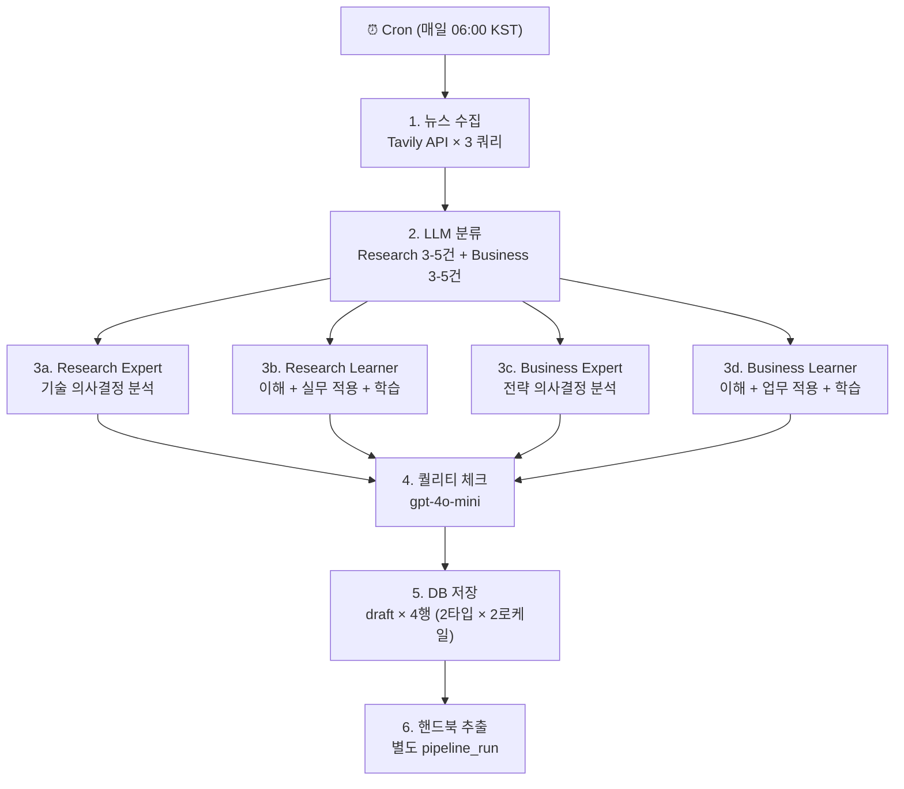

# AI News Pipeline v4 — 2 페르소나 전환

> 날짜: 2026-03-17
> 관련: [[2026-03-17-persona-identity-redesign]], [[2026-03-16-daily-digest-design]], [[AI-News-Pipeline-Design]]

---

## 배경

v3에서 3 페르소나(Expert/Learner/Beginner)를 운영했으나, 실제 출력 분석 결과:
- **Expert**: 명확히 차별화됨 (전략 분석, 의사결정 관점)
- **Learner와 Beginner**: LLM이 구분하지 못함 — 프롬프트를 "읽은 후 행동" 축으로 재설계해도 거의 동일한 출력

데이터 기반 결정: **2 페르소나로 전환.**

---

## v4 페르소나 정의

### Expert (현직자)
- **독자**: 시니어 ML 엔지니어, AI PM, 임원, 전략가
- **읽은 후 행동**: 의사결정을 내린다
- **Research**: 기술 의사결정 (도입/마이그레이션/대기)
- **Business**: 전략 의사결정 (예산 배분, 경쟁 대응, 로드맵 조정)
- **분량**: 뉴스당 3-4 단락

### Learner (학습자)
- **독자**: 개발자, PM, 마케터, 기획자, 학생, AI에 관심 있는 모든 사람
- **읽은 후 행동**: 이해하고, 업무에 적용하고, 배운다
- **특징**: 기존 Learner + Beginner 통합
  - 실무 적용 가이드 (구 Learner)
  - 핸드북 링크 + 용어 학습 (구 Beginner)
  - 비유와 쉬운 설명 (구 Beginner)
  - 기술 용어는 유지하되 인라인 설명 포함
- **분량**: 뉴스당 2-3 단락

---

## 파이프라인 흐름 비교

### v3 (3 페르소나)

```
수집 → 분류 → [Research: Expert + Learner + Beginner] × EN+KO
                [Business: Expert + Learner + Beginner] × EN+KO
= 6 다이제스트 LLM 호출 + 2 퀄리티 체크
```

### v4 (2 페르소나)



---

## 비용 비교

| | v3 (3 페르소나) | v4 (2 페르소나) | 절감 |
|--|---|---|---|
| 다이제스트 LLM 호출 | 6회 | **4회** | -33% |
| 퀄리티 체크 | 2회 | 2회 | 0 |
| 핸드북 | N회 | N회 | 0 |
| **일일 다이제스트 비용** | **~$0.48** | **~$0.32** | **-$0.16/일** |
| **월간** | ~$14.4 | ~$9.6 | **-$4.80/월** |

---

## 구현 계획

### Phase 1: DB 스키마 변경
- `content_beginner` 컬럼 → 더 이상 사용 안 함 (NULL 허용 유지, 삭제하지 않음)
- `content_learner`가 통합 콘텐츠 담당
- `content_expert` 유지
- 마이그레이션: 기존 `content_beginner` 데이터는 보존 (롤백 가능)

### Phase 2: 프롬프트 재작성
- `RESEARCH_EXPERT_*`, `RESEARCH_LEARNER_*` 유지 (Expert는 그대로)
- `RESEARCH_LEARNER_*` 재작성: Learner + Beginner 통합
- `BUSINESS_EXPERT_*`, `BUSINESS_LEARNER_*` 동일
- `*_BEGINNER_*` 프롬프트 삭제
- `DIGEST_PROMPT_MAP`에서 beginner 제거

### Phase 3: 파이프라인 코드 수정
- `pipeline.py`: 페르소나 루프 `("expert", "learner", "beginner")` → `("expert", "learner")`
- 완전성 체크: `len(personas) < 3` → `len(personas) < 2`
- 저장: `content_beginner` 필드 NULL로 저장 (또는 아예 포함 안 함)

### Phase 4: 프론트엔드 수정
- 페르소나 탭: 3개 → 2개 (학습자 / 현직자)
- `NewsprintArticleLayout.astro`: beginner 관련 코드 정리
- `newsDetailPage.ts`: `content_beginner` fallback 로직 정리
- 기본 탭: `learner` (대부분의 독자가 여기서 시작)

### Phase 5: 검증
- 파이프라인 1회 실행 → Expert/Learner 2탭만 표시
- Expert와 Learner가 명확히 다른 콘텐츠인지 확인
- 기존 3-탭 포스트가 깨지지 않는지 (backward compatibility)

---

## Backward Compatibility

기존 포스트(v3, 3 페르소나)는:
- `content_beginner`에 데이터가 있음
- 프론트엔드에서 `content_beginner`가 있으면 3탭 표시, 없으면 2탭 표시
- → 기존 포스트는 3탭, 새 포스트는 2탭으로 자연스럽게 전환

---

## Related

- [[2026-03-17-persona-identity-redesign]] — 페르소나 정체성 논의
- [[2026-03-16-daily-digest-design]] — v3 다이제스트 설계
- [[AI-News-Pipeline-Design]] — 파이프라인 전체 설계
